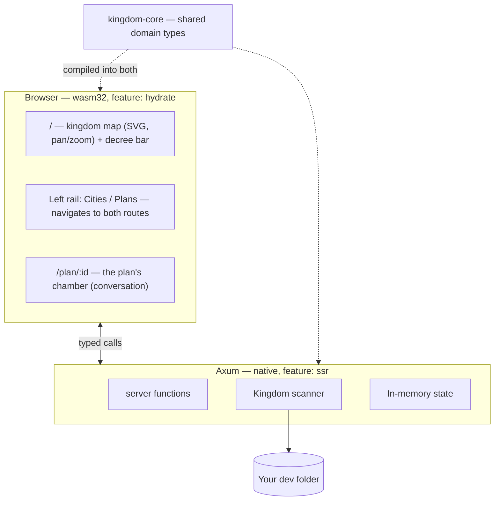

# AGENTS.md

Guidance for any agent (or human) working on **Kingdom IDE**. Read this before
writing code here.

---

## 1. What this product is

Kingdom IDE is **not** an editor that happens to have AI in it. Editing code is
a solved problem and not the reason this exists.

Kingdom IDE is a **command surface for coordinating many agents at once**. It
exists because of a specific, concrete failure: when several agents work across
several projects on one machine, they collide. Two of them bind port 3000. Two
of them run `cargo build` against the same target directory. One rewrites a file
another is halfway through reading. The work is individually fine and
collectively broken.

The product answers three questions, in priority order:

1. **What is every agent doing right now?**
2. **What shared resources are they holding, and who is blocked behind whom?**
3. **What are they proposing that I need to decide on?**

If a change does not serve one of those three, it is probably not the most
valuable thing to build next.

### The guiding test

> Does this make it easier for one person to know and steer what many agents are
> doing?

A beautiful file tree fails that test. A red line on the map between two
projects fighting over a port passes it.

---

## 2. The metaphor, and why it is load-bearing

The interface is a kingdom. This is not decoration; it is a deliberate choice
about the **stance** the user takes toward their agents.

| Metaphor | Type | What it really is |
|---|---|---|
| **Kingdom** | `Kingdom` | the dev folder you opened |
| **City** | `City` | one project directory inside it |
| **Architectural Plan** | `Plan` | a proposal, drafted by a model, awaiting your review |
| **The King** | the user | the only one who approves anything |

The point of the metaphor: **you are a sovereign reviewing proposals, not a
typing-assisted programmer.** An architect brings you plans. You approve or
reject. You do not draw the blueprints yourself. Every UI decision should
reinforce that stance — the user's scarce resource is *attention and judgement*,
not keystrokes.

Use this vocabulary in type names, function names, UI copy, and commit
messages. Consistency is what makes a metaphor explain itself instead of
needing a glossary.

## 3. Architecture

Rust end to end. Axum server, Leptos (WASM) browser UI, one shared domain crate.

```
crates/
  kingdom-core/     Domain model. No I/O, no framework deps. Compiles to
                    BOTH native and wasm32 — keep it that way.
    ids.rs          Newtyped IDs (CityId, PlanId)
    model.rs        Kingdom, City, Plan,
                    District/Building/Ward (a project's shape on disk)
    layout.rs       Deterministic map placement (pure maths)
    skyline.rs      Deterministic per-city building placement (pure maths)
    sample.rs       Placeholder court data
    mockdata/       The Proving Grounds: synthetic realms, in Rust
                    mod.rs (RealmSpec + expansion), realms.rs (THE FAKE DATA),
                    build.rs (terse constructors), court.rs (opening courts)

  kingdom-app/      Server + UI in one crate, split by feature flag.
    main.rs         Axum binary          (feature: ssr)
    bin/kingdom-seed.rs   Seeds a proving ground   (feature: ssr)
    lib.rs          wasm entry point     (feature: hydrate)
    api.rs          #[server] functions  — the browser/server bridge
    scan.rs         Filesystem scanning  (ssr only)
    herald.rs       Proclaiming a plan's changes to its watchers (ssr only)
    watch.rs        The chamber's push socket (ssr only)
    store.rs        The kingdom's records on disk (ssr only)
    mock.rs         Seeding a realm onto disk (ssr only)
    worktree.rs     Preparing and disposing of a plan's workspace (ssr only)
    llm/            Drafting plans with a model (ssr only)
                    mod.rs (Model + Provider traits, Brief, Reply, the provider
                    list), mock.rs (offline provider), copilot.rs (Copilot
                    provider + its /models catalogue), catalogue.rs (assembles
                    one catalogue from every provider), credential.rs
    tools/          What the court can do with its own hands (ssr only)
                    mod.rs (Tool trait, Workshop = the workspace boundary,
                    Remit = how much of the world a plan may touch),
                    think, read_file, search, bash, tmux, patch, browser,
                    spawn_agents (errands), ask_user_question

  kingdom-browser/  The headless browser: chromiumoxide/CDP driver and the
                    per-plan session manager. Native only — never in the wasm
                    bundle. The Tool impls over it live in kingdom-app.
    app.rs          Shell, routes, shared UI state
    components/     sidebar.rs, decree.rs, conversation.rs,
                    map/ (mod.rs + city.rs)

style/main.scss     All styling
```

### Why one crate builds two targets

`kingdom-app` compiles twice: natively with `--features ssr` into the Axum
server, and to `wasm32` with `--features hydrate` into the browser bundle.
A `#[server]` function is a real HTTP call on the client and a direct call on
the server, from **one** signature.

This is the main reason the project is Rust on both ends. There is no
hand-written API client and no schema to keep in sync: change a field on
`City` and both sides fail to compile together, rather than one side failing
at runtime in front of a user.

**Consequence to respect:** anything in `kingdom-core` must compile to wasm.
No `tokio`, no `std::fs`, no native-only crates. Server-only code goes in
`kingdom-app` behind `#[cfg(feature = "ssr")]`.



---

## 4. What is still faked today

**Faked — `kingdom_core::sample::populate_court`:**
- The *opening* court: the plans a kingdom starts with, before the King has
  issued any decree. Plans he opens himself are entirely real.

**Not built at all:**
- **Errands with hands, and errands that send errands.** An errand is read-only
  (`tools::Remit::Survey`), which is what makes running several of them in one
  worktree safe without arbitrating anything. Both extensions need the same
  missing piece: the moment an errand can write, two of them can collide, and
  that is the resource question above. `Remit::Full` is the seam either would
  arrive at.
- Restoring an archived plan. Its outcome records the branch, the tip and a
  patch, so everything a restore would need is kept — but nothing has asked for
  the button yet, and guessing at that UI is how the lease machinery happened.
- Live updates beyond a plan's own chamber. The chamber is pushed to over a
  WebSocket (`herald.rs`, `watch.rs`), but the map and the rail still only
  learn of a change when something refetches the kingdom.
- **Any resource arbitration at all** — see §3. This matters more now than it
  did: the court can bind ports and run builds, so two plans genuinely can
  collide. Nothing detects it.
- Naming a plan with a model. A plan's branch is cut from its title today —
  `kingdom/<slug>`, via `kingdom_core::naming::slugify`, with `-2`, `-3` walked
  past on collision — but that title is still just the first clause of the
  decree. Having a cheap model propose a real name is task 00070; when it lands
  it changes the title, and the branch follows for free.

**Tools the court does not have, and why each is its own decision:**
- `read_image`. The court can take a screenshot and cannot look at it, which
  makes the browser tools half a feature. The blocker is not the tool — it is
  that `Brief` and `copilot.rs` build text-only messages, so this needs the
  model layer to carry image content blocks first.
- `keyword_search`. Wants a model call of its own. Genuinely useful, but
  `search` plus `read_file` cover most of the ground, so it earns its place
  only once someone finds the gap.
- `skill`. Kingdom has no skills directory and no convention for one. Porting
  a loader for a directory nobody populates would be building for no user.

The placeholder court deliberately includes a **failed plan** and a plan **mid
draft**, because those are states the UI exists to show. Do not "clean up" the
sample data into a court of tidy settled plans — it would make the most
important visual states unreachable during development. A test pins this.

### Where state lives

Plans are kept as one JSON document each under the kingdom root:

```
<kingdom_root>/.kingdom/
  kingdom.json              format version
  plans/<plan-id>.json      one document per plan
  archive/<plan-id>.patch   the work an archived plan set aside
```

Cities are **not** stored — they are rescanned every open, because disk is their
source of truth. Plans are the one thing disk cannot tell us again, which is
exactly why they are worth writing down: a plan owns a worktree, and forgetting
it orphans real work with nothing left that knows what it was for.

`store.rs` is the seam. The in-memory `Mutex<Kingdom>` is still the read path and
the store is a write-through behind `api.rs::update`. Swapping in SQLite when
there are genuinely concurrent writers touches only that module — the reasoning
for files over a database is written up at the top of it.

Note the collision of names: `<kingdom_root>/.kingdom/` holds Kingdom's records,
while `<city>/.kingdom/` holds worktrees. A worktree is *derived* and disposable;
a plan record is not.

## 5. Running it

```bash
cargo leptos serve      # build + serve at http://127.0.0.1:3000
cargo leptos watch      # same, with rebuild on change
cargo test -p kingdom-core
cargo test -p kingdom-app --features ssr --no-default-features

# Raise a proving ground: a synthetic dev folder, safe to work against.
cargo run -p kingdom-app --bin kingdom-seed -- --list
cargo run -p kingdom-app --bin kingdom-seed -- kingdom-mirror [--force]
```

To change the fake data, edit `crates/kingdom-core/src/mockdata/realms.rs` and
re-seed with `--force`. It is plain Rust with terse builders — no config format,
no parser, and a mistyped realm fails to compile rather than at seed time.

The browser cannot hand a server a real filesystem path, so the opening screen
asks the King to type one; the server reads it directly from disk. A native
folder picker would require shipping as a desktop shell (Tauri) — a deliberate
later decision, not an oversight.

