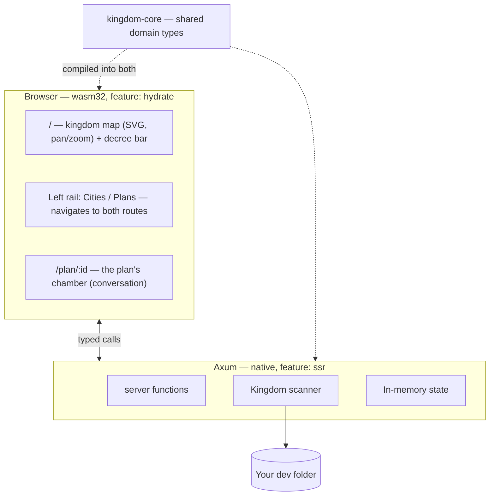

# AGENTS.md

Guidance for any agent (or human) working on **Kingdom IDE**. Read this before
writing code here. It explains not just the conventions but the reasoning
behind them, because the reasoning is what tells you what to do in the cases
this document does not cover.

---

## 1. What this product is

Kingdom IDE is **not** an editor that happens to have AI in it. Editing code is
a solved problem and not the reason this exists.

Kingdom IDE is a **command surface for coordinating many agents at once**. It
exists because of a specific, concrete failure: when several agents work across
several projects on one machine, they collide. Two of them bind port 3000. Two
of them run `cargo build` against the same target directory. One rewrites a file
another is halfway through reading. The work is individually fine and
collectively broken.

The product answers three questions, in priority order:

1. **What is every agent doing right now?**
2. **What shared resources are they holding, and who is blocked behind whom?**
3. **What are they proposing that I need to decide on?**

If a change does not serve one of those three, it is probably not the most
valuable thing to build next.

### The guiding test

> Does this make it easier for one person to know and steer what many agents are
> doing?

A beautiful file tree fails that test. A red line on the map between two
projects fighting over a port passes it.

---

## 2. The metaphor, and why it is load-bearing

The interface is a kingdom. This is not decoration; it is a deliberate choice
about the **stance** the user takes toward their agents.

| Metaphor | Type | What it really is |
|---|---|---|
| **Kingdom** | `Kingdom` | the dev folder you opened |
| **City** | `City` | one project directory inside it |
| **Architectural Plan** | `Plan` | a proposal, drafted by a model, awaiting your review |
| **Crown Resource** | `Resource` | a contended machine resource |
| **Lease** | `Lease` | a granted claim on one |
| **The King** | the user | the only one who approves anything |

There is deliberately **no agent noun**. An earlier design had an `Architect`
entity that owned plans, which meant two state machines to keep in sync for no
gain: the King never reviews an architect, he reviews a plan. A `Plan` is now
both the unit of work and the unit of review, and which model is drafting it is
just a field on it.

The point of the metaphor: **you are a sovereign reviewing proposals, not a
typing-assisted programmer.** An architect brings you plans. You approve or
reject. You do not draw the blueprints yourself. Every UI decision should
reinforce that stance — the user's scarce resource is *attention and judgement*,
not keystrokes.

Use this vocabulary in type names, function names, UI copy, and commit
messages. Consistency is what makes a metaphor explain itself instead of
needing a glossary.

---

## 3. Crown Resources — the actual core

**If you only read one section, read this one.**

Everything else is a shell around resource arbitration. The map, the sidebar,
the chat — all of it exists to make lease state legible.

A `Resource` is anything two agents can fight over:

- a **port** (`Port(3000)`)
- a **database** or stateful service
- the **GPU**
- a **git worktree** or branch
- a **build lock** (`~/.cargo`, `node_modules`, a shared `target/`)
- a **path** on disk

A `Lease` is a granted claim, held either `Exclusive` or `Shared`. The
compatibility rule lives in `Resource::can_grant` and is pinned by a test:

| Currently held | `Shared` request | `Exclusive` request |
|---|---|---|
| nothing | granted | granted |
| shared only | granted | **refused** |
| exclusive | **refused** | **refused** |

### Rules for anyone extending this

1. **Every new agent capability that touches something shared must acquire a
   lease first.** Running a command, starting a server, writing a file. No
   exceptions — an unleased side effect is invisible to the King, which defeats
   the entire product.
2. **Contention must be visible, never silently resolved.** When an agent waits,
   the King must be able to see that it is waiting and why. Auto-resolving a
   conflict quietly is a bug even when the resolution is correct.
3. **Leases belong in `kingdom-core`.** The arbitration logic is pure, so it
   stays testable and shared with the browser.

---

## 4. Architecture

Rust end to end. Axum server, Leptos (WASM) browser UI, one shared domain crate.

```
crates/
  kingdom-core/     Domain model. No I/O, no framework deps. Compiles to
                    BOTH native and wasm32 — keep it that way.
    ids.rs          Newtyped IDs (CityId, PlanId, ResourceId)
    model.rs        Kingdom, City, Plan, Resource, Lease,
                    District/Building/Ward (a project's shape on disk)
    layout.rs       Deterministic map placement (pure maths)
    skyline.rs      Deterministic per-city building placement (pure maths)
    sample.rs       Placeholder court data
    mockdata/       The Proving Grounds: synthetic realms, in Rust
                    mod.rs (RealmSpec + expansion), realms.rs (THE FAKE DATA),
                    build.rs (terse constructors), court.rs (opening courts)

  kingdom-app/      Server + UI in one crate, split by feature flag.
    main.rs         Axum binary          (feature: ssr)
    bin/kingdom-seed.rs   Seeds a proving ground   (feature: ssr)
    lib.rs          wasm entry point     (feature: hydrate)
    api.rs          #[server] functions  — the browser/server bridge
    scan.rs         Filesystem scanning  (ssr only)
    mock.rs         Seeding a realm onto disk (ssr only)
    llm/            Drafting plans with a model (ssr only)
                    mod.rs (Model trait, Brief), mock.rs, copilot.rs,
                    catalogue.rs (live /models list), credential.rs,
                    broker.rs (leases)
    app.rs          Shell, routes, shared UI state
    components/     sidebar.rs, decree.rs, conversation.rs,
                    map/ (mod.rs + city.rs)

style/main.scss     All styling
```

### Why one crate builds two targets

`kingdom-app` compiles twice: natively with `--features ssr` into the Axum
server, and to `wasm32` with `--features hydrate` into the browser bundle.
A `#[server]` function is a real HTTP call on the client and a direct call on
the server, from **one** signature.

This is the main reason the project is Rust on both ends. There is no
hand-written API client and no schema to keep in sync: change a field on
`City` and both sides fail to compile together, rather than one side failing
at runtime in front of a user.

**Consequence to respect:** anything in `kingdom-core` must compile to wasm.
No `tokio`, no `std::fs`, no native-only crates. Server-only code goes in
`kingdom-app` behind `#[cfg(feature = "ssr")]`.



---

## 5. What is real today, and what is faked

Being precise about this matters: the fastest way to waste effort here is to
build on top of a placeholder believing it is real.

**Real:**
- Scanning a dev folder into cities; stack detection; git presence; file counts
- Scanning each project's folder tree into districts and buildings
- Deterministic, non-overlapping map layout (tested)
- Deterministic per-city skyline layout: treemap placement, isometric draw
  order, caps with honest aggregation (tested)
- Pan, zoom, city selection, level-of-detail switching
- The client/server round trip for every `#[server]` function
- Lease compatibility logic (tested)
- **Two routes, and a plan you can navigate to.** `/` is the realm (map plus the
  decree bar); `/plan/:id` is that plan's chamber — its transcript, status,
  summary and touched files. The rail links to both, and every plan has a URL
  that survives a reload.
- **Drafting a plan with a real model.** A decree *opens* a plan instantly
  (`begin_plan`: no lease, no model call) and the chamber then asks for the
  draft (`draft_plan`), which takes a `Shared` lease on the city's path, calls
  the model with that project's real scan data, and settles the plan at
  `AwaitingReview` (or `Blocked`/`Failed`), releasing the lease on every path —
  including when the browser walks away mid-draft. Two providers: an offline
  deterministic `mock` (the default) and GitHub Copilot.
- **Choosing a model and an effort, per plan.** The catalogue is read live from
  Copilot's `/models` after the credential helper runs, so the picker offers
  only models that will actually serve, and only the reasoning efforts each one
  declares. The choice is settled when the plan opens and recorded on it, so a
  conversation keeps being drawn by the model it started with; the last one used
  is remembered in the browser, and a remembered model that has since been
  withdrawn degrades to the default rather than failing the decree.
- **Credential resolution** from `KINGDOM_API_KEY` or a helper command
  (`agency auth github` by default), with the contract tested.
- **The Proving Grounds.** Synthetic dev folders, defined in Rust in
  `kingdom-core/src/mockdata/realms.rs`, materialised on disk by
  `kingdom-app/src/mock.rs` and then read by the **ordinary scanner** — so a
  fixture exercises `scan.rs` for real rather than faking a `Vec<City>` above
  it. Expansion is deterministic (per-file seeding, so an edit changes only what
  it names) and files above 64 KB are sparse, which is what lets a realm hold a
  40 MB asset for kilobytes. Four realms ship: `kingdom-mirror` (the everyday
  one), `crowded` (40 cities), `monorepo` (every cap in `scan.rs`) and
  `contended` (a three-way resource fight).
- **A sandbox that is enforced, not remembered.** Three layers: a `.kingdom-mock`
  marker without which the seeder refuses to write into or clear any non-empty
  directory (no flag overrides this); `KINGDOM_SANDBOX=1`, under which
  `open_kingdom` refuses any canonicalised path outside the sandbox root; and
  `Kingdom.sandbox`, which puts a **PROVING GROUNDS** tag in the rail so a fake
  realm can never quietly pass for real work.

**Working on Kingdom IDE with Kingdom IDE?** Do it in a proving ground. Press
"Enter the Proving Grounds" on the opening screen, or seed one from the CLI, and
set `KINGDOM_SANDBOX=1` so the server enforces it rather than trusting you to
remember. This matters more with every capability added: the moment plans get
hands (§8 item 3), whatever folder is open is what an agent will be running
commands against.

**Faked — `kingdom_core::sample::populate_court`:**
- The *opening* court: the plans and resources a kingdom starts with, before the
  King has issued any decree. Plans he opens himself are entirely real.

**Not built at all:**
- Agents that *do* anything beyond replying: no tool use, no commands, no edits
- Live updates (no WebSocket yet — the chamber polls while a draft is in flight)
- Persistence (state is in memory; a restart empties the kingdom)
- Plan approval/rejection actually doing anything
- A lease *queue* — refusal is surfaced, never resolved

The placeholder court deliberately includes a **blocked plan** and a **contended
resource**, because those are the states the UI exists to show. Do not "clean
up" the sample data into a tidy all-quiet court — it would make the most
important visual states unreachable during development. A test pins this.

### Configuring model access

Copy `.kingdom.env.example` to `.kingdom.env` (gitignored). With nothing set,
the offline mock drafts every plan, so a fresh clone works with no credential
and no network. `KINGDOM_MODEL_PROVIDER` and `KINGDOM_MODEL` now only decide
which model the picker *opens on* — the King changes it per plan from the decree
bar, and a Copilot credential unlocks the live catalogue. The decree bar's
provider badge reports whether a credential actually resolves, not merely
whether one is configured.

---

## 6. Conventions

### Rust
- Run `cargo fmt` and keep `cargo clippy` clean.
- Newtyped IDs, never bare `String`, so the compiler catches mixups.
- Pure logic goes in `kingdom-core` with a test. I/O goes in `kingdom-app`.
- Comments explain **why**, not what. The code already says what.

### Leptos 0.8 — two traps that will cost you time
1. **Turbofish and `>` inside `view!`.** The macro parses `<` and `>` as tags,
   so `each=move || xs.collect::<Vec<_>>()` and `when=move || n > 0` both fail
   with confusing errors. Wrap the closure in braces:
   `each={move || ...}`, `when={move || n > 0}`.
2. **Closures used twice in a view must be `Copy`.** A plain closure capturing
   an owned value is `FnOnce` and will not compile in two places. Use
   `Memo::new(...)`, which is `Copy`.

### Testing
Test **invariants and behaviour a caller depends on**, not implementation
detail. The existing tests are the model:
- cities never overlap on the map (breaks legibility at scale)
- layout is deterministic (breaks the King's spatial memory)
- the lease compatibility matrix (breaks correctness of coordination)
- buildings stay inside their city and never overlap (breaks legibility, and is
  what extends the city non-overlap guarantee down to buildings)
- the skyline is deterministic and independent of directory read order
- every file is accounted for as a tower or inside a commons block (the map must
  never silently under-report how much code a folder holds)
- buildings are painted back to front (SVG has no depth buffer, so draw order is
  the entire 3D illusion)
- assets never outweigh code (a 40 MB video must not bury `src/`)

Each pins something a user would actually notice breaking. Do not add tests
that restate the implementation or assert trivial accessors.

### Visual work
The map is the product's face, so changes to it need to be *looked at*, not just
compiled. Two habits that paid off building the skyline:

- **Measure the DOM, do not eyeball it.** Reading rendered geometry back out of
  the SVG and checking it against the invariant (e.g. every occlusion constraint
  between every pair of buildings) catches real bugs and, just as usefully,
  disproves imaginary ones.
- **Treat impressionistic visual feedback as a lead, not a verdict.** "The draw
  order looks wrong" was worth investigating; it was only worth *acting* on once
  a measurement showed 17 genuinely mis-ordered pairs.

---

## 7. Running it

```bash
cargo leptos serve      # build + serve at http://127.0.0.1:3000
cargo leptos watch      # same, with rebuild on change
cargo test -p kingdom-core
cargo test -p kingdom-app --features ssr --no-default-features

# Raise a proving ground: a synthetic dev folder, safe to work against.
cargo run -p kingdom-app --bin kingdom-seed -- --list
cargo run -p kingdom-app --bin kingdom-seed -- kingdom-mirror [--force]
```

To change the fake data, edit `crates/kingdom-core/src/mockdata/realms.rs` and
re-seed with `--force`. It is plain Rust with terse builders — no config format,
no parser, and a mistyped realm fails to compile rather than at seed time.

The browser cannot hand a server a real filesystem path, so the opening screen
asks the King to type one; the server reads it directly from disk. A native
folder picker would require shipping as a desktop shell (Tauri) — a deliberate
later decision, not an oversight.

---

## 8. Where to go next

Roughly in order of value:

1. **WebSocket live updates.** "Know what your agents are doing" is inherently a
   push problem, and this is still the binding constraint. Opening a plan is now
   instant, but the *draft* still happens inside a request, and the conversation
   view falls back to polling once a second to notice one that landed elsewhere.
   That poll (`components/conversation.rs`) is a deliberate stopgap: delete it
   when push lands rather than growing it into a general polling layer.
2. **A lease queue.** `acquire`/`release` are real; what is missing is what
   happens *after* a refusal. Today a blocked plan sits visible but inert.
3. **Give a plan hands.** Tool use: run a command, read a file, propose a diff —
   each taking its own lease first. This is where the lease model stops being
   theory.
4. **Plan review UI.** Diff view, approve/reject that does something. This is the
   King's core loop and it is still a stub.
5. **Persistence.** SQLite behind `api.rs`. Deliberately deferred — the schema
   should follow a settled domain model, not lead it.
