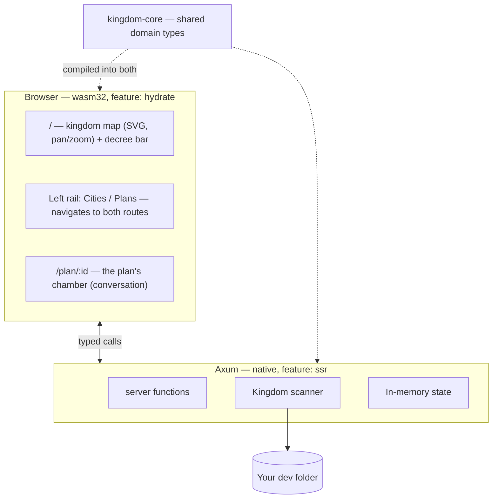

# AGENTS.md

Guidance for any agent (or human) working on **Kingdom IDE**. Read this before
writing code here.

---

## 1. What this product is

Kingdom IDE is **not** an editor that happens to have AI in it. Editing code is
a solved problem and not the reason this exists.

Kingdom IDE is a **command surface for coordinating many agents at once**. It
exists because of a specific, concrete failure: when several agents work across
several projects on one machine, they collide. Two of them bind port 3000. Two
of them run `cargo build` against the same target directory. One rewrites a file
another is halfway through reading. The work is individually fine and
collectively broken.

The product answers three questions, in priority order:

1. **What is every agent doing right now?**
2. **What shared resources are they holding, and who is blocked behind whom?**
3. **What are they proposing that I need to decide on?**

If a change does not serve one of those three, it is probably not the most
valuable thing to build next.

### The guiding test

> Does this make it easier for one person to know and steer what many agents are
> doing?

A beautiful file tree fails that test. A red line on the map between two
projects fighting over a port passes it.

---

## 2. The metaphor, and why it is load-bearing

The interface is a kingdom. This is not decoration; it is a deliberate choice
about the **stance** the user takes toward their agents.

| Metaphor | Type | What it really is |
|---|---|---|
| **Kingdom** | `Kingdom` | the dev folder you opened |
| **City** | `City` | one project directory inside it |
| **Architectural Plan** | `Plan` | a proposal, drafted by a model, awaiting your review |
| **The King** | the user | the only one who approves anything |

The point of the metaphor: **you are a sovereign reviewing proposals, not a
typing-assisted programmer.** An architect brings you plans. You approve or
reject. You do not draw the blueprints yourself. Every UI decision should
reinforce that stance — the user's scarce resource is *attention and judgement*,
not keystrokes.

### Where the metaphor lives, and where it does not

**The metaphor is presentation, not domain.** It belongs in everything the King
reads, and nowhere the compiler reads.

| Layer | Vocabulary |
|---|---|
| UI copy — every string the King sees | **metaphor**: "The court sent an errand" |
| CSS class names, `style/` | **metaphor**: `.deed-mark`, `.chamber-log` |
| Type names, functions, variables, modules | **standard**: `ToolCall`, `Permissions` |
| Doc comments and commit messages | **standard**: "the model", "a tool call" |

The reason is asymmetric cost. In the UI the metaphor is the product's voice and
costs a reader nothing. In the code it is a second vocabulary every reader must
learn before they can read a match arm — and one that no error message, crate
doc or Stack Overflow answer will ever use back.

The translation, in full:

| Shown as | Called in code |
|---|---|
| a deed | `ToolCall`, `ToolOutcome`, `Entry::Tool` |
| the Court | `Speaker::Assistant` |
| the King | `Speaker::User`, "the user" |
| an errand | a subagent — `Plan::spawned`, `SpawnedBy`, `subagents_of` |
| a decree | a prompt — `slug_for_prompt`, `PromptBar` |
| the chamber | the conversation — `Conversation`, `conversation.rs` |
| the spyglass | the screencast — `screencast.rs`, `BrowserView` |
| the herald | the event bus — `events::publish`, `events::subscribe` |
| a remit | `Permissions::ReadOnly` / `Permissions::Full` |
| a workshop | `Sandbox` |
| a realm (fixture) | `FixtureSpec`, `fixtures.rs` |
| a ward | `Language` |
| a district / building | `Folder` / `SourceFile` |

`Kingdom`, `City` and `Plan` are deliberately **both**. They are the crate names,
the routes and the `.kingdom/` directory, and they are also ordinary English for
a folder, a project and a unit of proposed work — so they need no translation.

The one other exception is the map, which is a whole crate of its own:
`kingdom-citymap` keeps `Ward`, `Town`, `Road`, `Plaza` and `Holding`. That code
draws a literal map of projects as settlements, so there the metaphor *is* the
subject matter rather than a euphemism for something else.

**Beware one collision.** In that crate a **`Ward` is a folder** — the ground a
directory's files stand on. Everywhere else in Kingdom "a ward" is
`Language`, and `ward_tree.rs` is the files rail. The two never meet — nothing
outside `kingdom-citymap` names a `Ward` — but the word means different things
on either side of that boundary, and its `lib.rs` says so at the top.

When you add a concept, name the type for what it is and let the view call it
what the King calls it. If you find yourself writing a glossary comment to
explain an identifier, that is the signal you named it for the UI.

## 3. Architecture

Rust end to end. Axum server, Leptos (WASM) browser UI, one shared domain crate.

```
crates/
  kingdom-core/     Domain model. No I/O, no framework deps. Compiles to
                    BOTH native and wasm32 — keep it that way.
    ids.rs          Newtyped IDs (CityId, PlanId)
    model.rs        Kingdom, City, Plan, Proposal (a plan put to the user),
                    Folder/SourceFile/Language (a project's shape on disk)
    permissions.rs  Permissions = what a plan may do to the world
    proposal.rs     Reading a proposal: splitting one into the blocks the King
                    annotates, and diffing a revision against its predecessor.
                    Shared deliberately — the browser splits to offer a target
                    and the server splits to quote it back, and two answers to
                    "where does a block begin" is how those come to disagree
    review.rs       What a plan changed, and how one file differs, as pure
                    data. The rows arrive already paired for a side-by-side
                    view; every decision needing a repository is made in
                    kingdom-app::review. FileText/FileStamp live here too: one
                    file whole and byte-exact for the King to edit, and the
                    cheap "is this still what I opened?" a save is checked
                    against
    naming.rs       slugify — a plan's title turned into its branch name
    sample.rs       Placeholder starter plans
    mockdata/       The Proving Grounds: synthetic fixtures, in Rust
                    mod.rs (FixtureSpec + expansion), fixtures.rs (THE FAKE
                    DATA), build.rs (terse constructors),
                    starter_plans.rs (the plans a kingdom opens with)

  kingdom-app/      Server + UI in one crate, split by feature flag.
    main.rs         Axum binary          (feature: ssr)
    bin/kingdom-seed.rs   Seeds a proving ground   (feature: ssr)
    lib.rs          wasm entry point     (feature: hydrate)
    api.rs          #[server] functions  — the browser/server bridge
    scan.rs         Filesystem scanning  (ssr only)
    events.rs       Publishing a plan's changes to its watchers, and a digest of
                    every plan to the rail (ssr only)
    watch.rs        The chamber's push socket, and the rail's (the route
                    constants cross to wasm; the handlers are ssr only)
    screencast.rs   The King's live view of a plan's browser (ssr only)
    artifact.rs     Serving a file a plan's work left behind, e.g. a
                    screenshot the chamber renders (route + URL on both
                    targets; the handler ssr only)
    profile.rs      The King's own ~/.kingdom: durable settings, and where each
                    kingdom's records are kept (ssr only)
    review.rs       What a plan has changed against the default branch, and one
                    file's diff, read out of its workspace with git (ssr only)
    edit.rs         The King's own edits: one file read whole and byte-exact,
                    written back, or removed. review.rs reads a file for
                    LOOKING AT (numbered, truncatable); this reads one for
                    CHANGING, so it never truncates and never reshapes. Holds
                    the stamp check that stops a save overwriting what the
                    court did while he was typing (ssr only)
    highlight.rs    Syntax colour: a file's lines split into runs of one kind
                    each, for the source panel. Server-only ON PURPOSE —
                    tokenising before the lines go over the wire is what keeps
                    syntect and 213 syntax definitions out of the wasm bundle,
                    the same division diff spans already follow. Holds the two
                    guards `review.rs`'s byte and row caps do not cover: cost is
                    quadratic in a LINE's width, and a minified bundle is one
                    very long line that passes both (ssr only)
    store.rs        The kingdom's records on disk (ssr only)
    turns.rs        Which plans have a turn running *in this process*, and the
                    King's way of stopping one (ssr only)
    mock.rs         Seeding a fixture onto disk (ssr only)
    worktree.rs     Preparing and disposing of a plan's workspace (ssr only)
    llm/            Drafting plans with a model (ssr only)
                    mod.rs (Model + Provider traits, Brief, Reply/Answer, the
                    provider
                    list), system_prompt.rs (everything the model is told,
                    ported from Phoenix IDE: base prompt, the project's
                    AGENTS.md, the skill catalogue, where it stands, and its
                    permissions LAST),
                    mock.rs (offline provider), copilot.rs (Copilot provider +
                    its /models catalogue), catalogue.rs (assembles one
                    catalogue from every provider), credential.rs
    skills.rs       Finding a project's skills on disk (ssr only)
    tools/          What the court can do with its own hands (ssr only)
                    mod.rs (Tool trait, Sandbox = the workspace boundary,
                    the one place Permissions become a list of tools, and
                    child_environment — what a plan's bash/tmux children get
                    beyond what the server inherited. Empty for an ordinary
                    project; for a Kingdom checkout it pins KINGDOM_MODEL=mock
                    and a KINGDOM_HOME inside the workspace, because a
                    rehearsal server otherwise inherits the King's credential
                    and writes its throwaway records into his own profile),
                    think, read_file, read_image, search, skill, bash, tmux,
                    patch, browser, profile (browser_profile),
                    propose_plan (the gateway from proposing to working: the
                    court drafts its plan to .kingdom/draft.md with a scoped
                    patch, then proposes that path — Phoenix's flow, ported.
                    That draft is the plan, and store::file_plan copies it out
                    of the worktree before it is destroyed),
                    spawn_agents (subagents), ask_user_question

    app.rs          Shell, routes, shared UI state
    components/     sidebar.rs, prompt_bar.rs, conversation.rs,
                    markdown.rs (the court's prose rendered: markdown, and
                    mermaid fences drawn as diagrams. Raw HTML is escaped,
                    never passed through — the text is model output and it
                    lands via inner_html. Mermaid itself is vendored at
                    public/vendor/ and fetched only when a fence appears),
                    browser_view.rs, resizer.rs (the drag handle the rail, the
                    focused panel and the files rail's split all share — it
                    drags height as well as width; and, beside it, the
                    remembering of a panel's own view preferences),
                    city_rail.rs (the files rail's column, split between) over
                    file_tree.rs (the plan's workspace on disk — a file row
                    opens it in the panel) and review_drawer.rs (every
                    file this plan has changed),
                    source_view.rs (one file read whole, and — in its other
                    mode — open for the King to edit, save or delete) and
                    diff_view.rs (one
                    changed file, old beside new) — those two and the spyglass
                    are alternatives for one panel, see `Aside`, and every line
                    of either takes a note,
                    note_composer.rs (the one box a note is written in, shared
                    with the proposal's margin),
                    review_notes.rs (those notes gathered, and the one button
                    that sends the whole review),
                    proposal/ (the plan put to the King: mod.rs is the card,
                    body.rs draws it as blocks he can write against, notes.rs
                    is the gathered margin, diff.rs reads a
                    revision against the plan it revises)

  kingdom-citymap/  The map: every project drawn as a town on one disk, hanging
                    in space. Repo City drew an island in a sea; the sea gave
                    the world no silhouette, so the ground is now a circle with
                    a cliff, a frustum and a spire under it — `MapUnderside`,
                    proportional to the disk's own radius so a large kingdom
                    and a small one hang the same way.
                    **Vendored** — this is Repo City
                    (github.com/craigloewen-msft/repo-city-visualizer, MIT),
                    copied in at 449f090 rather than depended on, so there is
                    one project to maintain rather than two. Edit it here.
                    Split by feature the same way kingdom-app is, and for the
                    same reason: `build` walks the disk and must never reach
                    wasm; `engine` is Bevy and must never reach the server.
    map/            The manifest: world-space geometry, plain serialisable
                    data. The one *seam* on both targets — where the two halves
                    meet. `works.rs` is the exception that proves it: what a
                    plan proposes, resolved from a `ChangeSummary` into ground
                    to build on, and the placer that finds free land inside a
                    folder for a file that has no house yet. It lives here
                    rather than in `engine` so `cargo test` can pin it without
                    a browser — a ghost house landing on a real one is then a
                    test failure rather than something noticed by eye
    progress.rs     How much of that manifest has arrived, as a fraction and a
                    line of text. Also on both targets, for a smaller reason:
                    only the browser reads it, but `cargo test` builds this
                    crate with no features, and `view.rs` is hydrate-only, so
                    arithmetic left there is never compiled by the suite
    build/          Scanning a kingdom and laying it out (ssr). Repo City's
                    own `Survey` was deliberately NOT taken: it finds projects
                    by looking for `.git` and so drops a folder without one,
                    which disagrees with `kingdom-app::scan`. `manifest_for`
                    walks `Kingdom::cities` instead
    engine/         Drawing it with Bevy (hydrate, plus native for its tests).
                    `activity.rs` is the one part fed from outside the manifest:
                    which towns have agents working in them, traced as a pulsing
                    ring, polled rather than pushed and never cached with the
                    geometry. `works.rs` is the second, for the same reason and
                    on the same channel: the open plan's changes, raised over the
                    city as scaffolding, skirts of cleared ground, and ghost
                    houses for files that do not exist yet. `stars.rs` is the
                    one part not in the world at all:
                    the projection is orthographic, so a star out in the scene
                    would have no parallax and would *zoom* with the kingdom —
                    it rides on the camera in pixels instead. `raise.rs` builds
                    a world a slice at a time instead of in one call, so the
                    browser gets the frame back and the loading bar can move —
                    see §4. `input.rs` holds `Steering`: a drag or a wheel takes
                    the camera away from the interface, so the map stops
                    re-framing itself on the open file until the King hands it
                    back or leaves it still for `RELEASE_AFTER`
    view.rs         `CityMap` — the canvas, the click that selects a city, the
                    loading card with the bar on it, and the free-look chip that
                    says the camera is his and offers it back

  kingdom-browser/  The headless browser: chromiumoxide/CDP driver and the
                    per-plan session manager. Native only — never in the wasm
                    bundle. The Tool impls over it live in kingdom-app.
    session.rs      Per-plan Chrome, finding one on the machine, and the
                    operations the tools call. Two things there are load-
                    bearing and easy to undo: HOVER_SETTLE, which rests the
                    pointer on a target before pressing it — chromiumoxide
                    moves and presses in one CDP batch, so a page that decides
                    what a click means from what is *hovered* never sees the
                    move in time, which is why nothing could click the map;
                    and DEFAULT_VIEWPORT, chosen against Kingdom's own
                    responsive thresholds rather than as a round number
                    (KINGDOM_BROWSER_VIEWPORT overrides it)
    screencast.rs   CDP screencast, relayed to the spyglass's viewers
                    (the panel is components/browser_view.rs)
    profile.rs      Metrics, CPU/trace/coverage, the per-run perf reading
    perf.rs         The in-page helper injected before any page script

style/main.scss     All styling
```

### Why one crate builds two targets

`kingdom-app` compiles twice: natively with `--features ssr` into the Axum
server, and to `wasm32` with `--features hydrate` into the browser bundle.
A `#[server]` function is a real HTTP call on the client and a direct call on
the server, from **one** signature.

This is the main reason the project is Rust on both ends. There is no
hand-written API client and no schema to keep in sync: change a field on
`City` and both sides fail to compile together, rather than one side failing
at runtime in front of a user.

**Consequence to respect:** anything in `kingdom-core` must compile to wasm.
No `tokio`, no `std::fs`, no native-only crates. Server-only code goes in
`kingdom-app` behind `#[cfg(feature = "ssr")]`.



---

## 4. What is still faked today

**Faked — `kingdom_core::sample::starter_plans`:**
- The *opening* court: the plans a kingdom starts with, before the King has
  issued any decree. Plans he opens himself are entirely real.

**How a plan actually runs.** A prompt opens under `Permissions::Propose`: the
model may read, search, and run commands, and gets `patch` scoped to a single
draft file — it cannot change the project. It writes the plan to
`.kingdom/draft.md` as it works, then calls `propose_plan` with that path, which
ends the turn and parks the plan in `AwaitingReview` with a `Proposal` standing
on it. The user either sends notes back — ordinary `say` + `draft_plan`, the
composer's own path — or presses **Start with this**, which is `approve_plan`:
the permissions widen to `Full` and the same conversation carries on with tools
it did not have.

**Or he writes in the margin.** `proposal.rs` splits the plan into markdown
blocks, and each one takes a note: `annotate_proposal` records it on the
`Proposal`, several may stand at once, and `send_notes` drains them into **one**
`Speaker::User` turn that blockquotes each annotated block above the objection to
it. Nothing new reaches the model — no tool, no message kind, no prompt change.
The court revises its draft and calls `propose_plan` again exactly as it always
did, and `Plan::propose` carries the outgoing body onto the new proposal as
`revises`, so the card can open on a diff of what moved. A switch in the head
turns that off; it is not drawn at all on a first proposal, which has nothing to
be read against.

Three things there are load-bearing. The notes live on the plan rather than in
the browser, for the reason `queued` does — a note typed and not sent must
survive a reload — and they are excluded from `Plan::turns` the same way, so
half-written second thoughts never reach a model. `ProposalNote` carries the
annotated **text** beside the line number, because a line is a reference into a
document that is about to be replaced and the quote is the half that cannot go
stale. And `send_notes` reuses `receive`, the branch `say` already splits out, so
notes sent into a working chamber queue and are heard at the next round boundary
with no second code path to get wrong.

`revises` is a whole body rather than a stored diff: the diff is computed for
display and thrown away, and keeping one would be a third rendering of prose that
already exists twice and is free to drift from both — the liability recorded
against the old `approved/` ledger below.

Nothing is parked while they read. The turn genuinely ends, so a server restart
mid-review loses nothing — the proposal is on the plan and the plan is on disk.
That is the whole reason `propose_plan` does not work like `ask_user_question`,
which holds a request open on a oneshot; the module docs there spell it out.

**The draft is the mechanism, not a formality.** This is Phoenix's shape, ported
part for part: a scoped `patch` (`PatchTool::for_task_proposal_drafts` there,
`Patch::for_draft` here), a `<next_step>` cue appended to every successful draft
write pointing back at the propose tool, and a propose tool that takes a *path*
rather than inline content.

It exists because the inline form failed in a specific, measured way. A real
plan asked for a file-tree view spent 21 rounds and 33 tool calls and never
proposed at all: its reasoning had settled the design by round 11 and then
re-derived it eight times, renaming the same component on each pass. Nothing it
decided was ever written down, so every round it faced the same choice between
emitting the whole plan from memory and looking a little further — and looking
always won. Giving it somewhere to put the plan is what fixes that; a paragraph
of prose telling it to stop looking is what Kingdom tried instead, and Phoenix
sends no such paragraph.

**The plan is one document, and it is filed when the worktree goes.** The court
drafts to `.kingdom/draft.md` inside its own worktree and revises it there as it
works — that file *is* the plan. But `.kingdom/` is excluded from the
repository, so the draft is never committed, and `git worktree remove --force`
deletes it with the checkout. So `store::file_plan` copies it out to
`plans/<plan-id>--<slug>.md` in the profile: at approval, and again at merge or
archive for a plan that was never approved. The id makes the name unique (slugs
collide), the slug makes it readable in `ls`, and `store::load` filters on the
`json` extension so the markdown sits beside the record without being mistaken
for one.

This is Phoenix's `tasks/` directory with its one liability removed. Phoenix
commits its task files into the project; Kingdom files the plan into the King's
profile, because a plan is Kingdom's bookkeeping *about* a repository rather
than that repository's content.

The writing is **write-once**, and that is load-bearing rather than tidy:
filing happens twice on the ordinary path, and between the two moments the court
holds an unrestricted `patch` and may rewrite its own draft freely. Without it,
finishing a plan would replace what the King agreed to with whatever the draft
said by the end. A failed write costs the document rather than the approval or
the merge, and the finish tries again.

Two details worth keeping straight. The draft must be read **before** the
disposal — `worktree.rs` has a test that pins this against real git, because
after the teardown there is nothing left to read and the patch cannot carry an
excluded file. And an **in-place** plan has no teardown, so its draft is deleted
explicitly after filing — guarded on the filing having succeeded, since that is
the only remaining copy.

This replaced an `approved/<plan-id>.md` ledger holding a second rendering of
the same prose. Its stated justification was that a revision after approval
replaces the standing proposal — but `Plan::propose` cannot be reached once
permissions widen (`propose_plan` is not offered at `Full` and refuses there
anyway), so that loss was not reachable. The guarantee it offered is kept by the
filed plan. Nothing already on disk was deleted, and `profile::migrate` still
brings `approved/` forward.

**An empty reply is not the end of a plan.** A reply that arrives with no
content and no tool calls is the *absence* of an answer rather than an answer,
and `converse` now asks again -- up to `MOST_ATTEMPTS`, with a short backoff,
raced against the halt like every other long await. Only failures a retry could
fix are retried: `ModelError::is_transient` says yes to `Empty` and `Transport`
(which a 5xx and a 429 now route to) and no to a refusal or a missing
credential, because those are considered answers and asking again only spends
the user's quota to be told the same thing.

The half that made this feel unfixable was never the first failure, though — it
was that **nothing the King did could change the request.** `settle` records a
failure as a `Note`, notes are deliberately excluded from `Plan::turns`, so
"keep going" rebuilt a byte-identical payload and got a byte-identical silence.
A real plan died this way three times in ninety seconds with its window 10%
full. So an empty reply is noted as `NoteKind::EmptyReply` specifically, and
`follows_silence` finds it — walking *past* the King's own words, because
`receive` appends them after the note and reading `transcript.last()` would
answer `false` on precisely the turn this exists to catch. A test pins that
sequence. What it yields is `Brief::aside`: rendered on the wire as a `system`
message, never as a `Turn`, never in the transcript, and never in the King's
voice — the same containment `copilot::shown` gives an image, for the same
reason.

**And the reply is no longer called empty when it was not.** Three paths funnelled
into that one message: tool calls dropped silently for want of an `id` or a
`name` (now counted and reported, naming what was unreadable), `content` sent as
an array of parts rather than a string (now read — `as_str()` on an array is
`None`, which became `""`, which became "empty reply"), and a reply carrying only
reasoning (now named as that, since the fix is the effort setting rather than the
gateway). `answer_from` also logs a bounded slice of the body on any parse
failure: this module logged *nothing*, which is why diagnosing the original bug
ended in "unknowable".

**And a request too large to send is not the end of one either.** The same
failure through a different door: a plan died on `413 Request Entity Too Large`
and stayed dead, because 413 is a 4xx, `Refused` is fatal, and every "keep
going" rebuilt a byte-identical body from the same transcript and was rejected
identically. Three deaths in ninety seconds.

The cause was that **a picture was replayed forever**. `read_image` puts base64
on the live plan, `store::save` strips it on the way to *disk* but nothing takes
it out of memory, and `copilot::messages` sent `shown()` for every tool call in
the transcript on every round. Six screenshots became 4.02 MB of a 5.3 MB body,
each already looked at and answered rounds earlier. So images now ride only while
they are new (`RECENT_REPLIES`), which is the code catching up with what
`ToolArtifact`'s own doc already claimed — `images` is "what the model was shown,
true for one turn".

Three things there are load-bearing. The window is **unconditional** rather than
a response to pressure: a conversation that merely happens to fit today would
otherwise keep every picture until the day it does not, and the King would meet
this mid-investigation instead of never. A dropped picture is **admitted** in the
tool result, for the reason `replayed` marks a truncation — a model that believes
it can still see a screenshot describes it from memory and is confidently wrong
about the UI it was asked to verify, while one told the attachment is gone simply
takes another. And a **blind** model hears nothing either way, since it never had
the image and the notice would only invite a screenshot it cannot read.

Beyond that, `Budget` bounds the assembled body. `MOST_REPLAYED` already capped
one result at 12 KB; nothing capped the sum, which is how 300 results comfortably
under that cap still added up to a refusal. Over budget, `shedding` drops in
order of what it costs to lose: stale pictures, then old `reasoning.opaque`, then
the tails of old results. `opaque` is the delicate one — `Reasoning::without_opaque`
records that a gateway *silently discards* thinking whose signature did not come
back, so it is never taken from a reply recent enough to still be live
(`LIVE_REPLIES`), and a test pins that under deliberate pressure.

The number in `Budget::FULL` is a **guess**, and the design assumes so. The only
hard fact is that 5.3 MB was refused; the real limit is unpublished and varies.
So 413 gets `ModelError::TooLarge` — not transient, because resending the
identical body is pointless, but `is_shrinkable`, which is a different question
with a different remedy. `converse` halves the budget and asks again with no
backoff (nothing is unwell; the next request is simply smaller), down to a floor
past which the honest answer is to fail and say what was too big. Being wrong in
either direction is survivable, which is what makes a guess acceptable here.

Two smaller things. The body is measured before it goes so a 413 can report its
own size, because "Request Entity Too Large" with no number attached is what made
this feel unknowable. And `shedding` tallies each reply *once* and then asks that
tally repeatedly — weighing candidates by re-walking the transcript re-serialised
every tool call's arguments a dozen times over, which cost 110 ms on a real plan
against 3 ms for the whole assembly.

The tally counts **wire** bytes, not `str::len`, and that distinction bit once
already during this very change. The body is JSON, where every quote and newline
costs an extra byte, and tool output is mostly quotes and newlines: counting raw
lengths under-reported the real transcript by 1.69x, so a request the budget
called 3 MB went out at 5.1 MB — the size that was refused to begin with. A
budget with no headroom is not a budget. `escaped_len` is counted rather than
fudged with a constant, because the ratio is entirely content-dependent (base64
escapes to nothing, a build log nearly doubles), and a test now pins the estimate
against a genuinely assembled body.

The chamber header now reports **both** limits. `ContextUsage` carries `bytes`
beside `tokens` — the measurement `copilot.rs` already took so a 413 could name
its own size, kept rather than discarded — and the header's tooltip says what the
last request weighed on the wire. The King watched 257k of 1M tick by while the
gateway refused him on bytes, and the bar was telling the truth about the wrong
quantity. It is in the tooltip rather than beside the bar because it is the
number to reach for when a turn fails for no visible reason, not one to watch;
`bytes: 0` reads as *unmeasured* and draws nothing, which is what every plan
recorded before the field existed loads as.

**A request stopped carrying thinking nobody was using.** The other half of the
same lesson as the pictures above, found by auditing four plans that did *not*
die. `shedding` consulted `LIVE_REPLIES` only when a body exceeded
`Budget::FULL`, so a conversation comfortably under budget re-sent every signed
reasoning blob it had ever produced, forever. On real plans that was the single
largest thing in a request — 638 KB of 1.15 MB on one, 651 KB of 1.45 MB on
another — and in both cases **100%** of it older than `LIVE_REPLIES` and
therefore dead by that constant's own definition. Cumulatively it was 46–53% of
everything those turns put on the wire.

So `opaque_from_reply` is now set in the *initial* `Shedding`, exactly as
`images_from_reply` already was, and for the reason stated there: a conversation
that merely happens to fit today would otherwise keep every blob until the day it
does not. The pressure loop no longer needs a step for signatures — the bound it
would have walked to is already applied — and it must never reach past it, since
dropping a *live* signature is silent (`Reasoning::without_opaque`) where
trimming a result says so.

**And a round is now understood to be the unit of cost.** `copilot::armed` has
set `parallel_tool_calls` all along, with a comment explaining that it saves
(N−1) round trips whenever a model recognises a batch as independent — and
nothing had ever asked a model to use it. Across those same four plans, 702
rounds produced 840 tool calls: 1.20 per round, 84% of rounds carrying exactly
one, and not a single round in any of them carrying three. `BATCHING` is the
sentence that asks, kept for the `SHARED_MACHINE` reason rather than Phoenix's
(Phoenix sends no such line; this is a fact about Kingdom's transport). Its
second clause — *wait when a call needs an earlier result* — is as load-bearing
as the ask, because batching a read with the write that depends on it trades a
token bill for a correctness bug.

The honest caveat is that a prompt line is a weak instrument: `workspace_block`'s
own second clause fixed the redundant-`cd` habit outright and then lost to a
stronger prior the moment a plan worked across two repositories, and the same
audit found 71% of one plan's `bash` calls had the prefix back. Measured after
the change, a four-file read arrived as one round of four calls.

**A screenshot no longer costs two rounds.** `browser_take_screenshot` returned a
path and left the model to spend a whole round on `read_image` for a file it had
just asked to be created, reasoning that "the bytes must not be spent on a model
that may not need them". The records disagreed: across a real kingdom, 131
screenshots drew 128 `read_image` calls. 98% is not a model deciding, and the
call now hands back the picture with the path.

Nothing about the weight changes — `shown` puts an image on the wire only while
it is within `RECENT_REPLIES`, so a picture delivered this way decays exactly as
one delivered by `read_image` did, one round earlier and one round cheaper. The
half of the old reasoning that was right is kept: a **blind** model still gets
the path alone. That check could not live in `ToolSpec::for_model`, which
narrows by withholding a tool — this tool is worth offering either way, since the
King sees the picture regardless — so `Sandbox` carries `sighted` and `api.rs`
sets it from the same `Model::can_see` the tool list is built from.

**A question is asked one at a time, and the rail says one is standing.** Two
halves of the same fault. `ask_user_question` may put up to four questions, and
the chamber used to render all of them with every option live — so the *first*
click sent its own label and settled the call, and the other three answers were
discarded without the court ever learning they had been asked. They are now put
to the King one at a time (`Question` in `conversation.rs`), with Back and Next
between them and **Submit** in place of Next on the last. `compose_answer` folds
the lot into the single `String` the parked oneshot takes.

Every question ends in Submit, including a lone one. That costs the old
one-click path a second click and buys three things worth more: `multi_select`
becomes answerable at all (it had been in the schema, and read by nothing), an
option and a sentence of his own can stand *together*, and the set is answered
as one act. A single question still sends its **bare answer** with no
scaffolding, so the far side reads exactly as it always did — the mock's "You
chose X" path and the tool's own test needed no change. Several are labelled and
kept in the order asked, and a question he left alone is named as `(no answer)`
rather than dropped: silence and omission look identical to a model, which then
fills the gap with the guess it stopped to avoid making.

The King's place in the wizard is local state, and it survives the push socket
for a reason that is not obvious: `Transcript`'s `<For>` is keyed by
`(index, entry_version)` and an in-flight call holds version 1 throughout, so
deeds landing elsewhere re-render the list without rebuilding that row. A change
to that key would silently send him back to question one every time the court
did anything.

**And the rail could not have told him.** A plan parked on a question is still
`PlanStatus::Drafting` — asking moves nothing — so a badge read off the status
said "Drafting" in the working green, the same thing it says for a plan happily
running a build. `Attention` answers the different question *whose move is it*,
and is deliberately **not** a sixth `PlanStatus`: a status is where a plan is in
its life, and a sixth variant would ripple through `ALL`, the map legend,
`is_settled` and every match on plan state to say one word.
`Plan::wants_attention` is the single definition, read by the rail, the chamber
header and the pulse alike.

**A second socket carries it, and it carries a digest.** `events.rs` argues at
length that whole plans on the wire are free — and that argument holds only for a
channel keyed *per plan*, where one watcher is looking at exactly what is sent.
The rail asks "which of my thirty plans needs me?", and answering it the same way
would wake every open tab with every transcript on every round to repaint a
badge. So `/watch/kingdom` carries `PlanPulse` — id, city, title, status, what it
is doing, what it wants — and is **deduped** against the last pulse sent for that
plan. The digest makes a message cheap; the dedupe makes most rounds send nothing
at all. Dedupe narrows what is *sent*, never what a message *says*: a pulse is a
whole digest, so a listener that falls behind has still missed only intermediate
states, which is the same property that makes lag survivable on the plan channel.

Two details there are load-bearing. The badge cache in `KingdomState` stores an
`Option` *inside* the map, because "the server says this plan wants nothing" and
"nothing has been said about this plan" must stay different answers — a question
answered in another tab pulses `None`, and treating that as silence would fall
back to a transcript fetched before the answer and go on showing a question
nobody is asking. And **both** sockets write it: the chamber's, which holds the
whole plan and computes it, and the rail's, which is told. They cannot disagree,
because `wants_attention` is the one definition on both ends.

**The King can speak over a running turn, and can stop one.** The composer is
never disabled. Words sent mid-turn are queued on the plan (`Plan::queued`, kept
deliberately *out* of the transcript and therefore out of `Plan::turns`) and
heard by `Plan::hear_queued` at the top of the next round — the one moment where
nothing is half-done. Splicing them in mid-deed would hand the model a
conversation in which a tool call and its result are separated by something
nobody said at the time. `converse` also drains on its two normal exits, because
otherwise words queued just as a turn ended would be waited on by nobody; it
deliberately does *not* drain on its failure exits, where re-entering the loop
would burn the round budget against a model that just errored.

**Stop** signals `turns::halt`, which `converse` races against its two long
awaits with `tokio::select!`. Cooperative rather than an abort, so the code that
clears the busy mark and settles the in-flight deed still runs — the difference
between a stopped plan and a wedged one. The interrupted deed is closed as
`ToolOutcome::Refused`, exactly as `store::reconcile` closes a deed the server
died during and for the same reason: an unsettled call is replayed to the model
as still running, forever. The plan lands in `AwaitingReview`, not `Failed` —
nothing failed, and `Failed` is the status the chamber offers a retry against. A
halted `bash` keeps its process, as Phoenix's does; the `JOBS` handle survives
for a later turn to peek at or kill.

`turns.rs` answers a narrower question than `Plan::working_on`, and the gap is
load-bearing. `working_on` is a *description* that survives a restart and a
panic; the registry is emptied by a guard on every exit path. `say` branches on
the registry, so a plan whose busy mark outlived its turn still takes the direct
path and is un-wedged by being spoken to — branching on `is_busy()` would queue
every message behind a turn nothing would ever drain, turning today's
recoverable wedge into a permanent one. `stop_plan` reads the same absence as
its diagnosis and repairs such a plan, which is why Stop is also the cure that
used to need a server restart.

**The `Propose` boundary is a statement of the job, not a sandbox.** It keeps
`bash`, which `Sandbox::root` is explicit about not containing — a command that
names an absolute path writes wherever it likes. Withholding it would buy a
guarantee Kingdom cannot keep while costing the model `git log`, `cargo tree`
and running the failing test it is proposing to fix. What it narrows is `patch`:
offering the editing tool unrestricted says *you may change the project*, and
offering it scoped to a draft says *you may write down what you would change*.
`system_prompt.rs` says the rest in words, and says plainly that the shell is a
boundary the model is trusted to keep rather than one that is enforced. Closing
that properly means an OS-level sandbox, which is a deliberate later decision.

**The map says how far along it is, and had to be rebuilt to be able to.** The
loading card named its two phases and animated three towers; it reported no
progress, because there was none to be had. Both phases now carry a real bar,
and the second one is the whole of the work.

The fetch was the easy half: `view::read_whole` reads the body a chunk at a time
instead of calling `Response::json`, and counts bytes against `content-length`.
`progress::Transfer` turns that into a fraction and a line — *2.1 MB of 4.2 MB*.
It refuses to answer rather than guessing when the two numbers cannot be
compared: no declared length, or a count that has passed it. That second case is
not hypothetical — putting compression in front of `/kingdom/map.json` would
make `content-length` the compressed size while the reader counts decompressed
bytes, and a bar reading 640% is worse than one that admits it does not know.

The raise is the half that mattered. **A bar over `spawn_world` could not have
moved at all**: measured on a real dev folder, building ~20k entities held the
main thread in blocks of 1.3–1.7 seconds, and a sampling loop started at
navigation did not get its first turn until t≈10.9 s. Nothing repaints in there
— which is exactly why the card's SCSS already insisted every animation on it be
`transform`/`opacity`, since those composite off the main thread. A *number* has
no such escape. So `engine::raise` cuts the build into slices against an 8 ms
deadline, publishes the fraction to the bridge between them, and lets the frame
go. The bar moves because the browser is free to draw it.

Five things there are load-bearing. `spawn.rs`'s stages take a `Range` and
`spawn_step` is the one door both paths go through, so the sliced build and
`spawn_world` cannot raise different settlements. The root is spawned
**hidden** and revealed on the last slice: the card is a translucent gradient
rather than an opaque screen, and scenery spawns visible and is only culled when
`apply_lod` next runs — so the King would otherwise watch trees appear and then
vanish. `ActiveLod` and `Activity` are **marked changed** at completion, because
both systems early-return unless their resource moved and every entity of the
new world was spawned after the last change. Winit is held at the watching pace
while a raise is in flight, since walking into a chamber mid-raise would
otherwise drop the engine to four ticks a second and turn three seconds into a
minute — `winit_for` is one definition so the two systems cannot disagree. And
`built` still means *standing*, so the card's dismissal and the bridge's test
for it are untouched.

The weights in `Step::weight` are **estimates** and the design assumes so:
being wrong makes the bar advance unevenly and nothing else, and `fraction`
reaches exactly 1.0 whatever they say. `status_matches` compares the fraction
within 0.5% for the reason it already tolerates sub-pixel camera drift — tens of
thousands of entities against a bar a few hundred pixels wide — but starting and
finishing are always heard, because `None` means *nothing is going up* and
rounding that together with a build at 0% would leave the bar indeterminate for
the whole first slice.

What is deliberately **not** done here is compressing that route. It would cut
4.35 MB to ~694 KB and help the fetch more than any bar does, but it is a server
change with its own trade-offs and it is what `Transfer`'s clamp is written to
survive.

**Not built at all:**
- **Subagents with tools, and subagents that spawn subagents.** A subagent is
  read-only
  (`Permissions::ReadOnly`), which is what makes running several of them in one
  worktree safe without arbitrating anything. Both extensions need the same
  missing piece: the moment a subagent can write, two of them can collide, and
  that is the resource question above. `Permissions::Full` is the seam either
  would arrive at.
- **Subagents while drawing up a plan.** `spawn_agents` is `Permissions::Full`
  only, so a proposing plan cannot fan out — which is a shame, because exploring
  a codebase to write a proposal is the most fan-out-shaped work there is. It
  was left out rather than guessed at; the case for adding it is that
  `Plan::spawned` already pins a subagent to `ReadOnly` unconditionally, so a
  subagent of a proposing plan would be the same read-only thing a subagent
  always is.
- Restoring an archived plan. Its outcome records the branch, the tip and a
  patch, so everything a restore would need is kept — but nothing has asked for
  the button yet, and guessing at that UI is how the lease machinery happened.
- Live updates on the **map**. The chamber is pushed to over a WebSocket
  (`events.rs`, `watch.rs`), the plan's browser is mirrored over a second one
  (`screencast.rs`), and the **rail** now has one of its own — a kingdom-wide
  socket carrying a `PlanPulse` per plan (`watch.rs::KINGDOM_ROUTE`), which is
  what lets a plan that has stopped to ask something say so from a chamber
  nobody has open.

  The map does not read it yet. Which towns are working is still *polled*, every
  two seconds and only while the map is on screen (`app.rs::poll_activity` over
  `api::kingdom_activity`) — written when `events.rs` was keyed per plan by
  design and a kingdom-wide channel was "a real change rather than a smaller
  one". That change has since landed, so the poll is now a survivor rather than
  a necessity, and folding it onto the pulse is a tidy-up someone should do. The
  rest of the map is a Bevy canvas, and colouring holdings from plan state is
  its own piece of work. The spyglass is still deliberately *not* surfaced
  there: a city lighting up because a plan holds a live browser needs a plan
  that knows it owns a session.

  Both halves of "is the King looking at the map?" hang off the **same**
  `on_the_map` memo in `ThroneRoom`: it stops the activity poll
  (`poll_activity`) and it stops the engine drawing (`ViewerCommand::Show`).
  Keeping them on one signal is what stops the map from polling for a ring that
  nothing is rendering, or rendering a ring nothing is refreshing.
- **Any resource arbitration at all** — see §3. This matters more now than it
  did: the court can bind ports and run builds, so two plans genuinely can
  collide. Nothing detects it.
- Naming a plan with a model. A plan's branch is cut from its title today —
  `kingdom/<slug>`, via `kingdom_core::naming::slugify`, with `-2`, `-3` walked
  past on collision — but that title is still just the first clause of the
  decree. Having a cheap model propose a real name is task 00070; when it lands
  it changes the title, and the branch follows for free.

**Tools the court does not have, and why each is its own decision:**
- `keyword_search`. Wants a model call of its own. Genuinely useful, but
  `search` plus `read_file` cover most of the ground, so it earns its place
  only once someone finds the gap.

**The prompt and the tool descriptions are Phoenix IDE's**, ported wholesale
because its agents demonstrably answered better on the same work. Three things
about that are worth keeping straight.

*The order is the point.* The remit renders **last**, after the project's
`AGENTS.md` and the skill catalogue, because it is what the model must still be
holding when it picks its first tool. Kingdom used to render it early and then
bury it under up to 64 KB of guidance. Anything appended after the remit puts
that distance back, and a test pins the ordering.

*Phoenix wins on wording, never on facts about Kingdom.* Where a Phoenix string
would describe behaviour Kingdom does not have, the behaviour is authoritative:
its `bash` description is trimmed of the `label` and `since` arguments this tool
does not take. `SHARED_MACHINE` goes the other way — no Phoenix counterpart,
kept anyway, because several agents on one machine is Kingdom's own subject.
Both departures are tested.

The mermaid hint is the case that shows the rule working in both directions. It
was **not** ported at first, because Kingdom had no markdown renderer and the
claim had once cost a plan 25 of its 30 reasoning blocks arguing with the
prompt; the comment where it belonged said "restore this the day a renderer
exists". `components/markdown.rs` is that renderer, so the sentence is back and
the test that once forbade the word now requires it. If the renderer ever goes,
both go with it.

*What was deleted with it.* The house blocks on ending a turn, on the cost of
re-reading, and on writing tests are gone, and so is the `NUDGE` machinery in
`api.rs` that sent a narration-only reply back round. A reply with prose and no
tool call now simply ends the turn, as it does in Phoenix.

**The King can read what a plan changed, not only what it said.** The files rail
is **split**: the plan's own file tree above, and below it a **review drawer**
listing every file this plan has touched with its `+`/`−` counts. Both are on
screen at once, with a draggable divider between them, because the question "what
did my agent change?" is answered *against* "what is in this project?" — tabs made
holding both in view impossible. A row in either opens the file in the panel the
spyglass occupies: the drawer opens a side-by-side **diff**, and the tree opens
the file **whole**, because most files in a project have no diff at all and the
tree offers all of them.

The tree reads **the plan's workspace, not the city's checkout**, and that was a
correction rather than a choice. An isolated plan works in a worktree, so keyed
on the city the rail listed one copy of the project while the court edited
another — tolerable while it was read-only decoration, and not tolerable once a
row opens a file the King writes notes against: line 34 of the city's checkout is
not line 34 of the worktree, so the court would be sent an objection about code
it cannot see. `list_directory` is keyed on the plan for that reason, and
`SKIP_DIRS` gained `.kingdom` with it, since a city's worktree folder holds
entire further copies of the project.

Three decisions there are load-bearing. **The comparison is against
`merge-base(default, HEAD)`, not against `main`** — `git diff main` is
symmetric, so every commit that lands on main while an agent works renders as a
deletion *by the plan*, and the King opens the drawer to review his agent and is
shown files it never touched. A test in `review.rs` pins that against a real
repository. **It reads the plan's own workspace**, which is the worktree rather
than the city, and it counts committed, uncommitted and untracked work alike,
because a plan's checkout is normally in all three states at once and a drawer
showing only commits would be empty for most of a plan's life. And **the rows
arrive already paired**: deciding which deletion sits opposite which insertion
needs the differ that knows a replacement was a replacement, so `review.rs` does
it and the browser renders two columns without re-deciding anything — a flat
sequence of tagged lines would be mispaired on any uneven replace.

The diff, the source view and the spyglass are **alternatives for one panel**,
held in a single `Aside` value in `conversation.rs`: opening any closes the
others, because there is one signal holding one value rather than booleans that
must remember to close each other. The transcript is deliberately outside that
decision — it is not one of the alternatives, it is the thing they are
alternatives beside, and the panel is always to its **right** rather than stacked
above it. It used to stack below 1100px, which put a diff between the King and
the chamber header and pushed the transcript off the bottom of the screen.

**Any of the three can take the conversation's room as well as its own.** A
panel 640px wide is not enough to review several files against each other, and
while he is doing that the transcript is not what he is reading. So a **Focus**
chip in the panel's bar turns `.chamber-body` from a row into a column: the
panel takes the full width above, and the conversation keeps the strip beneath
it. `Escape` leaves, as it leaves every overlay.

Three decisions there are load-bearing. It is **one flag for all three panels**,
remembered in `localStorage` — a width is about what a particular panel needs to
be legible, but focus is about what the King is doing, and clicking from a diff
to the file beside it does not change that. It is **gated on something being in
the slot** (`Aside::is_showing`), or a flag remembered from last visit would hide
the transcript of a chamber with an empty column, with the toggle that would put
it back living in a panel bar that is not on screen. And the **review margin and
the composer survive it** — that is the whole reason focus shortens the
conversation column instead of hiding it, since a review that cannot be sent from
the screen it was written on is not a review mode. The files rail survives for a
simpler reason: it is outside that box, and it is how reviewing several files
happens at all. What goes is the header and the log, and the log goes by
`display: none` so its scroll position is still there when he comes back.

One mechanical detail is worth knowing before changing it. Each panel sets its
width **inline** from the resizer's signal, and an inline style beats a class
rule — so focus does not override the width, it *removes* it: the closure yields
`Option<String>`, which is how tachys spells "reset this property", and no
`!important` appears on either side. The same move retired `--panel-width`, the
inline var a note composer used to size itself against; it was the one number
that claimed to know how much room there was, and it stopped being true the
moment the panel could grow without that signal moving. `.diff-stage` is now a
`container-type: inline-size` and the composers are `100cqi`, which asks the box
itself.

**And the diff shows both of its sides.** It did not, and the cause was one rule
rather than the layout: `.diff-grid` was `width: max-content` with columns of
`minmax(50%, 1fr)`, so the grid grew to the longest line and each column took
half of *that*. At the panel's 640px default one real line of this repository
resolved the columns to 856.8px each — the new side began at x=857 inside a box
640 wide, off screen until the King thought to scroll sideways. Short files were
fine, which is why it survived so long: the failure bites exactly on the real
code a diff is opened for. The rows now wrap (`minmax(0, 1fr)`, `pre-wrap`,
`overflow-wrap: anywhere`), and a wrapped pair stays level for free because a
grid row is as tall as its tallest cell — the part a hand-rolled two-pane view
gets wrong. A **Wrap** chip turns it off for a King who would rather scroll, and
the source view is deliberately untouched: `_source.scss` argues that wrapping
there breaks the correspondence between what he types and the line number he just
read, and that argument does not apply to a read-only pair of columns.

What yields instead is the **cities rail**, which folds itself to a strip below
1250px (`app.rs::fold_rail_when_cramped`). A chamber can want four columns at
once, and that rail is the one the King has finished using by the time he is
reading a diff. Two things there are load-bearing: it **never writes to storage**,
so the stored flag stays his *preference* and widening the window gives back what
he chose rather than what the last resize left behind; and it defers to a choice
made at the current width (`rail_decided_at`), because otherwise opening the rail
on a laptop is undone by the very next resize — and window managers send a flurry
of them. Crossing the threshold is what makes that choice stale.

The drawer was also the first thing to open a plan's workspace directory and find
nothing there. `sample::starter_plans` builds a `Workspace` from `City::path`,
which is *relative* to the kingdom root, and hands it to a field documented as
absolute; `api::grounded` closes that at the one boundary that holds the root,
and a test pins it.

**And he can write in the margin of the code, not only of the plan.** Every line
of both panels takes a note. They gather into one **review** above the composer,
and one button sends the lot as a single `Speaker::User` turn: `ReviewNote` →
`annotate_file` → `send_file_notes` → `file_notes_as_decree`. That is
deliberately the same shape marginal notes on a *proposal* already had, part for
part, because it is the same act performed against code instead of prose — and
four of its decisions are carried over for their original reasons. The notes live
on the plan, so one typed and not sent survives a reload and a second tab. They
are kept out of the transcript and therefore out of `Plan::turns`, so a
half-written second thought cannot reach a model. `quote` travels beside `line`,
because a line number is a reference into a file about to be rewritten. And
`take_review_notes` drains rather than reads, so nothing can compose the decree
and leave the notes standing to be sent twice.

What is **not** carried over is where they live: on the `Plan` rather than on a
`Proposal`. These are written against work in progress, so they must survive
approval — reviewing what the court has *built* is the case they exist for, and by
then there is no standing proposal to hang them on. That is also why the two
margins are kept apart when both stand: a proposal note asks the court to revise
a document and propose again, a line note asks it to change code, and one decree
meaning two things is worse than two buttons.

Three smaller things are load-bearing. `send_file_notes` reuses `receive`, the
branch `say` already splits out, so a review sent into a working chamber queues
and is heard at the next round boundary with no second code path to get wrong.
The decree is **grouped by file and ordered by line** rather than left in the
order the notes were written, because a model given nine notes shuffled across
four files has to sort them before it can start — and the margin groups the same
way, so the King checks his review against something that reads in the order he
will be answered in. And a note on the **old** column of a diff carries
`NoteSide::Base` and is reported as "in the version before your changes": a note
on a deleted line is an ordinary review comment, and a bare line number would
point the court at whatever now occupies that position.

One behaviour is worth stating because it looks like an oversight. **A panel with
a composer open does not refetch.** Both panels otherwise follow the court's
edits, which is right while the King is only reading and wrong the moment he is
typing against line 34 — the lines would shift under him and the note would land
on something he never read.

**And he can change the file himself.** The source panel has two modes. *Notes*
is the panel above: every line takes a comment for the court. *Edit* replaces the
lines with one box, and he can save the file or delete it — `plan_file_text` →
`plan_write_file` / `plan_delete_file` over `edit.rs`. A mode of one panel rather
than a fourth `Aside`, because it is the same file in the same slot; a King who
spots a typo while reading should not have to close what he is looking at to fix
it. It is deliberately **not** offered on the diff: editing one column of a
comparison is ambiguous about which column, and the comparison goes stale under
the cursor as it is typed into.

Those routes are the fifth, sixth and seventh places an outsider names a path and
the server opens it, and they raise the stakes — the earlier four only *read* a
file the King should not see, and these overwrite or delete one. All seven go
through `within_workspace` and none has a resolver of its own, which a test now
pins by reading the source. They refuse a **settled** plan, as `annotate_file`
does and for its reason, and they deliberately do **not** consult `Permissions`:
that is what bounds the *court*, and gating it would mean the man reviewing a
proposal cannot fix the typo he just found in it.

Four decisions there are load-bearing.

**The buffer is fetched, not rebuilt from the rendered lines.** `FileText` is a
second type beside `SourceText` precisely so it can be whole and byte-exact where
that one is numbered and truncated. Joining `SourceText`'s lines back with `\n`
would need no request at all and would rewrite every CRLF file as LF and add or
remove a final newline, because those lines come from `str::lines()` — a
whole-file diff the King never asked for, landing in his agent's branch. A cap on
`FileText` would be the same class of harm: a truncated buffer saved back is a
file with its tail deleted, so a file too long to edit is *refused* rather than
part-shown.

**And the line endings are restored on the way out**, which is the same lesson
one layer lower and was found only by driving the real panel. A **DOM textarea
normalises CRLF to LF in its `value`**: the bytes reach the browser intact, the
King types one character, and what comes back has had every `\r` stripped by the
platform before any of Kingdom's code ran. The server-side round-trip test passed
throughout — it never went near a DOM. So `edit::write` gives the text the
convention the file on disk already had, guarded twice: only if the file *was*
CRLF, and only if what arrived has no `\r` at all, which is the signature of a
wholesale strip rather than of a deliberately mixed file. Nothing in the browser
can be trusted to preserve this, and nothing in the browser needs to.

**A save cannot overwrite work it never saw.** Every read carries a `FileStamp`
— length and an FNV-1a hash, the not-cryptographic-and-doesn't-need-to-be trick
`profile::hash` already uses — and a write or delete sends it back to be checked.
The King reads a file while his agent works in the same workspace, so without
this a save at the wrong moment silently destroys a round of the agent's work,
which is the exact collision this product exists to surface rather than to cause.
Optimistic rather than a lock, because a lock has to be released by something and
the something is a browser tab that may simply be closed. A missing file stamps
as `ABSENT`, which is what makes deleting an already-deleted file a refusal
rather than a silent success.

**Unsaved text is never dropped on the floor.** Dirty buffers are stashed by path
for the chamber's lifetime, so glancing at another file mid-edit and coming back
restores what was typed. No modal and no `confirm()` — there is nothing to lose,
so there is nothing to ask about. Edit mode also suspends the refetch, which is
the composer's rule above for a sharper version of its reason: text moving under
a cursor is worse than under a quote.

Two smaller things. A save appends a `NoteKind::Workspace` note, which the King
reads and the model never sees — notes are excluded from `Plan::turns` by design,
and the court finds out the honest way, since `patch` reads a file fresh on every
call and refuses an anchor that is no longer there. That note also lengthens the
transcript, which is the change signal the review drawer already refetches on, so
his own edit refreshes the drawer's counts by the route the court's edits use.
And a **delete** bumps a `revision` the files tree watches: that tree caches every
listing and deliberately never re-lists, so without it a deleted file would sit
in the rail forever. On delete only — a save changes no listing.

**The court can see, and can be seen.** `read_image` was the tool that closed the
loop `browser_take_screenshot` opened, and it cost a domain change: `ToolOutcome`
carries images beside its text. That machinery is now used by the screenshot tool
directly (see above) and `read_image` remains for every *other* picture — a
diagram or a mockup already in the workspace. Two things about it are load-bearing
and easy to undo by accident. Images are *not* persisted — `store.rs` strips them,
because a plan's record is rewritten on every update and would otherwise grow by a
megabyte per screenshot forever. And chat-completions has no image part on a
tool result, so `copilot.rs` sends the picture as a following `user` message,
built only on the wire and never as a `Turn` — the Responses API is the real fix
and the comment there says so.

A model that cannot see is never offered `read_image` (`ToolSpec::for_model`,
beside the existing `can_act` narrowing). The vision flag is read from three
places in Copilot's `/models` payload because the catalogue is not ours; if it
ever reads as blind for everything, that is where to look.
`browser_take_screenshot` is the one tool that check does *not* withhold — it is
worth having either way, since the King sees the picture regardless — so it asks
`Sandbox::sighted` at run time instead.

**The King reads what the court said, not only what it ran.** A model narrates
the move it is about to make in the *same reply* as the tool calls, and that
sentence is the reason for the deeds under it. `ToolCall::narration` has carried
it since task 00110 and `copilot.rs::messages()` replayed it to the model, but
the chamber drew only the commands until 00200. It renders above the deed now, as
the header of the block rather than as a `chat-msg`: a bubble carries a speaker
column and a clock, which would present the preamble of an action as a separate
thing the court said.

The grouping is the part to keep straight. **Narration belongs to a reply, not to
a call** — `api.rs` records it on the first call of a batch and `None` on the
rest, so a reply asking for six things replays as one decision rather than six
deliberations. `conversation.rs::remark` honours that same shape, and it is drawn
in `Transcript`'s `<For>` body rather than inside `ToolCallLine`, because
`Question` and `Subagents` render tool calls too and a batch's first call can be
any of the three. Putting it in `ToolCallLine` would lose the sentence exactly
when the court explains *why it is stopping to ask you something*.

`Reasoning::text` rides beside it, collapsed to `thinking (N lines)` and not
rendered as markdown — reasoning is a stream of thought with stray `#` in it that
was never meant as formatting. It is deliberately ranked below the remark: a
remark is what the court chose to say, and reasoning is what it happened to think
on the way there.

**And so can the King.** A screenshot renders in the chamber, under the deed
that took it. The picture is *not* carried on the plan: `ToolOutcome::Done`
gained `artifacts` — workspace-relative **paths** beside the base64 `images` —
and `artifact.rs` serves the file back over `/plan/{id}/artifact/{*path}`,
resolved through the plan's own `Sandbox`. The two channels look alike and are
not, which is the thing to keep straight: `images` feed a model for one turn and
are stripped on save; `artifacts` feed the conversation and are persisted, which
is the only reason a reloaded chamber can show the picture again. Inlining the
bytes instead would have re-broken all three of the constraints above — the
store's, the provider's, and the watch socket's, which re-sends whole plans.

That route is the one place in Kingdom where an outsider names a file and the
server opens it, so it refuses rather than guesses: outside the workspace, or a
media type `read_image` would not accept, is a refusal. It must not become a
general file server for a plan's checkout.

The placeholder court deliberately includes a **failed plan**, a plan **mid
draft**, and one with a **proposal standing in front of the user**, because
those are states the UI exists to show — and the last is the one the product's
whole stance rests on. Do not "clean up" the sample data into a court of tidy
settled plans — it would make the most important visual states unreachable
during development. A test pins this.

### Where state lives

Everything Kingdom records about itself lives in the King's own profile —
`~/.kingdom/`, or wherever `KINGDOM_HOME` points — rather than inside the folder
he opened:

```
~/.kingdom/
  settings.json                  durable IDE settings; today, the last kingdom opened
  kingdoms/<key>/
    kingdom.json                 which root this folder is for
    plans/<plan-id>.json         one document per plan
    plans/<id>--<slug>.md        the plan itself, filed when its worktree goes
    archive/<plan-id>.patch      the work an archived plan set aside
  realms/<name>/                 the proving grounds
```

`<key>` is the folder's own name plus a hash of its resolved path, so two
projects both called `dev` do not share a drawer. It is derived and never
authoritative: `kingdom.json` holds the real root.

**Why out here.** Which folder was last opened is the one fact that cannot be
read from inside a kingdom not yet opened, so it has nowhere else to live — and
that is what lets the server come up on the map instead of the folder picker.
The rest followed it: a plan record is Kingdom's bookkeeping, not the user's
repository's, and `realms/` used to default to a *relative* path, so which
proving grounds existed depended on where the server was launched from.

A kingdom recorded under the old layout is migrated on open. It **copies** and
never deletes — a plan record is the one thing disk cannot tell us again, so a
bug in that path must be survivable.

Cities are **not** stored — they are rescanned every open, because disk is their
source of truth. Plans are the one thing disk cannot tell us again, which is
exactly why they are worth writing down: a plan owns a worktree, and forgetting
it orphans real work with nothing left that knows what it was for.

`store.rs` is the seam. The in-memory `Mutex<Kingdom>` is still the read path and
the store is a write-through behind `api.rs::update`. Swapping in SQLite when
there are genuinely concurrent writers touches only that module — the reasoning
for files over a database is written up at the top of it.

The two `.kingdom` directories used to be a collision worth warning about. They
are now a division: `<city>/.kingdom/` still holds worktrees and a plan's draft,
which are derived from that repository and disposable, while the durable records
have left the tree entirely. The worktree deliberately stayed — it is a checkout
*of that project*, and its path is named in the system prompt and resolved by
each plan's `Sandbox`.

## 5. Running it

```bash
cargo leptos serve      # build + serve at http://127.0.0.1:3000
cargo leptos watch      # same, with rebuild on change
cargo test -p kingdom-core
cargo test -p kingdom-app --features ssr --no-default-features

# No test launches a browser *by default*, so the suite needs nothing installed
# and stays fast. The exception is opt-in and marked as such:
cargo test -p kingdom-browser -- --ignored   # launches a real Chrome

# Kingdom finds Chrome itself at runtime: whatever is on `PATH` or in the
# usual install locations, and failing that a Chromium that Playwright or
# Puppeteer already downloaded. Set KINGDOM_CHROME_EXECUTABLE only to override
# that on a machine where the guess is wrong.
```

### What a plan needs that the tests do not

The suite runs on a bare machine. *Driving a real project* does not, and the
gap is invisible until a plan is halfway through a job and cannot finish:

- **A browser**, for the `browser_*` tools. Any Chrome or Chromium on `PATH`.
  On arm64 note that Google Chrome has no Linux build at all -- Chromium is the
  native one, and is what Kingdom's own error text points at.
- **Whatever the city itself needs to run.** `mommys-heart`, for instance,
  brings up Postgres and Azurite through `etc/dev.sh`, so a plan there needs a
  container runtime. That is the *project's* prerequisite rather than Kingdom's,
  and Kingdom cannot install it -- but a plan asked to "verify in the browser"
  will discover it the hard way, several minutes in.

Neither is checked up front on purpose: a plan that only reads and proposes
needs neither, and refusing to start without them would be worse than the
diagnosis. Worth knowing before you ask a plan to prove its work.

```bash
# Raise a proving ground: a synthetic dev folder, safe to work against.
cargo run -p kingdom-app --bin kingdom-seed -- --list
cargo run -p kingdom-app --bin kingdom-seed -- kingdom-mirror [--force]
```

To change the fake data, edit `crates/kingdom-core/src/mockdata/fixtures.rs` and
re-seed with `--force`. It is plain Rust with terse builders — no config format,
no parser, and a mistyped fixture fails to compile rather than at seed time.

### Rehearsing a change

Work against a proving ground, not your dev folder:

```bash
KINGDOM_REALM=kingdom-mirror KINGDOM_SANDBOX=1 cargo leptos watch
```

`KINGDOM_REALM` opens that realm at boot, so the server comes up on a populated
map instead of whichever kingdom was last opened — which matters under `watch`,
where every save restarts the server. It seeds the realm
on first use and is instant thereafter.

`KINGDOM_SANDBOX=1` makes "I meant to open the fake one" a rule the server
enforces rather than one you remember: any folder outside the sandbox root is
refused.

Both belong in `.kingdom.env` (gitignored; copy `.kingdom.env.example`) so the
setting survives a restart. If you are changing what a fixture *contains*,
re-seed with `--force` — an already-standing realm is deliberately left alone.

The browser cannot hand a server a real filesystem path, so the opening screen
asks the King to type one; the server reads it directly from disk. A native
folder picker would require shipping as a desktop shell (Tauri) — a deliberate
later decision, not an oversight.

