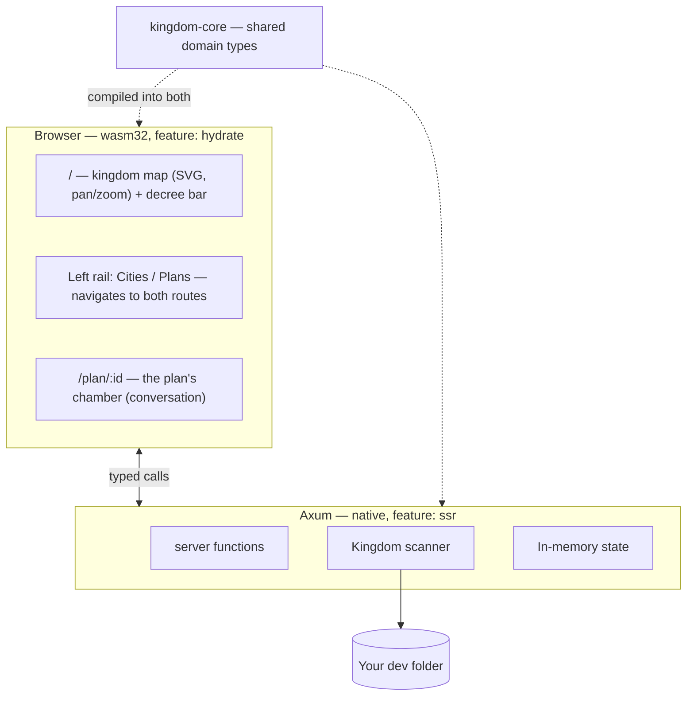

# AGENTS.md

Guidance for any agent (or human) working on **Kingdom IDE**. Read this before
writing code here.

---

## 1. What this product is

Kingdom IDE is **not** an editor that happens to have AI in it. Editing code is
a solved problem and not the reason this exists.

Kingdom IDE is a **command surface for coordinating many agents at once**. It
exists because of a specific, concrete failure: when several agents work across
several projects on one machine, they collide. Two of them bind port 3000. Two
of them run `cargo build` against the same target directory. One rewrites a file
another is halfway through reading. The work is individually fine and
collectively broken.

The product answers three questions, in priority order:

1. **What is every agent doing right now?**
2. **What shared resources are they holding, and who is blocked behind whom?**
3. **What are they proposing that I need to decide on?**

If a change does not serve one of those three, it is probably not the most
valuable thing to build next.

### The guiding test

> Does this make it easier for one person to know and steer what many agents are
> doing?

A beautiful file tree fails that test. A red line on the map between two
projects fighting over a port passes it.

---

## 2. The metaphor, and why it is load-bearing

The interface is a kingdom. This is not decoration; it is a deliberate choice
about the **stance** the user takes toward their agents.

| Metaphor | Type | What it really is |
|---|---|---|
| **Kingdom** | `Kingdom` | the dev folder you opened |
| **City** | `City` | one project directory inside it |
| **Architectural Plan** | `Plan` | a proposal, drafted by a model, awaiting your review |
| **The King** | the user | the only one who approves anything |

The point of the metaphor: **you are a sovereign reviewing proposals, not a
typing-assisted programmer.** An architect brings you plans. You approve or
reject. You do not draw the blueprints yourself. Every UI decision should
reinforce that stance — the user's scarce resource is *attention and judgement*,
not keystrokes.

### Where the metaphor lives, and where it does not

**The metaphor is presentation, not domain.** It belongs in everything the King
reads, and nowhere the compiler reads.

| Layer | Vocabulary |
|---|---|
| UI copy — every string the King sees | **metaphor**: "The court sent an errand" |
| CSS class names, `style/` | **metaphor**: `.deed-mark`, `.chamber-log` |
| Type names, functions, variables, modules | **standard**: `ToolCall`, `Permissions` |
| Doc comments and commit messages | **standard**: "the model", "a tool call" |

The reason is asymmetric cost. In the UI the metaphor is the product's voice and
costs a reader nothing. In the code it is a second vocabulary every reader must
learn before they can read a match arm — and one that no error message, crate
doc or Stack Overflow answer will ever use back.

The translation, in full:

| Shown as | Called in code |
|---|---|
| a deed | `ToolCall`, `ToolOutcome`, `Entry::Tool` |
| the Court | `Speaker::Assistant` |
| the King | `Speaker::User`, "the user" |
| an errand | a subagent — `Plan::spawned`, `SpawnedBy`, `subagents_of` |
| a decree | a prompt — `slug_for_prompt`, `PromptBar` |
| the chamber | the conversation — `Conversation`, `conversation.rs` |
| the spyglass | the screencast — `screencast.rs`, `BrowserView` |
| the herald | the event bus — `events::publish`, `events::subscribe` |
| a remit | `Permissions::ReadOnly` / `Permissions::Full` |
| a workshop | `Sandbox` |
| a realm (fixture) | `FixtureSpec`, `fixtures.rs` |
| a ward | `Language` |
| a district / building | `Folder` / `SourceFile` |

`Kingdom`, `City` and `Plan` are deliberately **both**. They are the crate names,
the routes and the `.kingdom/` directory, and they are also ordinary English for
a folder, a project and a unit of proposed work — so they need no translation.

The one other exception is the map's own geometry: `layout.rs`, `terrain.rs` and
`skyline.rs` keep `Realm`, `Road`, `CityPlacement`, `Lot` and `Plate`. That code
draws a literal map of cities and roads, so there the metaphor *is* the subject
matter rather than a euphemism for something else.

When you add a concept, name the type for what it is and let the view call it
what the King calls it. If you find yourself writing a glossary comment to
explain an identifier, that is the signal you named it for the UI.

## 3. Architecture

Rust end to end. Axum server, Leptos (WASM) browser UI, one shared domain crate.

```
crates/
  kingdom-core/     Domain model. No I/O, no framework deps. Compiles to
                    BOTH native and wasm32 — keep it that way.
    ids.rs          Newtyped IDs (CityId, PlanId)
    model.rs        Kingdom, City, Plan, Proposal (a plan put to the user),
                    Folder/SourceFile/Language (a project's shape on disk)
    permissions.rs  Permissions = what a plan may do to the world
    layout.rs       Deterministic map placement (pure maths)
    skyline.rs      Deterministic per-city building placement (pure maths)
    sample.rs       Placeholder starter plans
    mockdata/       The Proving Grounds: synthetic fixtures, in Rust
                    mod.rs (FixtureSpec + expansion), fixtures.rs (THE FAKE
                    DATA), build.rs (terse constructors),
                    starter_plans.rs (the plans a kingdom opens with)

  kingdom-app/      Server + UI in one crate, split by feature flag.
    main.rs         Axum binary          (feature: ssr)
    bin/kingdom-seed.rs   Seeds a proving ground   (feature: ssr)
    lib.rs          wasm entry point     (feature: hydrate)
    api.rs          #[server] functions  — the browser/server bridge
    scan.rs         Filesystem scanning  (ssr only)
    events.rs       Publishing a plan's changes to its watchers (ssr only)
    watch.rs        The chamber's push socket (ssr only)
    screencast.rs   The King's live view of a plan's browser (ssr only)
    store.rs        The kingdom's records on disk (ssr only)
    mock.rs         Seeding a fixture onto disk (ssr only)
    worktree.rs     Preparing and disposing of a plan's workspace (ssr only)
    llm/            Drafting plans with a model (ssr only)
                    mod.rs (Model + Provider traits, Brief, Reply/Answer, the
                    provider
                    list), system_prompt.rs (everything the model is told: the
                    city, where it stands, its permissions, and the project's
                    AGENTS.md),
                    mock.rs (offline provider), copilot.rs (Copilot provider +
                    its /models catalogue), catalogue.rs (assembles one
                    catalogue from every provider), credential.rs
    tools/          What the court can do with its own hands (ssr only)
                    mod.rs (Tool trait, Sandbox = the workspace boundary,
                    and the one place Permissions become a list of tools),
                    think, read_file, read_image, search, bash, tmux, patch,
                    browser, profile (browser_profile),
                    propose_plan (the gateway from proposing to working),
                    spawn_agents (subagents), ask_user_question

  kingdom-browser/  The headless browser: chromiumoxide/CDP driver and the
                    per-plan session manager. Native only — never in the wasm
                    bundle. The Tool impls over it live in kingdom-app.
    session.rs      Per-plan Chrome, finding one on the machine, and the
                    operations the tools call
    screencast.rs   CDP screencast, relayed to the spyglass's viewers
                    (the panel is components/browser_view.rs)
    profile.rs      Metrics, CPU/trace/coverage, the per-run perf reading
    perf.rs         The in-page helper injected before any page script

    app.rs          Shell, routes, shared UI state
    components/     sidebar.rs, prompt_bar.rs, conversation.rs,
                    browser_view.rs, resizer.rs (the drag handle the rail
                    and the spyglass share),
                    map/ (mod.rs + city.rs)

style/main.scss     All styling
```

### Why one crate builds two targets

`kingdom-app` compiles twice: natively with `--features ssr` into the Axum
server, and to `wasm32` with `--features hydrate` into the browser bundle.
A `#[server]` function is a real HTTP call on the client and a direct call on
the server, from **one** signature.

This is the main reason the project is Rust on both ends. There is no
hand-written API client and no schema to keep in sync: change a field on
`City` and both sides fail to compile together, rather than one side failing
at runtime in front of a user.

**Consequence to respect:** anything in `kingdom-core` must compile to wasm.
No `tokio`, no `std::fs`, no native-only crates. Server-only code goes in
`kingdom-app` behind `#[cfg(feature = "ssr")]`.



---

## 4. What is still faked today

**Faked — `kingdom_core::sample::starter_plans`:**
- The *opening* court: the plans a kingdom starts with, before the King has
  issued any decree. Plans he opens himself are entirely real.

**How a plan actually runs.** A prompt opens under `Permissions::Propose`: the
model may read, search, and run commands, but has no `patch` and cannot change
the project. When it knows what to do it calls `propose_plan`, which ends the
turn and parks the plan in `AwaitingReview` with a `Proposal` standing on it.
The user either sends notes back — ordinary `say` + `draft_plan`, the composer's
own path — or presses **Start with this**, which is `approve_plan`: the
permissions widen to `Full` and the same conversation carries on with tools it
did not have.

Nothing is parked while they read. The turn genuinely ends, so a server restart
mid-review loses nothing — the proposal is on the plan and the plan is on disk.
That is the whole reason `propose_plan` does not work like `ask_user_question`,
which holds a request open on a oneshot; the module docs there spell it out.

**The `Propose` boundary is a statement of the job, not a sandbox.** It keeps
`bash`, which `Sandbox::root` is explicit about not containing — a command that
names an absolute path writes wherever it likes. Withholding it would buy a
guarantee Kingdom cannot keep while costing the model `git log`, `cargo tree`
and running the failing test it is proposing to fix. What it loses is `patch`:
offering the editing tool says *you may edit*, and withholding it says *you may
not*. `system_prompt.rs` says the rest in words, and says plainly that the shell
is a boundary the model is trusted to keep rather than one that is enforced. Closing that properly means an OS-level sandbox, which is a deliberate
later decision.

**Not built at all:**
- **Subagents with tools, and subagents that spawn subagents.** A subagent is
  read-only
  (`Permissions::ReadOnly`), which is what makes running several of them in one
  worktree safe without arbitrating anything. Both extensions need the same
  missing piece: the moment a subagent can write, two of them can collide, and
  that is the resource question above. `Permissions::Full` is the seam either
  would arrive at.
- **Subagents while drawing up a plan.** `spawn_agents` is `Permissions::Full`
  only, so a proposing plan cannot fan out — which is a shame, because exploring
  a codebase to write a proposal is the most fan-out-shaped work there is. It
  was left out rather than guessed at; the case for adding it is that
  `Plan::spawned` already pins a subagent to `ReadOnly` unconditionally, so a
  subagent of a proposing plan would be the same read-only thing a subagent
  always is.
- Restoring an archived plan. Its outcome records the branch, the tip and a
  patch, so everything a restore would need is kept — but nothing has asked for
  the button yet, and guessing at that UI is how the lease machinery happened.
- Live updates beyond a plan's own chamber. The chamber is pushed to over a
  WebSocket (`events.rs`, `watch.rs`), and the plan's browser is mirrored over a
  second one (`screencast.rs`) — but the map and the rail still only learn of a
  change when something refetches the kingdom. The spyglass is deliberately
  *not* surfaced on the map for that reason: a city lighting up because a plan
  holds a live browser needs both this, and a plan that knows it owns a session.
- **Any resource arbitration at all** — see §3. This matters more now than it
  did: the court can bind ports and run builds, so two plans genuinely can
  collide. Nothing detects it.
- Naming a plan with a model. A plan's branch is cut from its title today —
  `kingdom/<slug>`, via `kingdom_core::naming::slugify`, with `-2`, `-3` walked
  past on collision — but that title is still just the first clause of the
  decree. Having a cheap model propose a real name is task 00070; when it lands
  it changes the title, and the branch follows for free.

**Tools the court does not have, and why each is its own decision:**
- `keyword_search`. Wants a model call of its own. Genuinely useful, but
  `search` plus `read_file` cover most of the ground, so it earns its place
  only once someone finds the gap.
- `skill`. Kingdom has no skills directory and no convention for one. Porting
  a loader for a directory nobody populates would be building for no user.

**The court can see, and can be seen.** `read_image` closes the loop
`browser_take_screenshot` opened, and it cost a domain change: `ToolOutcome`
carries images beside its text. Two things about that are load-bearing and easy
to undo by accident. Images are *not* persisted — `store.rs` strips them, because
a plan's record is rewritten on every update and would otherwise grow by a
megabyte per screenshot forever. And chat-completions has no image part on a
tool result, so `copilot.rs` sends the picture as a following `user` message,
built only on the wire and never as a `Turn` — the Responses API is the real fix
and the comment there says so.

A model that cannot see is never offered `read_image` (`ToolSpec::for_model`,
beside the existing `can_act` narrowing). The vision flag is read from three
places in Copilot's `/models` payload because the catalogue is not ours; if it
ever reads as blind for everything, that is where to look.

The placeholder court deliberately includes a **failed plan**, a plan **mid
draft**, and one with a **proposal standing in front of the user**, because
those are states the UI exists to show — and the last is the one the product's
whole stance rests on. Do not "clean up" the sample data into a court of tidy
settled plans — it would make the most important visual states unreachable
during development. A test pins this.

### Where state lives

Plans are kept as one JSON document each under the kingdom root:

```
<kingdom_root>/.kingdom/
  plans/<plan-id>.json      one document per plan
  archive/<plan-id>.patch   the work an archived plan set aside
```

Cities are **not** stored — they are rescanned every open, because disk is their
source of truth. Plans are the one thing disk cannot tell us again, which is
exactly why they are worth writing down: a plan owns a worktree, and forgetting
it orphans real work with nothing left that knows what it was for.

`store.rs` is the seam. The in-memory `Mutex<Kingdom>` is still the read path and
the store is a write-through behind `api.rs::update`. Swapping in SQLite when
there are genuinely concurrent writers touches only that module — the reasoning
for files over a database is written up at the top of it.

Note the collision of names: `<kingdom_root>/.kingdom/` holds Kingdom's records,
while `<city>/.kingdom/` holds worktrees. A worktree is *derived* and disposable;
a plan record is not.

## 5. Running it

```bash
cargo leptos serve      # build + serve at http://127.0.0.1:3000
cargo leptos watch      # same, with rebuild on change
cargo test -p kingdom-core
cargo test -p kingdom-app --features ssr --no-default-features

# No test launches a browser, so the suite needs nothing installed and stays
# fast. Kingdom finds Chrome itself at runtime: whatever is on `PATH` or in the
# usual install locations, and failing that a Chromium that Playwright or
# Puppeteer already downloaded. Set KINGDOM_CHROME_EXECUTABLE only to override
# that on a machine where the guess is wrong.

# Raise a proving ground: a synthetic dev folder, safe to work against.
cargo run -p kingdom-app --bin kingdom-seed -- --list
cargo run -p kingdom-app --bin kingdom-seed -- kingdom-mirror [--force]
```

To change the fake data, edit `crates/kingdom-core/src/mockdata/fixtures.rs` and
re-seed with `--force`. It is plain Rust with terse builders — no config format,
no parser, and a mistyped fixture fails to compile rather than at seed time.

### Rehearsing a change

Work against a proving ground, not your dev folder:

```bash
KINGDOM_REALM=kingdom-mirror KINGDOM_SANDBOX=1 cargo leptos watch
```

`KINGDOM_REALM` opens that realm at boot, so the server comes up on a populated
map instead of the folder picker — which matters under `watch`, where every save
restarts the server and would otherwise send you back to it. It seeds the realm
on first use and is instant thereafter.

`KINGDOM_SANDBOX=1` makes "I meant to open the fake one" a rule the server
enforces rather than one you remember: any folder outside the sandbox root is
refused.

Both belong in `.kingdom.env` (gitignored; copy `.kingdom.env.example`) so the
setting survives a restart. If you are changing what a fixture *contains*,
re-seed with `--force` — an already-standing realm is deliberately left alone.

The browser cannot hand a server a real filesystem path, so the opening screen
asks the King to type one; the server reads it directly from disk. A native
folder picker would require shipping as a desktop shell (Tauri) — a deliberate
later decision, not an oversight.

