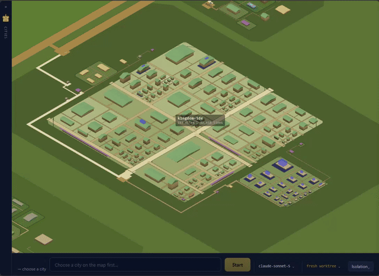
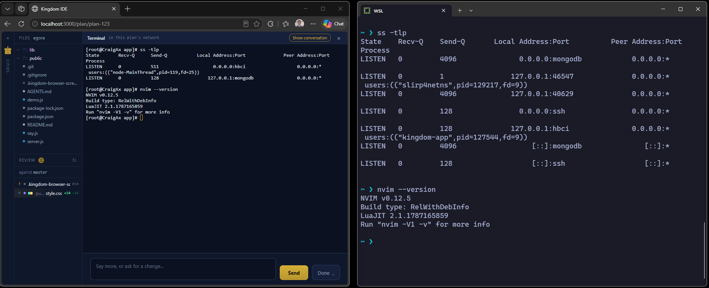
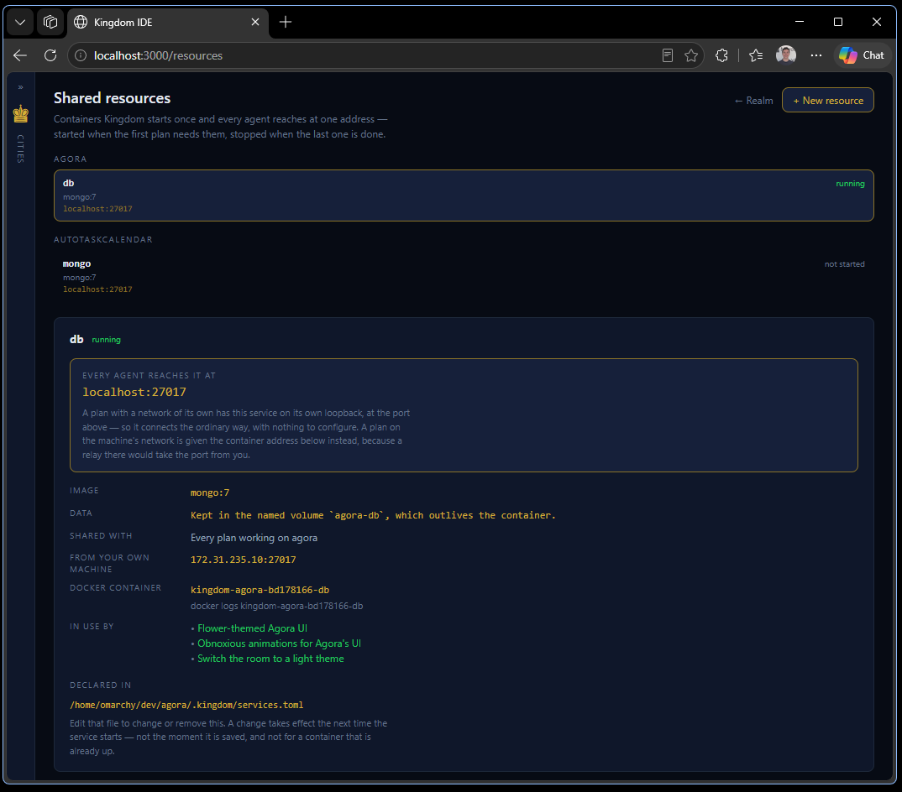
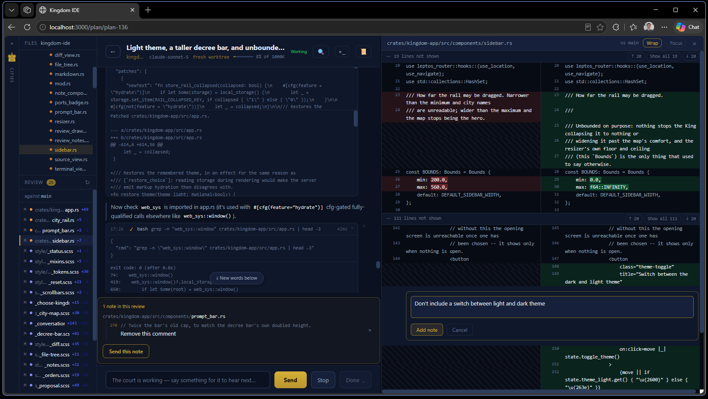
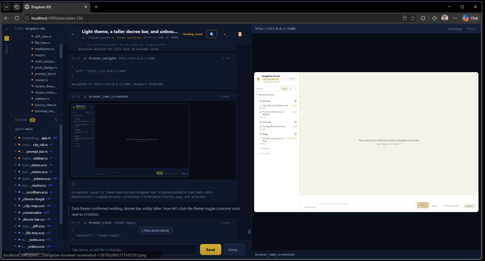

<div align="center">

# Kingdom IDE

**A command surface for coordinating many coding agents at once.**

[](rust-toolchain.toml)
[](https://leptos.dev)
[](Cargo.toml)


</div>

[Watch the video deep dive](https://www.youtube.com/watch?v=M9V98lRt9J8) or read on below for the highlights.

## What it is

Kingdom IDE is not an editor that happens to have AI in it. Open the folder that
holds your projects: each one becomes a **city**, and work is proposed as a
**plan** — drafted by a model in its own git worktree — that you approve or
reject. You are the King, and your scarce resource is judgement, not keystrokes.

It exists to answer three questions at a glance:

1. What is every agent doing right now?
2. What shared resources are they holding, and who is blocked behind whom?
3. What are they proposing that I need to decide on?

> Question 2 is the goal, not the state of play — resource arbitration is **not
> built yet**.

## Key features

### Workspace and changes visualization



Your whole project folder is visualized for you in a town. Each agent acts as an
architect, making plans of how they'd like to change the town. The size of
buildings corresponds to the lines of the file, and the size of the roads
correspond to how connected that file is to others in the project. Any changes
made by the agents is also visualized.

The end result is you can have 10 agents working at once on the same project,
and at a glance get a view of where the changes are concentrated, and whether
they are touching any crucial files or rarely used ones.

Like a [mind palace](https://en.wikipedia.org/wiki/Method_of_loci), it's easier
to explore and gauge how severe (or not) a set of changes is without reading
all of the code in detail. Also, it has that Dwarf Fortress / Age of Empires
feel to it.

### Isolation only for what matters



Agents get isolated file access and network, but still get access to the tools
already installed on your machine — no need to manage a bunch of Linux
container images. Containers work great, but they're heavy: each one has its
own file system, when really you just want to share what's already on your
file system while restricting access to the important bits.

Kingdom IDE does this with Linux namespaces to share sane defaults, so each
plan can use the tools you already have on your host machine (like `ss` in the
screenshot above) without being able to find or touch other projects on your
file system. Network isolation makes it easy to run 10 agents at once who are
all convinced they own port 3000, and still reach them from the host for
testing.

### Better shared resources



Kingdom IDE uses a 'Resource' metaphor to quickly understand what's being
asked for. Make one database and share it across multiple agents, letting
them do things like read each other's logs or implementations without
impacting each other's actual files or changes — one Docker container as a
test database, instead of one per agent.

### Review tools and processes





Add comments to specific sections of files, merge or archive chats, and give
your agent a browser tool to do some quick testing — all directly in
Kingdom IDE.

## Quick start

Prerequisites: Rust (the pinned toolchain installs itself from
`rust-toolchain.toml`) and `cargo-leptos`.

```bash
cargo install cargo-leptos
cargo leptos serve      # http://127.0.0.1:3000
```

Point it at the folder holding your projects — or press **“Enter the Proving
Grounds”** for a synthetic one. No credential is needed: with none configured,
Kingdom falls back to an offline mock model. Copy `.kingdom.env.example` to
`.kingdom.env` to change that.

When pointing Kingdom IDE at Kingdom IDE, rehearse against a realm instead:

```bash
KINGDOM_REALM=kingdom-mirror KINGDOM_SANDBOX=1 cargo leptos watch
```

- `KINGDOM_SANDBOX=1` — refuse any folder outside the proving grounds.
- `KINGDOM_REALM=<name>` — open that realm at startup instead of the picker.
- `cargo run -p kingdom-app --bin kingdom-seed -- --list` — seed realms by hand.

The fixtures are plain Rust in `crates/kingdom-core/src/mockdata/fixtures.rs`;
edit and re-seed with `--force`.

## Project layout

```
crates/kingdom-core      Domain model. No I/O — compiles to native and wasm32.
crates/kingdom-app       Axum server + Leptos UI, split by feature flag.
crates/kingdom-citymap   The map: projects as settlements, in Bevy.
crates/kingdom-browser   Headless Chrome over CDP (native only).
style/main.scss          All styling.
```

## Development

```bash
cargo test-all           # the whole native suite
cargo fmt --all
cargo clippy --workspace --all-targets --no-default-features --features kingdom-app/ssr
cargo check -p kingdom-app --target wasm32-unknown-unknown --features hydrate --no-default-features
```

## Documentation

[`AGENTS.md`](./AGENTS.md) is the working guide: the product, the naming rule,
the crate map and the invariants. [`docs/`](docs) holds the references —
[architecture](docs/architecture.md), the [agent loop](docs/agent-loop.md),
[the map](docs/citymap.md) and [shared resources](docs/shared-resources.md).

## Acknowledgements

This was hugely based upon
[Scott Opell's `phoenix-ide`](https://github.com/scottopell/phoenix-ide/), which
was an amazing starting point. Thank you Scott!

## License

This project is licensed under the MIT License — see [LICENSE](LICENSE) for details.
