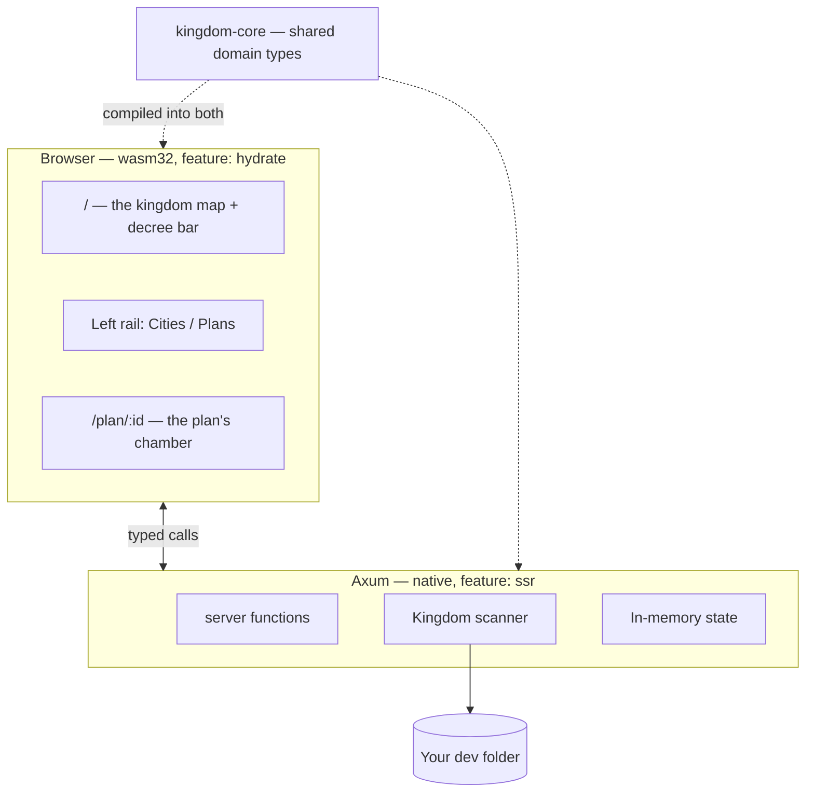
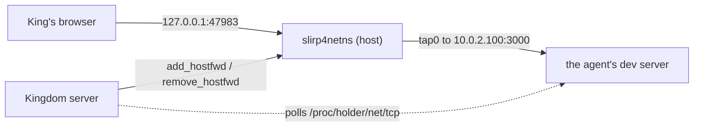
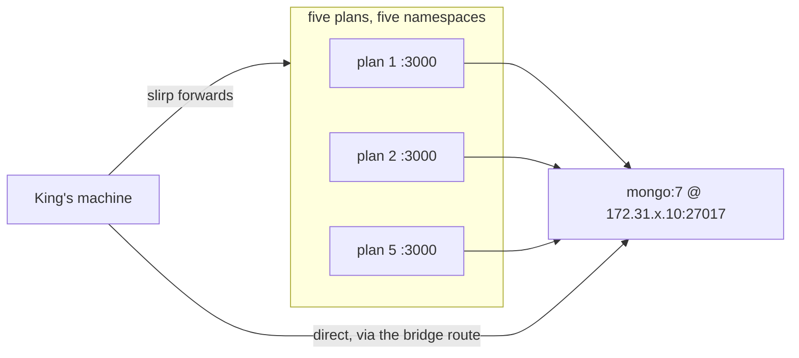

# Architecture

The crate-by-crate map of Kingdom. [`AGENTS.md`](../AGENTS.md) carries the
one-line version and the invariants; this is the reference behind it.

## The crates

Rust end to end. Axum server, Leptos (WASM) browser UI, one shared domain crate.

```
crates/
  kingdom-core/     Domain model. No I/O, no framework deps. Compiles to
                    BOTH native and wasm32 — keep it that way.
    ids.rs          Newtyped IDs (CityId, PlanId)
    model.rs        Kingdom, City, Plan, Proposal; Folder/SourceFile/Language
    permissions.rs  Permissions = what a plan may do to the world
    proposal.rs     Splitting a proposal into the blocks the King annotates,
                    and diffing a revision against its predecessor. Shared
                    deliberately: the browser splits to offer a target and the
                    server splits to quote it back, and two answers to "where
                    does a block begin" is how those come to disagree
    review.rs       What a plan changed, and how one file differs, as pure
                    data, already paired for a side-by-side view. FileText and
                    FileStamp live here too: one file whole and byte-exact for
                    editing, and the cheap "is this still what I opened?"
    naming.rs       slugify — a plan's title turned into its branch name
    palette.rs      WHICH AGENT did this: one hue per plan, light for lines
                    added and dark for removed. The third colour axis, and it
                    needs its own: PlanStatus::color says what an agent is
                    DOING and Language::tint says what the code IS.
                    `assign_banners` is hash-with-de-collision — stable across
                    restarts, but two live plans are NEVER the same colour
    services.rs     The services/mounts manifest, its validation, the scopes,
                    and rendering a block back out. Pure and wasm-safe
    sample.rs       Placeholder starter plans
    mockdata/       The Proving Grounds: synthetic fixtures, in Rust.
                    fixtures.rs is THE FAKE DATA

  kingdom-app/      Server + UI in one crate, split by feature flag.
    main.rs         Axum binary                              (ssr)
    bin/kingdom-seed.rs   Seeds a proving ground             (ssr)
    lib.rs          wasm entry point                         (hydrate)
    api.rs          #[server] functions — the browser/server bridge, and
                    nothing else. The kingdom's records live behind `lock`,
                    `update`, `snapshot` and `remember` here
    turn.rs         Taking turns with the model: the agent loop (`converse`),
                    the subagents it sends, and how a turn settles or stops.
                    Carved out of api.rs because one is a request and the other
                    a conversation that outlives the request that started it.
                    Stopping is shared with api::stop_plan through turns.rs
                    rather than by either side reaching into the other   (ssr)
    scan.rs         Filesystem scanning                      (ssr)
    events.rs       Publishing a plan's changes to its watchers, and a digest
                    of every plan to the rail                 (ssr)
    watch.rs        The chamber's push socket, and the rail's
    screencast.rs   The King's live view of a plan's browser  (ssr)
    namespaces/     Namespaces of a plan's own. ssr, Linux only at runtime
      mod.rs        The holder, the registry, and enter_prefix. ONE holder
                    process per plan
      net.rs        slirp4netns, forwards and relays, and a watch on
                    /proc/<holder>/net/tcp for ports the agent opened
      mount.rs      The mount set, a pivot_root into it, a resolver of its own,
                    and the folders the King allows in
    terminal.rs     The King's own shell, in a plan's workspace and its
                    network. One shell per plan, outliving any socket
    artifact.rs     Serving a file a plan's work left behind
    profile.rs      The King's own ~/.kingdom                 (ssr)
    review.rs       What a plan changed against the default branch, and one
                    file's diff, read with git                (ssr)
    edit.rs         The King's own edits: one file read whole and byte-exact,
                    written back, or removed. review.rs reads a file for
                    LOOKING AT (numbered, truncatable); this reads one for
                    CHANGING, so it never truncates and never reshapes  (ssr)
    highlight.rs    Syntax colour, server-only ON PURPOSE — tokenising before
                    the lines go over the wire keeps syntect and 213 syntax
                    definitions out of the wasm bundle. Cost is quadratic in a
                    LINE's width, and a minified bundle is one very long line,
                    so it has guards review.rs's byte and row caps do not cover
    store.rs        The kingdom's records on disk            (ssr)
    turns.rs        Which plans have a turn running in this process  (ssr)
    services.rs     The registry, the conversation with Docker, the ledger,
                    and the manifest writer                  (ssr)
    worktree.rs     Preparing and disposing of a plan's workspace  (ssr)
    llm/            Drafting plans with a model              (ssr)
                    mod.rs (Model/Provider traits, Brief, Reply/Answer),
                    system_prompt.rs (everything the model is told, ported from
                    Phoenix IDE, with permissions LAST), mock.rs (offline),
                    copilot.rs, catalogue.rs, credential.rs
    skills.rs       Finding a project's skills on disk       (ssr)
    tools/          What the court can do with its own hands (ssr)
                    mod.rs (Tool trait, Sandbox = the workspace boundary, the
                    one place Permissions become a list of tools, and
                    child_environment — what a plan's bash/tmux children get
                    beyond what the server inherited: empty for an ordinary
                    project, and for a Kingdom checkout KINGDOM_MODEL=mock and
                    a KINGDOM_HOME inside the workspace, so a rehearsal server
                    cannot spend the King's credential or write into his
                    profile), think, read_file, read_image, search, skill,
                    bash, tmux, patch, browser, profile, propose_plan,
                    spawn_agents, ask_user_question

    app.rs          Shell, routes, shared UI state
    components/     sidebar.rs, prompt_bar.rs, conversation.rs,
                    markdown.rs (the court's prose: markdown, and mermaid
                    fences drawn as diagrams. Raw HTML is escaped, never passed
                    through — the text is model output and it lands via
                    inner_html), browser_view.rs, resizer.rs (the drag handle
                    the rail, the focused panel and the files rail's split all
                    share), city_rail.rs over file_tree.rs and
                    review_drawer.rs, source_view.rs and diff_view.rs (those
                    two and the spyglass are alternatives for one panel, see
                    `Aside`, and every line of either takes a note),
                    note_composer.rs (the one box a note is written in, shared
                    with the proposal's margin), review_notes.rs,
                    wells.rs (the shared-resources screen), ports_badge.rs,
                    proposal/ (mod.rs the card, body.rs the annotatable blocks,
                    notes.rs the gathered margin, diff.rs a revision against
                    what it revises)

  kingdom-citymap/  The map: every project drawn as a town on one disk.
                    **Vendored** — Repo City
                    (github.com/craigloewen-msft/repo-city-visualizer, MIT),
                    copied in at 449f090 rather than depended on, so there is
                    one project to maintain rather than two. Edit it here.
                    Split by feature the same way kingdom-app is: `build`
                    walks the disk and must never reach wasm; `engine` is Bevy
                    and must never reach the server.
    map/            The manifest: world-space geometry, plain serialisable
                    data. The one *seam* on both targets. `works.rs` is the
                    exception that proves it — what every live agent in the
                    KINGDOM is changing, grouped by (CITY, PATH) rather than by
                    plan, so a file three agents share is one house wearing
                    three bands and two projects' src/main.rs stay two files.
                    Here rather than in `engine` so `cargo test` can pin it
    progress.rs     How much of the manifest has arrived, as a fraction and a
                    line of text. On both targets because view.rs is
                    hydrate-only, so arithmetic left there is never compiled
                    by the suite
    build/          Scanning a kingdom and laying it out (ssr). Repo City's own
                    `Survey` was deliberately NOT taken: it finds projects by
                    looking for `.git` and so drops a folder without one
    engine/         Drawing it with Bevy (hydrate, plus native for its tests).
                    activity.rs and works.rs are the two parts fed from outside
                    the manifest, polled rather than pushed. NOTHING on the map
                    animates itself; size is the only channel magnitude has.
                    stars.rs rides on the camera in pixels, since the
                    projection is orthographic and a star in the scene would
                    zoom with the kingdom. raise.rs builds a world a slice at a
                    time so the loading bar can move (see citymap.md).
                    input.rs holds `Steering`: a drag or a wheel takes the
                    camera away from the interface until the King hands it back
    follow.rs       When the rail's map may move its camera, and where. The
                    rule: the King opens a file, the chamber becomes about a
                    different city, or the map changes home — and NOTHING else.
                    A pure function, because a rule left in an effect is a rule
                    nothing can pin. Its memory holds the PATH as well as the
                    city, or a new file cannot be told from a stray wake
    view.rs         `CityMap` — the canvas, the loading card, the free-look
                    chip. Also publish_status: under automation the engine's
                    ViewerStatus is mirrored onto window.__kingdom_map so a
                    browser test can assert on values rather than pixels
    mode.rs         Whether the map draws at all, and at what pace

  kingdom-browser/  Headless Chrome over CDP. Native only.
                    The Tool impls over it live in kingdom-app.
    session.rs      Per-plan Chrome, finding one on the machine, and the
                    operations the tools call. Three things are load-bearing
                    and easy to undo: HOVER_SETTLE, which rests the pointer on
                    a target before pressing it (chromiumoxide moves and
                    presses in one CDP batch, so a page that decides what a
                    click means from what is hovered never sees the move —
                    which is why nothing could click the map); DEFAULT_VIEWPORT,
                    chosen against Kingdom's own responsive thresholds; and
                    WebGL, on by default, held affordable by two ceilings that
                    are both needed (see citymap.md for the measurements).
                    A session also ends: on the plan settling, after
                    KINGDOM_BROWSER_IDLE, and by sweep_orphans at startup for
                    browsers a killed server never closed
    screencast.rs   CDP screencast, relayed to the spyglass. Paced by holding
                    the CDP ack, the only throttle Chrome offers: unpaced it
                    ran at 68fps and doubled the cost of the browser it watched
    profile.rs      Metrics, CPU/trace/coverage, the per-run perf reading
    perf.rs         The in-page helper injected before any page script

style/main.scss     All styling
```

## Why one crate builds two targets

`kingdom-app` compiles twice: natively with `--features ssr` into the Axum
server, and to `wasm32` with `--features hydrate` into the browser bundle.
A `#[server]` function is a real HTTP call on the client and a direct call on
the server, from **one** signature.

This is the main reason the project is Rust on both ends. There is no
hand-written API client and no schema to keep in sync: change a field on `City`
and both sides fail to compile together, rather than one side failing at runtime
in front of a user.

**Consequence to respect:** anything in `kingdom-core` must compile to wasm.
No `tokio`, no `std::fs`, no native-only crates. Server-only code goes in
`kingdom-app` behind `#[cfg(feature = "ssr")]`.



## How far a plan is walled off

The first real answer to the product's second question — *what shared resources
are these agents holding?* — for two of them: **ports** and **the disk**.

`Isolation` is one axis with three rungs, chosen per plan and **off by default**:

| Shown as | In code | What it gets |
|---|---|---|
| On this machine | `Isolation::Shared` | Nothing of its own. The default. |
| A network of its own | `Isolation::Isolated` | Its own loopback and ports, forwarded back to the King |
| A machine of its own | `Isolation::Sealed` | That, plus its own filesystem and process table |

Its own axis rather than more `WorkspaceMode` variants, because "can this agent
trample my folder?" and "can it trample my port?" are independent questions.
Within the axis the three are a **ladder**, not a menu: each rung is the one
below plus more, which is what lets `is_isolated()` stay the single question
~100 call sites already ask. `Plan::isolation` carries
`#[serde(alias = "network")]`, because the field was called `network` while it
only answered about the network and plan records on disk say so.

### One holder, several namespaces

Exactly one holder process per plan, taking whichever namespaces that plan asked
for. Two holders — one for the network, one for the mounts — was tried and
**rejected on a measurement**: two separately created user namespaces are
siblings, and an unprivileged process may not enter a sibling user namespace. It
works only when the server happens to run as root, and where it fails it fails
in the worst way, attaching the network and silently not the mounts.



Three unprivileged processes per isolated plan: an `unshare` **holder** that
owns the namespace and keeps it alive between tool calls, **slirp4netns** giving
it a way out, and `nsenter` putting everything else in. `bash`, `tmux`, Chrome
and the King's terminal all prepend `namespaces::enter_prefix`, which is **empty
for a shared-network plan** — that emptiness is what makes the default path
behave exactly as it did before this existed.

Five things learned by running it:

- **`nsenter` needs `--preserve-credentials`.** Re-entering a namespace you made
  yourself otherwise fails with `setgroups failed`. A test pins the flag: its
  absence is not a compile error, it is a tool that mysteriously will not run.
- **Port discovery costs one file read.** `/proc/<holder>/net/tcp` read from the
  host *is* the namespace's table. Only state `0A` counts.
- **A forward can only ever land on `tap0`**, and the relay is written in Rust
  rather than reaching for `socat`, which would otherwise become a prerequisite.
- **The namespace lives in a process, not on disk.** A restarted server has an
  empty registry while plan records still say `Isolated`, so every entry point
  calls `namespaces::ensure` before reading the prefix, and `reclaim_previous`
  kills what the last server left — identified by namespace and command line,
  never by pid alone. Skipping that `ensure` in `terminal.rs` was a real bug:
  the King got a shell on his *own* network while the header said otherwise.
  Nothing here may fall back to the host network silently. A second version of
  the same trap hit **tmux**, whose socket is named from the plan id and is
  found again after a restart regardless — so `ensure_server` compares the
  daemon's `/proc/<pid>/ns/net` against the namespace the plan should be in, and
  restarts on a mismatch rather than trusting that a live daemon is the right
  one.
- **The browser's two wrappers nest; they do not compete.** CPU confinement
  (`taskset`) and namespace entry (`nsenter`) both want to be the executable
  chromiumoxide launches, and setting `chrome_executable` twice silently keeps
  only the last. They are composed, `nsenter -> taskset -> chrome`, so an
  isolated plan's browser is confined *and* in its own network — which matters
  more since WebGL became the default.

**An isolated plan cannot reach the host's loopback**, by design: slirp4netns
runs with `--disable-host-loopback`, so the King's own `127.0.0.1:3000` answers
nothing from inside. That is the collision being prevented, with one surprising
consequence: such a plan cannot browse *this* Kingdom's map at `?map=on`. See
[`citymap.md`](citymap.md#looking-at-the-map-from-a-plans-browser).

**It is not a security boundary.** A process in the namespace still has the
whole filesystem and the King's uid. It cannot take another plan's port; it can
still delete his home directory. The same admission `Sandbox::root` makes about
paths: a limit people can see beats a guarantee that does not hold.

`slirp4netns` is **required**, not optional. Without it a namespace has only
`lo` — no DNS, no crates.io, no git — so Kingdom refuses to open an isolated
plan and names the package, rather than degrading to something that breaks every
build.

### What a sealed plan can see

Its workspace and its project's `.git` (writable), a read-only `/usr` and
`/etc`, a private `/tmp`, a fresh `/proc` — and whatever folders the King has
allowed in, declared as `[[mount]]` blocks in the same manifests that declare
shared services. [`shared-resources.md`](shared-resources.md) has the format.

The isolation panel offers a **quick-add** list built from his own `PATH`,
because that is the only honest answer to "which tools do I have". A recognised
entry brings the folders its tool actually needs — `~/.cargo` without `~/.rustup`
gives a `cargo` that re-downloads the toolchain, measured — and an unrecognised
one is offered read-only. Windows folders under `/mnt/c` are dropped: WSL
appends the whole Windows `PATH`, which put twenty-five unusable `.exe`
directories in front of the four that mattered.

Five things about the mount namespace that were measured rather than assumed,
each a silent wrong answer rather than an error:

- **`nsenter --wdns`, not `--wd` and not `current_dir`.** Every caller sets the
  working directory host-side, and that path is resolved *before* the mount
  namespace is entered — so a sealed plan ran every command in `/`.
- **tmux is stamped with its holder** rather than asked for `#{pid}`, which in a
  PID namespace is that namespace's numbering and named an unrelated host
  process.
- **The tmux socket directory crosses the private `/tmp`**, or the daemon is
  invisible to the 14 host-side calls that drive it.
- **A resolver of our own**: `/etc/resolv.conf` is a symlink to somewhere
  unmounted on both WSL and systemd-resolved machines, so DNS fails while the
  network is perfectly up.
- **`/bin` is a symlink and must not be mounted.** Every current distribution is
  merged-usr; only a genuinely split-usr host gets binds.

Two further bugs were found only by running it: the private `/tmp` was mounted
*after* the binds beneath it, hiding a workspace under `/tmp`; and `/proc` was
never created in the new root, which killed the holder and surfaced a second
later as an unrelated `nsenter` error. Both have regression tests.

The live tests that prove all of this are opt-in, because the suite must run on
a bare machine:

```bash
cargo test -p kingdom-app --features ssr --no-default-features -- --ignored live::
```

## A database of the city's own

The other half of the second question. Network isolation stops agents colliding
over a port; this is for the resources that are meant to be **shared**. A
project's database is not a collision to prevent — it is a common good every
agent must reach, started once and stopped once.

Shown to the King as **the well**; a shared service in code. What he can do and
every field of a manifest is in
[`shared-resources.md`](shared-resources.md); what follows is the mechanism.

`services::reconcile` is the only thing that starts or stops one, driven by the
**live agent population** rather than by any single plan: handed every live,
non-subagent plan, it raises what they can reach (once per scope) and stops what
nobody is left drawing from. `api::reconcile_wells` calls it at the four moments
that population changes — a kingdom opened, a plan opened, a plan finished, a
kingdom closed — which is what makes a server restart invisible to five agents
that had a database. Taking a turn and opening a shell call `services::require`,
which waits for a raise in flight and refuses if a promised well is missing; it
raises no container, but it *is* where `namespaces::net::open_wells` stands the
relay onto an isolated plan's own loopback — that relay belongs to one plan's
namespace, so it cannot be done by the per-scope pass.

A well is declared at one of **two levels**, and the level decides only which
file the declaration lives in:

| Level | File | Reached by | Registry key |
|---|---|---|---|
| a project | `<city>/.kingdom/services.toml`, committed | plans on that project | the city's key |
| the King's machine | `$KINGDOM_HOME/services.toml`, never committed | plans on **every** project | `host` |

Everything downstream is a function of that key — the network `kingdom-<key>`,
the container `kingdom-<key>-<name>`, the `/24` hashed from it, the reference
count. So the second level cost a `Scope` type rather than a branch in six
places, and a host well is stopped when the last plan *anywhere* lets go.
`scopes_for` returns host first so a project's own declaration wins where the
two collide: the more specific statement is the one the project meant.

A well is also **drawn on the map**, standing on its city's square, with a
channel to each agent drawing from it — which is what makes "isolated, yet still
reaching the database" a picture rather than a paragraph. See
[`citymap.md`](citymap.md#wells-and-networks-what-each-agent-is-plugged-into).



The design turns on **one measurement**, taken from inside a real namespace:

| Probe | Result |
|---|---|
| namespace → container on a bridge (`172.17.0.2`, `172.31.77.10`) | **reachable** |
| namespace → host loopback (`127.0.0.1`, a published port) | **refused** |

`slirp4netns --disable-host-loopback` blocks `127.0.0.1` and *nothing else*, so
a Docker bridge is just another host route. The obvious design is therefore the
one that cannot work: publishing the container and pointing plans at
`127.0.0.1` is exactly the second line. Kingdom publishes **nothing** and gives
each service a fixed address on a per-scope network instead. The converse is
what lets a plan use the friendly address anyway: the loopback that is refused
is the **host's**, and the plan's own is empty and free, so Kingdom relays each
service onto it.

Seven things worth knowing:

- **The address is assigned, not allocated** — from the service's position in
  the manifest, which is what makes it knowable *before* the container exists,
  and therefore printable in the badge and reachable by the relay.
- **It is an IP, not a name.** Docker's DNS resolves service names only between
  containers on the same network; neither the host nor a plan's namespace can
  resolve `db`.
- **Plans find it at `localhost`, and nowhere else.** No environment variable is
  set for a shared resource: one address, learned one way. `services::address_for`
  is the single place that decides it, read by the system prompt, the ports
  badge and the resources screen alike.
- **An isolated plan is given `localhost`, not the IP** — `open_wells` stands a
  relay on `127.0.0.1:<port>` *inside that plan's namespace*. A plan on the
  machine's network keeps the IP, because binding its `127.0.0.1` would take the
  King's real port. Matched by **container**, not port number: two resources can
  want `:6379`, only one gets the loopback, and the other must not be sent into
  the first one's data.
- **A well's port is never forwarded back to the King.** Its relay listens
  inside the namespace, so `forwardable` drops it, or the ports badge would
  offer him a MongoDB socket to open in a browser tab.
- **Reference counted by plan id, not by an integer.** A plan closed twice
  cannot decrement twice and strand the four still using it. A test pins that.
- **Adopted on restart, not killed** — the one place this deliberately differs
  from `reclaim_previous`. A stale namespace is worthless; a stale database
  holds state. The container is stopped rather than removed and its named volume
  kept.

**The host needs nothing built.** `docker network create --subnet` installs a
host route via its own `br-*` interface, so the King can open the address
directly. An in-process TCP proxy was drafted for this and deleted: it re-solved
a problem the kernel had already solved.

**Not a sandbox**, the same admission `namespaces/` makes: a container Kingdom
starts is an ordinary container, visible to `docker ps`, and a plan can run
`docker` itself. **Docker missing is a refusal**, on the rule
`NetworkError::SlirpMissing` sets — a city that declares a database and silently
runs without one fails later in a way that reads as a bug in the project.

The `shopfront` realm is the rehearsal: one city, one MongoDB, and a real
runnable Node ledger for five agents to write to at once. Unlike every other
fixture its files are real code, because a claim about the network cannot be
tested with sized filler.

## Where state lives

Everything Kingdom records about itself lives in the King's own profile —
`~/.kingdom/`, or wherever `KINGDOM_HOME` points — rather than inside the folder
he opened:

```
~/.kingdom/
  settings.json                  durable IDE settings; today, the last kingdom opened
  services.toml                  shared resources the King keeps for every project
  kingdoms/<key>/
    kingdom.json                 which root this folder is for
    plans/<plan-id>.json         one document per plan
    plans/<id>--<slug>.md        the plan itself, filed when its worktree goes
    archive/<plan-id>.patch      the work an archived plan set aside
  realms/<name>/                 the proving grounds
```

`services.toml` sits at the top rather than under `kingdoms/<key>/` because a
host well is offered to every kingdom the King opens — that is the whole
difference between it and a project's own. It also means a plan rehearsing
Kingdom itself declares and sees its own, since `tools::child_environment`
points such a plan at a `KINGDOM_HOME` inside its workspace.

`<key>` is the folder's own name plus a hash of its resolved path, so two
projects both called `dev` do not share a drawer. It is derived and never
authoritative: `kingdom.json` holds the real root.

Cities are **not** stored — they are rescanned every open, because disk is their
source of truth. Plans are, because a plan owns a worktree and forgetting it
orphans real work.

**Why out here.** Which folder was last opened is the one fact that cannot be
read from inside a kingdom not yet opened, so it has nowhere else to live — and
that is what lets the server come up on the map instead of the folder picker.
The rest followed it: a plan record is Kingdom's bookkeeping, not the user's
repository's, and `realms/` used to default to a *relative* path, so which
proving grounds existed depended on where the server was launched from.

A kingdom recorded under the old layout is migrated on open. It **copies** and
never deletes — a plan record is the one thing disk cannot tell us again, so a
bug in that path must be survivable.
