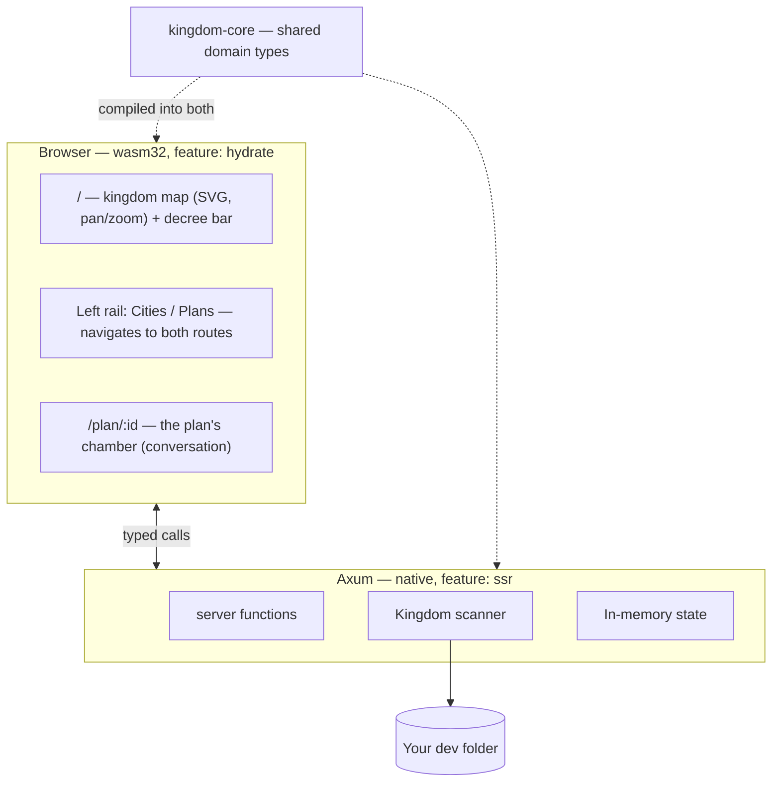
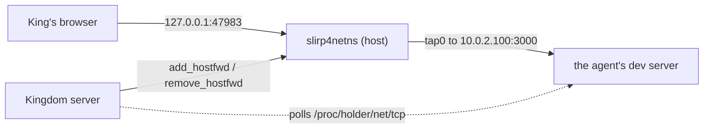
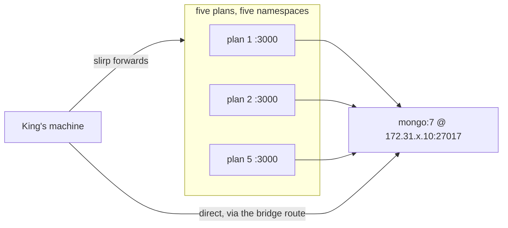

# Architecture

The crate-by-crate map of Kingdom, in full. [`AGENTS.md`](../AGENTS.md) carries
the one-line version and the invariants; this is the reference behind it.

## The crates

Rust end to end. Axum server, Leptos (WASM) browser UI, one shared domain crate.

```
crates/
  kingdom-core/     Domain model. No I/O, no framework deps. Compiles to
                    BOTH native and wasm32 — keep it that way.
    ids.rs          Newtyped IDs (CityId, PlanId)
    model.rs        Kingdom, City, Plan, Proposal (a plan put to the user),
                    Folder/SourceFile/Language (a project's shape on disk)
    permissions.rs  Permissions = what a plan may do to the world
    proposal.rs     Reading a proposal: splitting one into the blocks the King
                    annotates, and diffing a revision against its predecessor.
                    Shared deliberately — the browser splits to offer a target
                    and the server splits to quote it back, and two answers to
                    "where does a block begin" is how those come to disagree
    review.rs       What a plan changed, and how one file differs, as pure
                    data. The rows arrive already paired for a side-by-side
                    view; every decision needing a repository is made in
                    kingdom-app::review. FileText/FileStamp live here too: one
                    file whole and byte-exact for the King to edit, and the
                    cheap "is this still what I opened?" a save is checked
                    against
    naming.rs       slugify — a plan's title turned into its branch name
    palette.rs      WHICH AGENT did this: one hue per plan, in two values
                    (light = lines added, dark = lines removed). The third
                    colour axis, and it needs its own because the other two
                    are spoken for — PlanStatus::color says what an agent is
                    DOING and Language::tint says what the code IS, and
                    neither can say who is touching a file. Hues were picked
                    by search against the status palette, and tests pin the
                    separation. `assign_banners` is hash-with-de-collision:
                    stable across restarts, but two live plans are NEVER the
                    same colour, because two agents on one house that cannot
                    be told apart is the failure the feature exists to fix
    sample.rs       Placeholder starter plans
    mockdata/       The Proving Grounds: synthetic fixtures, in Rust
                    mod.rs (FixtureSpec + expansion), fixtures.rs (THE FAKE
                    DATA), build.rs (terse constructors),
                    starter_plans.rs (the plans a kingdom opens with)

  kingdom-app/      Server + UI in one crate, split by feature flag.
    main.rs         Axum binary          (feature: ssr)
    bin/kingdom-seed.rs   Seeds a proving ground   (feature: ssr)
    lib.rs          wasm entry point     (feature: hydrate)
    api.rs          #[server] functions  — the browser/server bridge, and
                    nothing else. The kingdom's records live behind `lock`,
                    `update`, `snapshot` and `remember` here, which is why
                    `turn.rs` calls back into it
    turn.rs         Taking turns with the model: the agent loop (`converse`),
                    the subagents it sends (`spawn_subagents`), and how a turn
                    settles, stops or is asked again. Carved out of `api.rs`,
                    which was holding both the wire and the loop — one is a
                    request, the other a conversation that outlives the request
                    that started it. Two ways in: `api::draft_plan` and
                    `tools::spawn_agents`. Stopping is shared with
                    `api::stop_plan` through `turns.rs` rather than by either
                    side reaching into the other (ssr only)
    scan.rs         Filesystem scanning  (ssr only)
    events.rs       Publishing a plan's changes to its watchers, and a digest of
                    every plan to the rail (ssr only)
    watch.rs        The chamber's push socket, and the rail's (the route
                    constants cross to wasm; the handlers are ssr only)
    screencast.rs   The King's live view of a plan's browser (ssr only)
    netns.rs        A network of a plan's own: an unprivileged user+net
                    namespace per isolated plan, held open by an `unshare`
                    process, given a way out by `slirp4netns`, and entered by
                    everything the plan runs. Also watches
                    /proc/<holder>/net/tcp for ports the agent opened and asks
                    slirp to forward each to a host port. ssr only, and Linux
                    only at runtime -- availability() refuses elsewhere
    terminal.rs     The King's own shell, over a socket, in a plan's workspace
                    and its network — the door into an isolated plan (route +
                    URL on both targets via `terminal_route`; the pty ssr only)
    artifact.rs     Serving a file a plan's work left behind, e.g. a
                    screenshot the chamber renders (route + URL on both
                    targets; the handler ssr only)
    profile.rs      The King's own ~/.kingdom: durable settings, and where each
                    kingdom's records are kept (ssr only)
    review.rs       What a plan has changed against the default branch, and one
                    file's diff, read out of its workspace with git (ssr only)
    edit.rs         The King's own edits: one file read whole and byte-exact,
                    written back, or removed. review.rs reads a file for
                    LOOKING AT (numbered, truncatable); this reads one for
                    CHANGING, so it never truncates and never reshapes. Holds
                    the stamp check that stops a save overwriting what the
                    court did while he was typing (ssr only)
    highlight.rs    Syntax colour: a file's lines split into runs of one kind
                    each, for the source panel. Server-only ON PURPOSE —
                    tokenising before the lines go over the wire is what keeps
                    syntect and 213 syntax definitions out of the wasm bundle,
                    the same division diff spans already follow. Holds the two
                    guards `review.rs`'s byte and row caps do not cover: cost is
                    quadratic in a LINE's width, and a minified bundle is one
                    very long line that passes both (ssr only)
    store.rs        The kingdom's records on disk (ssr only)
    turns.rs        Which plans have a turn running *in this process*, and the
                    King's way of stopping one (ssr only)
    mock.rs         Seeding a fixture onto disk (ssr only)
    worktree.rs     Preparing and disposing of a plan's workspace (ssr only)
    llm/            Drafting plans with a model (ssr only)
                    mod.rs (Model + Provider traits, Brief, Reply/Answer, the
                    provider
                    list), system_prompt.rs (everything the model is told,
                    ported from Phoenix IDE: base prompt, the project's
                    AGENTS.md, the skill catalogue, where it stands, and its
                    permissions LAST),
                    mock.rs (offline provider), copilot.rs (Copilot provider +
                    its /models catalogue), catalogue.rs (assembles one
                    catalogue from every provider), credential.rs
    skills.rs       Finding a project's skills on disk (ssr only)
    tools/          What the court can do with its own hands (ssr only)
                    mod.rs (Tool trait, Sandbox = the workspace boundary,
                    the one place Permissions become a list of tools, and
                    child_environment — what a plan's bash/tmux children get
                    beyond what the server inherited. Empty for an ordinary
                    project; for a Kingdom checkout it pins KINGDOM_MODEL=mock
                    and a KINGDOM_HOME inside the workspace, because a
                    rehearsal server otherwise inherits the King's credential
                    and writes its throwaway records into his own profile),
                    think, read_file, read_image, search, skill, bash, tmux,
                    patch, browser, profile (browser_profile),
                    propose_plan (the gateway from proposing to working: the
                    court drafts its plan to .kingdom/draft.md with a scoped
                    patch, then proposes that path — Phoenix's flow, ported.
                    That draft is the plan, and store::file_plan copies it out
                    of the worktree before it is destroyed),
                    spawn_agents (subagents), ask_user_question

    app.rs          Shell, routes, shared UI state
    components/     sidebar.rs, prompt_bar.rs, conversation.rs,
                    markdown.rs (the court's prose rendered: markdown, and
                    mermaid fences drawn as diagrams. Raw HTML is escaped,
                    never passed through — the text is model output and it
                    lands via inner_html. Mermaid itself is vendored at
                    public/vendor/ and fetched only when a fence appears),
                    browser_view.rs, resizer.rs (the drag handle the rail, the
                    focused panel and the files rail's split all share — it
                    drags height as well as width; and, beside it, the
                    remembering of a panel's own view preferences),
                    city_rail.rs (the files rail's column, split between) over
                    file_tree.rs (the plan's workspace on disk — a file row
                    opens it in the panel) and review_drawer.rs (every
                    file this plan has changed),
                    source_view.rs (one file read whole, and — in its other
                    mode — open for the King to edit, save or delete) and
                    diff_view.rs (one
                    changed file, old beside new) — those two and the spyglass
                    are alternatives for one panel, see `Aside`, and every line
                    of either takes a note,
                    note_composer.rs (the one box a note is written in, shared
                    with the proposal's margin),
                    review_notes.rs (those notes gathered, and the one button
                    that sends the whole review),
                    proposal/ (the plan put to the King: mod.rs is the card,
                    body.rs draws it as blocks he can write against, notes.rs
                    is the gathered margin, diff.rs reads a
                    revision against the plan it revises)

  kingdom-citymap/  The map: every project drawn as a town on one disk, hanging
                    in space. Repo City drew an island in a sea; the sea gave
                    the world no silhouette, so the ground is now a circle with
                    a cliff, a frustum and a spire under it — `MapUnderside`,
                    proportional to the disk's own radius so a large kingdom
                    and a small one hang the same way.
                    **Vendored** — this is Repo City
                    (github.com/craigloewen-msft/repo-city-visualizer, MIT),
                    copied in at 449f090 rather than depended on, so there is
                    one project to maintain rather than two. Edit it here.
                    Split by feature the same way kingdom-app is, and for the
                    same reason: `build` walks the disk and must never reach
                    wasm; `engine` is Bevy and must never reach the server.
    map/            The manifest: world-space geometry, plain serialisable
                    data. The one *seam* on both targets — where the two halves
                    meet. `works.rs` is the exception that proves it: what
                    EVERY live agent in the KINGDOM is changing, resolved from
                    their `PlanChanges` into ground to build on, and the placer
                    that finds free land inside a folder for a file that has no
                    house yet. Grouped by (CITY, PATH) rather than by plan, so a
                    file three agents share is one house wearing three bands
                    rather than three houses claiming to be the same file — and
                    so two projects' `src/main.rs` stay two files rather than
                    fusing into one falsely-contended house. It lives here
                    rather than in `engine` so `cargo test` can pin it without
                    a browser — a ghost house landing on a real one is then a
                    test failure rather than something noticed by eye
    progress.rs     How much of that manifest has arrived, as a fraction and a
                    line of text. Also on both targets, for a smaller reason:
                    only the browser reads it, but `cargo test` builds this
                    crate with no features, and `view.rs` is hydrate-only, so
                    arithmetic left there is never compiled by the suite
    build/          Scanning a kingdom and laying it out (ssr). Repo City's
                    own `Survey` was deliberately NOT taken: it finds projects
                    by looking for `.git` and so drops a folder without one,
                    which disagrees with `kingdom-app::scan`. `manifest_for`
                    walks `Kingdom::cities` instead
    engine/         Drawing it with Bevy (hydrate, plus native for its tests).
                    `activity.rs` is the one part fed from outside the manifest:
                    which towns have agents working in them, traced as a steady
                    green ring, polled rather than pushed and never cached with
                    the geometry. `works.rs` is the second, for the same reason
                    and on the same channel: EVERY live agent's changes, raised
                    over the whole kingdom at once — not the selected city, which
                    drew nothing for a town nobody had clicked. What is being
                    BUILT rises above the roof as stacked
                    colour-per-agent columns; what is being TAKEN AWAY covers
                    the house as a shroud, over as much of it as the file is
                    losing (`WorkBand::cover`, a share of the file's own length,
                    so a deletion simply covers all of it). Nothing crosses that
                    line in either direction — removals used to stack into the
                    same upward column as additions, so a file losing 300 lines
                    grew a taller tower. Column height AND girth ramp with
                    ABSOLUTE churn (`FULL_CHURN`) — never a share of a plan's
                    own busiest file, which made two agents incomparable and
                    flattened a 400-line change against a 4-line one. NOTHING on
                    the map animates itself: neither the ring nor the bands
                    pulse, and a band's colour is its agent's exactly rather than
                    dimmed by how small the change is. Size is the only channel
                    magnitude has. Ghost
                    houses stand for files that do not exist yet. `stars.rs` is the
                    one part not in the world at all:
                    the projection is orthographic, so a star out in the scene
                    would have no parallax and would *zoom* with the kingdom —
                    it rides on the camera in pixels instead. `raise.rs` builds
                    a world a slice at a time instead of in one call, so the
                    browser gets the frame back and the loading bar can move —
                    see docs/citymap.md. `input.rs` holds `Steering`: a drag or a wheel takes
                    the camera away from the interface, so the map stops
                    re-framing itself on the open file until the King hands it
                    back or leaves it still for `RELEASE_AFTER`
    follow.rs       When the rail's map may move its camera, and where to. The
                    rule is: the King opens a file, the chamber becomes about a
                    different city, or the map changes home — and NOTHING else.
                    It answers `Stay` for every other wake, which is what an
                    agent writing a file, a status poll and a pan all are. A
                    pure function for `input.rs`'s reason: `view.rs` is
                    hydrate-only and there is no DOM under `cargo test`, so a
                    rule left in an effect is a rule nothing can pin. Its
                    memory holds the PATH as well as the city — remembering
                    only the city cannot tell a new file from a stray wake
    view.rs         `CityMap` — the canvas, the click that selects a city, the
                    loading card with the bar on it, and the free-look chip that
                    says the camera is his and offers it back. One effect reads
                    `follow::decide` and resolves its answer into geometry;
                    that resolving is here because the engine does not know
                    what a city is, the same boundary `SetWorks` is written to.
                    Also `publish_status`: under automation only, the engine's
                    `ViewerStatus` is mirrored onto `window.__kingdom_map` so a
                    browser test can assert on *values* — `built`, `hovered`,
                    `clicked.holding` — rather than on pixels
    mode.rs         Whether the map draws at all, and at what pace. An
                    automated browser stands the engine down by default;
                    `?map=on` overrides that and is now sufficient on its own
                    (WebGL is on by default), drawing a real, pickable map at a
                    capped frame rate. The cap exempts *bounded* work — capping
                    a world going up turned a three-second raise into 157
                    seconds, the same work spread over fifty times the wall
                    clock with something waiting on it

  kingdom-browser/  The headless browser: chromiumoxide/CDP driver and the
                    per-plan session manager. Native only — never in the wasm
                    bundle. The Tool impls over it live in kingdom-app.
    session.rs      Per-plan Chrome, finding one on the machine, and the
                    operations the tools call. Three things there are load-
                    bearing and easy to undo: HOVER_SETTLE, which rests the
                    pointer on a target before pressing it — chromiumoxide
                    moves and presses in one CDP batch, so a page that decides
                    what a click means from what is *hovered* never sees the
                    move in time, which is why nothing could click the map;
                    DEFAULT_VIEWPORT, chosen against Kingdom's own
                    responsive thresholds rather than as a round number
                    (KINGDOM_BROWSER_VIEWPORT overrides it); and WebGL, which
                    a plan's browser now has **by default** — it is what lets
                    an agent look at Kingdom's own map. Two ceilings keep that
                    affordable, and both are needed. Measured on the map,
                    world standing, nothing happening: 9.50 cores uncapped and
                    unconfined, 4.09 at one frame a second, 2.03 capped and
                    confined to four CPUs. The frames are the engine's job
                    (citymap engine::AUTOMATED_WAKE); the floor beneath them is
                    KINGDOM_BROWSER_CPUS (default 4), because SwiftShader sizes
                    its thread pool from the machine and spends most of what it
                    spends whether or not a frame was asked for. Confinement is
                    a `taskset` shim written into the profile, so the mask is
                    set before Chrome forks and every rendering child inherits
                    it. KINGDOM_BROWSER_WEBGL=off is the blunt instrument;
                    KINGDOM_BROWSER_CPUS=0 lifts the ceiling. `--disable-gpu`
                    does none of this and never did: it turns off *hardware*
                    acceleration, which a headless machine did not have to
                    begin with

                    A session also *ends*, which it did not use to: on the
                    plan settling (browser::dismiss, beside tmux::dismiss),
                    after KINGDOM_BROWSER_IDLE untouched and unwatched
                    (default 15m, 0 disables), and — for browsers a killed
                    server never closed — by sweep_orphans at startup, which
                    reads the owner pid each profile records and reclaims only
                    those whose owner is gone
    screencast.rs   CDP screencast, relayed to the spyglass's viewers
                    (the panel is components/browser_view.rs). Paced by
                    holding the CDP ack, which is the only throttle Chrome
                    offers: unpaced it ran at 68fps and doubled the cost of
                    the browser it was watching
    profile.rs      Metrics, CPU/trace/coverage, the per-run perf reading
    perf.rs         The in-page helper injected before any page script

style/main.scss     All styling
```

## Why one crate builds two targets

`kingdom-app` compiles twice: natively with `--features ssr` into the Axum
server, and to `wasm32` with `--features hydrate` into the browser bundle.
A `#[server]` function is a real HTTP call on the client and a direct call on
the server, from **one** signature.

This is the main reason the project is Rust on both ends. There is no
hand-written API client and no schema to keep in sync: change a field on
`City` and both sides fail to compile together, rather than one side failing
at runtime in front of a user.

**Consequence to respect:** anything in `kingdom-core` must compile to wasm.
No `tokio`, no `std::fs`, no native-only crates. Server-only code goes in
`kingdom-app` behind `#[cfg(feature = "ssr")]`.



## A network of a plan's own

The first real answer to the product's second question -- *what shared resources
are these agents holding?* -- for one resource: **ports**. Two agents that both
run `cargo leptos serve` used to collide on 3000 and the second one died.

It is **off by default** and chosen per plan, beside the model and workspace
chips. `NetworkMode` is its own axis rather than a fourth `WorkspaceMode`,
because "can this agent trample my folder?" and "can it trample my port?" are
independent questions with independent answers.



Three unprivileged processes per isolated plan: an `unshare` **holder** that
owns the namespace and keeps it alive between tool calls, **slirp4netns** giving
it a way out, and `nsenter` putting everything else in. `bash`, `tmux`, Chrome
and the King's terminal all prepend `netns::enter_prefix`, which is **empty for
a shared-network plan** -- that emptiness is what makes the default path
behave exactly as it did before this existed.

Five things worth knowing, each learned by running it:

- **`nsenter` needs `--preserve-credentials`.** Re-entering a namespace you made
  yourself otherwise fails with `setgroups failed: Operation not permitted`. A
  test pins the flag, because its absence is not a compile error -- it is a tool
  that mysteriously will not run.
- **Port discovery costs one file read.** `/proc/<holder>/net/tcp` read from the
  host *is* the namespace's table, so nothing has to enter the namespace to find
  out what it is serving. Only state `0A` counts; the rest are live connections.
- **slirp4netns forwards for us.** Its JSON API socket takes `add_hostfwd` and
  `remove_hostfwd`, so Kingdom ships no bridge process and needs no `socat`.
- **The namespace lives in a process, not on disk.** A restarted server has an
  empty registry while plan records still say `Isolated`. Every entry point
  therefore calls `netns::ensure` before reading the prefix, and
  `reclaim_previous` kills what the last server left -- identified by namespace
  and command line, never by pid alone, because pids are reused. Skipping that
  `ensure` in `terminal.rs` was a real bug: the King got a shell on his *own*
  network while the header said otherwise, and it took `EADDRINUSE` from his own
  server. Nothing here may fall back to the host network silently.
- **The browser's two wrappers nest; they do not compete.** CPU confinement
  (`cpu_shim`, `taskset`) and namespace entry (`write_namespace_wrapper`,
  `nsenter`) both want to be the "executable" chromiumoxide launches, and
  setting `chrome_executable` twice silently keeps only the last. They are
  composed instead, `nsenter -> taskset -> chrome`, so an isolated plan's
  browser is confined *and* in its own network. This matters more since WebGL
  became the default: the CPU ceiling is half of what makes that affordable, and
  dropping it for isolated plans would have handed exactly those plans an
  uncapped software rasteriser. Verified with a real Chrome — every child,
  including the GPU process, in the plan's namespace and masked to `0-3`.

**An isolated plan cannot reach the host's loopback**, by design:
slirp4netns runs with `--disable-host-loopback`, so the King's own
`127.0.0.1:3000` answers nothing from inside. That is the collision being
prevented, but it has one surprising consequence worth knowing before it costs
somebody an hour — a plan with its own network cannot browse *this* Kingdom's
map at `?map=on`. See
[`docs/citymap.md`](citymap.md#a-plan-with-a-network-of-its-own-cannot-reach-your-kingdom).

**It is not a security boundary.** A process in the namespace still has the
whole filesystem and the King's uid. It cannot take another plan's port; it can
still delete his home directory. The same admission `Sandbox::root` makes about
paths, for the same reason: a limit people can see beats a guarantee that does
not hold.

`slirp4netns` is **required**, not optional. Without it a namespace has only
`lo` -- no DNS, no crates.io, no git -- so Kingdom refuses to open an isolated
plan and the picker says which package to install, rather than degrading to
something that breaks every build.

## A database of the city's own

The other half of the second question. Network isolation stops agents colliding
over a port; this is for the resources that are meant to be **shared**. A
project's database is not a collision to prevent — it is a common good every
agent must reach, started once and stopped once.

Shown to the King as **the well**; called a shared service in code
(`ServiceSpec`, `RunningService`, `SharedService`). There is a screen for seeing
and declaring them — `components/wells.rs`, at `/resources`; what the King can
do there, and every field of a manifest, is
[`shared-resources.md`](shared-resources.md). What follows is the mechanism
under it.

A well is declared at one of **two levels**, and the level decides only which
file the declaration lives in:

| Level | File | Reached by | Registry key |
|---|---|---|---|
| a project | `<city>/.kingdom/services.toml`, committed | plans on that project | the city's key |
| the King's machine | `$KINGDOM_HOME/services.toml`, never committed | plans on **every** project | `host` |

Everything downstream is a function of that key — the network `kingdom-<key>`,
the container `kingdom-<key>-<name>`, the `/24` hashed from it, the reference
count. So the second level cost a `Scope` type rather than a branch in six
places, and a host well is stopped when the last plan *anywhere* lets go rather
than the last plan in one city. Where both levels set the same environment
variable, the project's wins: the more specific declaration is the one it meant.

A city declares what it needs in `<city>/.kingdom/services.toml`, committed:

```toml
[[service]]
name  = "db"
image = "mongo:7"
port  = 27017
env   = { MONGODB_URI = "mongodb://{host}:{port}/shopfront" }
volume = "shopfront-db"
```



The design turns on **one measurement**, taken from inside a real namespace:

| Probe | Result |
|---|---|
| namespace → container on a bridge (`172.17.0.2`, `172.31.77.10`) | **reachable** |
| namespace → host loopback (`127.0.0.1`, a published port) | **refused** |

`slirp4netns` runs with `--disable-host-loopback`, which blocks `127.0.0.1` and
*nothing else*; every other address routes out through the host's stack, and a
Docker bridge is just another host route. So the obvious design is the one that
cannot work: publishing the container and pointing plans at `127.0.0.1` is
exactly the second line. Kingdom publishes **nothing** and gives each service a
fixed address on a per-city network instead.

Six things worth knowing:

- **The address is assigned, not allocated.** A service's IP comes from its
  position in the manifest, which is what makes it knowable *before* the
  container exists — and therefore substitutable into `MONGODB_URI` and
  printable in the badge.
- **It is an IP, not a name.** Docker's DNS resolves service names only between
  containers on the same network; neither the host nor a plan's namespace can
  resolve `db`. That is why the address is pinned rather than left to Docker.
- **Plans find it through `tools::child_environment`**, which `bash`, `tmux` and
  the King's terminal already route through — the same reasoning that makes
  `netns::enter_prefix` a no-op rather than a thing each call site remembers.
  The system prompt says it too, because every model's prior for "connect to the
  database" is `localhost`, and here that is precisely wrong.
- **Reference counted by plan id, not by an integer.** The last plan out stops
  the container; a plan closed twice cannot decrement twice and strand the four
  still using it. A test pins that.
- **Adopted on restart, not killed** — the one place this deliberately differs
  from `netns::reclaim_previous`. A stale namespace is worthless; a stale
  database holds state. The container is stopped rather than removed and its
  named volume is kept, because losing the King's data because five agents
  finished would be the worst reading of "tear down".
- **The host needs nothing built.** `docker network create --subnet` installs a
  host route via its own `br-*` interface, so the King can open the address
  directly. An in-process TCP proxy was drafted for this and deleted: it
  re-solved a problem the kernel had already solved. Nothing is on his loopback,
  so the service takes no port from him — but it *is* routable by anything on
  the machine, which is Docker's behaviour rather than something Kingdom adds.

**Not a sandbox**, and the same admission `netns.rs` makes: a container Kingdom
starts is an ordinary container, visible to `docker ps`, and a plan can still
run `docker` itself.

**Docker missing is a refusal**, on the rule `NetworkError::SlirpMissing` sets —
a city that declares a database and silently runs without one fails later in a
way that reads as a bug in the project.

The `shopfront` realm is the rehearsal: one city, one MongoDB, and a real
runnable Node ledger for five agents to write to at once. Unlike every other
fixture its files are real code, because a claim about the network cannot be
tested with sized filler.

## Where state lives

Everything Kingdom records about itself lives in the King's own profile —
`~/.kingdom/`, or wherever `KINGDOM_HOME` points — rather than inside the folder
he opened:

```
~/.kingdom/
  settings.json                  durable IDE settings; today, the last kingdom opened
  services.toml                  shared resources the King keeps for every project
  kingdoms/<key>/
    kingdom.json                 which root this folder is for
    plans/<plan-id>.json         one document per plan
    plans/<id>--<slug>.md        the plan itself, filed when its worktree goes
    archive/<plan-id>.patch      the work an archived plan set aside
  realms/<name>/                 the proving grounds
```

`services.toml` sits at the top rather than under `kingdoms/<key>/` because a
host well is offered to every kingdom the King opens — that is the whole
difference between it and a project's own. It also means a plan rehearsing
Kingdom itself declares and sees its own, since `tools::child_environment`
points such a plan at a `KINGDOM_HOME` inside its workspace.

`<key>` is the folder's own name plus a hash of its resolved path, so two
projects both called `dev` do not share a drawer. It is derived and never
authoritative: `kingdom.json` holds the real root.

**Why out here.** Which folder was last opened is the one fact that cannot be
read from inside a kingdom not yet opened, so it has nowhere else to live — and
that is what lets the server come up on the map instead of the folder picker.
The rest followed it: a plan record is Kingdom's bookkeeping, not the user's
repository's, and `realms/` used to default to a *relative* path, so which
proving grounds existed depended on where the server was launched from.

A kingdom recorded under the old layout is migrated on open. It **copies** and
never deletes — a plan record is the one thing disk cannot tell us again, so a
bug in that path must be survivable.

Cities are **not** stored — they are rescanned every open, because disk is their
source of truth. Plans are the one thing disk cannot tell us again, which is
exactly why they are worth writing down: a plan owns a worktree, and forgetting
it orphans real work with nothing left that knows what it was for.

`store.rs` is the seam. The in-memory `Mutex<Kingdom>` is still the read path and
the store is a write-through behind `api.rs::update`. Swapping in SQLite when
there are genuinely concurrent writers touches only that module — the reasoning
for files over a database is written up at the top of it.

The two `.kingdom` directories used to be a collision worth warning about. They
are now a division: `<city>/.kingdom/` still holds worktrees and a plan's draft,
which are derived from that repository and disposable, while the durable records
have left the tree entirely. The worktree deliberately stayed — it is a checkout
*of that project*, and its path is named in the system prompt and resolved by
each plan's `Sandbox`.
