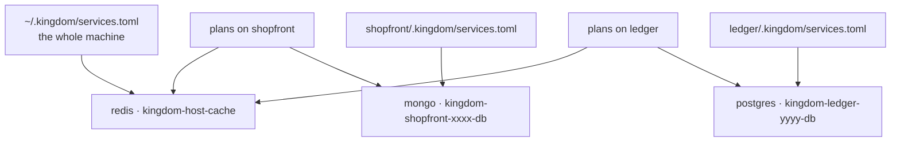
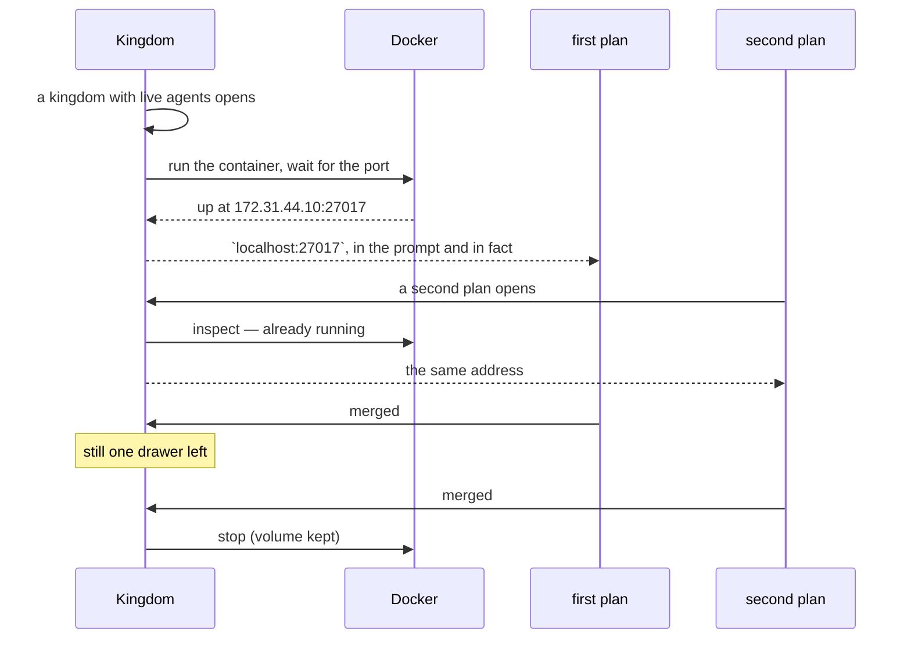

# Shared resources

A database, a cache, a message broker — the things several agents are supposed
to reach **together** rather than each starting a copy of.

Shown to the King as *the well*; called a shared service in code (`ServiceSpec`,
`RunningService`, `SharedService`, `SharedResource`).

This is the other half of the product's second question. Network isolation
([`architecture.md`](architecture.md#a-network-of-a-plans-own)) stops five
agents fighting over `:3000`. This is for the resources where sharing is the
*point*: five plans on a project that needs MongoDB should reach one MongoDB,
started once and stopped once — not five, and not one by accident.

Today a shared resource is always a **Docker container**.

## How an agent reaches one

**At `localhost`, on the service's own port.** `mongodb://localhost:27017`,
`postgres://localhost:5432`. Nothing to configure, no environment variable to
read, no address to be taught — the agent connects the way it would if the
database were running on its own machine, because as far as it can tell it is.

That is the whole feature, and everything below is in service of it.

It is true because a plan with a network of its own has a **loopback of its
own**. Kingdom stands a relay inside that namespace on `127.0.0.1:<port>` and
splices it through to the container. So `localhost:27017` is true inside the
plan, is still *your* loopback on your own machine, and is a different database
again in the plan next door. Five agents can each hold `localhost:27017` without
colliding, and all five land in the one shared container.

So the isolation is what *makes* the friendly address possible, rather than what
forbids it — and the isolation picker says so when the project you have selected
shares anything.

### The one case where it is not localhost

A plan on **the machine's network** gets the container's address instead —
`172.31.4.10:27017`. It has no loopback of its own, so a relay there would bind
*your* `127.0.0.1:27017`: exactly the port collision Kingdom exists to prevent,
committed by Kingdom. Such a plan is told the real address in its system prompt.

The same fallback applies if a relay could not be raised at all, because an
awkward address that works beats a familiar one that does not. Kingdom decides
this in one place — `services::address_for` — and the prompt, the ports badge
and the resources screen all read it, so none of them can promise something
another denies.

Two resources can also want the same port: your own Redis and a project's are
both `:6379` by default. A loopback has one socket per port, so only the first
gets `localhost` and the second is given its container address. Kingdom matches
on **which container** a relay reaches, not on the port number, so the second
resource is never quietly handed the first one's data.

### Why the address underneath is still an IP

The relay has to reach the container, and your own machine has to be able to
open it too. Neither can use a name, and neither can use a published port:

- A plan with a network of its own runs `slirp4netns --disable-host-loopback`,
  so `127.0.0.1` inside it is *its own* loopback. A container published to your
  loopback is provably unreachable from there — measured, not assumed.
- Docker's DNS resolves service names only between containers on the same
  network, so neither your machine nor a plan's namespace can look up `db`.

So Kingdom gives each set of services a network of its own out of `172.31.0.0/16`
and assigns addresses **from manifest order**. `docker network create --subnet`
installs a host route, so you can open that address from your own machine too,
and the screen shows it as *"from your own machine"*. Nothing is published on
your loopback, so a shared resource can never take a port from you.

## The screen

**Shared resources**, in the cities rail, or at `/resources`. It answers three
questions the ports badge in a chamber cannot:

| Question | Where the answer is |
|---|---|
| Where does an agent reach this? | Every row, and the top of the detail pane |
| What does this machine share at all? | The ledger, grouped by owner |
| Who is in this database *right now*? | The detail pane, by plan title |
| Where do I go to change it? | The detail pane, as an absolute path |

The badge behind the 🔌 in a chamber still answers *"what can this plan
reach?"* — a glance — and links here for the rest.

**The screen never starts or stops anything.** A well is raised when a kingdom
or a plan with live agents opens, and stopped when the last agent that could
reach it is gone; a stop button would fight that count in front of five working
agents. The one thing the screen writes is a new declaration, which is a change
to a file.

## The two levels

When you declare a resource you choose how far it is shared. That choice decides
exactly one thing — **which file the declaration is written to** — and
everything else follows from it.

| | One project | The whole machine |
|---|---|---|
| Declared in | `<project>/.kingdom/services.toml` | `~/.kingdom/services.toml` |
| Committed? | **Yes** — it travels with the repository | No — it is your machine's business |
| Reached by | every plan working on that project | every plan on every project you open |
| Stopped when | the last plan on that project is done | the last plan **anywhere** is done |
| Container | `kingdom-<project-key>-<name>` | `kingdom-host-<name>` |

Use **one project** for something the project genuinely needs in order to run —
its own database. It is a fact about the project, so it belongs in the project's
repository and every clone of it gets the same one.

Use **the whole machine** for something that is yours rather than any project's
— one Redis you keep around, a local S3 stand-in. It lives in your profile
(`$KINGDOM_HOME`, default `~/.kingdom`), so it is never committed anywhere.



## What a declaration says

The form writes TOML, and the file is the source of truth. A complete example —
this is *all* of it:

```toml
[[service]]
name   = "db"
image  = "mongo:7"
port   = 27017
volume = "shopfront-db"
```

| Field | Required | What it means |
|---|---|---|
| `name` | yes | What you call it, and half the container's name. Letters, digits, `-` and `_` only, unique within the file. |
| `image` | yes | The image to run, **tag included**. `mongo:7`, not `mongo`. |
| `port` | yes | The port the service listens on — and the port an agent reaches it at. |
| `volume` | no | A named Docker volume for the data. Without one, the data goes with the container. |

That is the whole vocabulary. There is nothing to say about addresses because
the address is `localhost:<port>`, and nothing to say about environment
variables because none are set.

### `env` was removed, and a manifest that still has it is refused

Kingdom used to let a service declare variables — `MONGODB_URI = "mongodb://
{host}:{port}/shopfront"` — and handed them to every command a plan ran. That
was a second way to learn one address, and the two could disagree.

A manifest still carrying `env` is **refused by name**, not ignored:

```
service `db` sets `env`, which Kingdom no longer uses — an agent reaches a
shared resource at `localhost` on the service's own port, with nothing to
configure. Remove that line.
```

Refused rather than dropped because TOML parsers discard an unknown key without
a word, and a project that went on believing its agents get `$DATABASE_URL`
while nothing set it would fail an hour later in a way that reads as a bug in
its own code. Delete the line and the service works.

If a project genuinely wants a variable, it belongs in that project's own
configuration — an `.env` file, a config default — pointed at `localhost`, where
it is a fact the project states rather than one Kingdom injects.

### What Kingdom knows about an image

For `mongo`, `postgres`, `mysql`, `mariadb` and `redis`, Kingdom knows three
things without being told, so the form does not ask:

| | What it is for |
|---|---|
| The default **port** | Filled into the form when you type the image, and editable. |
| Where it keeps its **data** | Where a named volume gets mounted. |
| What it needs to **boot** | `postgres` exits 1 without `POSTGRES_PASSWORD`; Kingdom passes one. |

That last one is container-facing and never reaches an agent — the opposite
direction of travel from the `env` above. Without it, declaring `postgres:16`
produced a resource that never started, and all you saw was "never answered on
port 5432".

An image outside the table works fine: name the port it listens on, and a volume
on it is mounted at `/data`.

### The volume, and your data

`volume` names a Docker volume mounted where the image keeps its data.

With one, the data survives the container being stopped and started. Without
one, it does not. The form **names one for you** — `kingdom-<scope>-<name>-data`
— because losing a database because an optional box was left empty is the worse
of the two mistakes, and a volume on a cache costs nothing. Clear the box if you
want the data to go with the container.

When the last plan finishes, the container is **stopped, not removed**, and the
volume is left alone. Losing your data because five agents finished their work
would be the worst possible reading of "tear down".

## Folders, for a sealed plan

The same manifests declare a second kind. A plan opened with **a machine of its
own** (`Isolation::Sealed`) has a filesystem of its own: its workspace, its
project's git directory, and a read-only system. That is enough to read and
build a great deal, and not enough for a toolchain you keep in your home
directory.

```toml
[[mount]]
path = "~/.cargo"
mode = "rw"      # "ro" if omitted
```

| Field | What it is |
|---|---|
| `path` | Absolute, or starting with `~`. It appears at **the same path** inside the plan |
| `mode` | `ro` (the default) or `rw` |

The path is the same inside as outside, and that is not incidental:
`~/.cargo/bin/cargo` looks for its registry at `~/.cargo/registry`, so a folder
mounted anywhere else is a folder its own tool cannot find.

**Read-only is the default**, because a toolchain a plan can rewrite is one
every later plan inherits the damage from. Some folders genuinely need `rw` — a
package cache fills itself in as a build runs, and `~/.cargo` without write
access means re-downloading the registry every time.

`~` is expanded when the folder is mounted, not when the file is read, so a
committed project manifest means "this user's home" wherever it is checked out.

### Quick-add

You rarely need to write these by hand. Opening a plan with **a machine of its
own** offers a list built from your own `PATH` — the only honest answer to
"which tools do I have" — and one press writes the block for you, into
`$KINGDOM_HOME/services.toml`. Always your profile: `~/.cargo` is where cargo
lives whatever project you are on, and writing your home directory's layout into
a project's committed manifest would put it in somebody else's repository. A
folder that genuinely belongs to one project is declared here, by hand, where
the scope is yours to choose.

An offer names every folder its tool needs, not just the one on `PATH`. Anything
Kingdom does not recognise is still offered, read-only — a tool it has never
heard of is still a tool you have.

### What is refused

A mount is checked when the file is read, not when the plan starts:

| Refused | Why |
|---|---|
| `/` | It would undo the sealing entirely |
| a relative path | Nothing resolves it; guessing would share the wrong folder |
| `..` anywhere | It reaches outside what the line appears to name |
| `~someone-else` | Only `~/` is expanded, and the wrong home silently would be worse |

A folder that simply is not there is **skipped**, not refused: a stale line in a
manifest should not stop a plan from opening.

### They need no daemon

Nothing about a mount touches Docker. A manifest that declares only folders
raises nothing, waits for nothing and is not reference-counted — it is read once
when the plan's namespace is built and is inert thereafter.

## The life of a well

A well stands **exactly while at least one live agent that can reach it
exists**. That is the whole rule, and Kingdom checks it at the four moments the
population changes: a kingdom is opened, a plan is opened, a plan is finished,
and a kingdom is closed.

Taking a turn and opening a shell deliberately raise *nothing*. They check, and
refuse if something the project promised is missing — opening a terminal is not
a reason to start a database. What they *do* do is stand the relay that puts an
isolated plan's wells on its own `localhost`, because that relay lives inside
that one plan's network and cannot exist before the plan does.



Because opening the kingdom is one of those moments, **a restart is invisible**:
five agents that had a database before the server stopped find it again without
any of them having to take a turn first. The raising happens in the background,
so the map opens at once and the wells appear as they come up — which is why the
shared resources screen refreshes itself while you have it open.

On a server restart, containers still carrying Kingdom's labels are **adopted**
rather than killed — the opposite of what happens to a stale network namespace,
and for a good reason: a namespace with no server attached is worthless, and a
database holds state. Shutting the server down therefore stops nothing, and a
container found standing that no live agent needs is left alone rather than
stopped: that server never raised it and cannot know it is safe to take away.

**A change to the file takes effect the next time the service starts**, not the
moment you save it. A container already up is not restarted under a working
agent. A plan editing `services.toml` in its worktree does not get a private
database mid-flight either — its change lands when the work is merged.

## Changing or removing one

By editing the file. The screen shows you where it is, with a path you can
paste; it creates and reports but does not edit or delete. Keeping the manifest
unambiguously the source of truth is worth more than a delete button, and
removing a `[[service]]` block is not the hard part of the job.

After removing one, stop the container yourself if it is still up:
`docker rm -f kingdom-<key>-<name>`.

## When something is wrong

| What you see | What it means |
|---|---|
| An orange banner across the screen | Docker is not installed, or the daemon is not answering. Nothing can be running; try `sudo systemctl start docker`. |
| A yellow row with a file path | That manifest does not parse. The message says why and which file. **Nothing else in that file works either** until it is fixed. |
| `not started` | Ordinary. Nothing needs it — a project with no live agent open. |
| `unknown` | It is declared, but with no daemon answering Kingdom cannot tell. |

A project whose manifest is broken **refuses to start an agent** rather than
running one with no database and saying nothing: an agent that cannot reach a
database it was told about fails in a way that reads as a bug in its own code.
Before this screen existed, that refusal was the *first* you heard of a typo.

To see one for yourself:

```bash
docker ps --filter label=kingdom.city        # everything Kingdom has standing
docker logs kingdom-host-cache               # why one will not start
```

## What this is not

**Not a sandbox.** A container Kingdom starts is an ordinary container, visible
to the whole machine and to `docker ps`, and an agent can run `docker` itself
and do as it likes. Like the network namespace, this is coordination rather than
containment, and saying so plainly is worth more than a guarantee that does not
hold.

**Not arbitration.** Kingdom starts one thing and hands out its address. It does
not detect two agents writing to the same collection, and it does not queue
them. The system prompt tells an agent the data is shared and that others are
reading and writing it at the same time; that is all. See
[`roadmap.md`](roadmap.md).

**Docker is required only if you use this.** A project that declares nothing
needs no daemon, and almost every project declares nothing.

## Where the code is

| File | What it holds |
|---|---|
| `crates/kingdom-core/src/services.rs` | The manifest, its validation, the scopes, and rendering a block back out. Pure and wasm-safe, so all of it is tested without a disk or a daemon. |
| `crates/kingdom-app/src/services.rs` | The registry, the conversation with Docker, the ledger, and the writer. |
| `crates/kingdom-app/src/components/wells.rs` | The screen. |
| `crates/kingdom-app/src/components/ports_badge.rs` | The badge in a chamber. |
