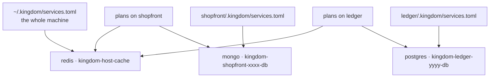
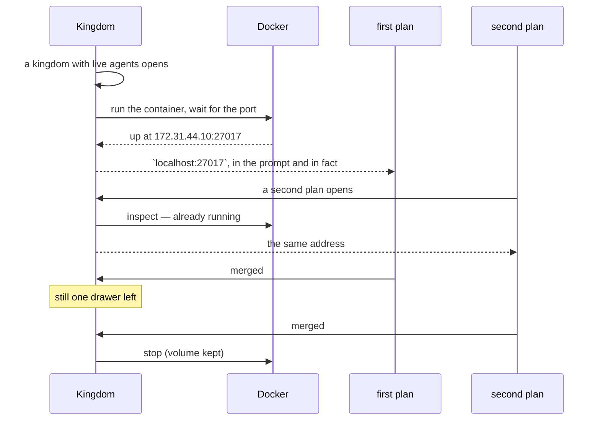

# Shared resources

A database, a cache, a message broker — the things several agents are supposed
to reach **together** rather than each starting a copy of.

Shown to the King as *the well*; called a shared service in code (`ServiceSpec`,
`RunningService`, `SharedService`, `SharedResource`).

This is the other half of the product's second question. Network isolation
([`architecture.md`](architecture.md#how-far-a-plan-is-walled-off)) stops five
agents fighting over `:3000`. This is for the resources where sharing is the
*point*: five plans on a project that needs MongoDB should reach one MongoDB,
started once and stopped once.

Today a shared resource is always a **Docker container** — that is the one
*kind* Kingdom knows how to run. What it is, and what runs it, are now separate
things in the code, so a second kind is a variant rather than a rewrite: see
[what kind of thing it is](#what-kind-of-thing-it-is-type).

## How an agent reaches one

**At `localhost`, on the service's own port.** `mongodb://localhost:27017`,
`postgres://localhost:5432`. Nothing to configure, no environment variable to
read — the agent connects as if the database were on its own machine, because
as far as it can tell it is.

That is true because a plan with a network of its own has a **loopback of its
own**. Kingdom stands a relay inside that namespace on `127.0.0.1:<port>` and
splices it through to the container. So `localhost:27017` is true inside the
plan, is still *your* loopback on your own machine, and is a different database
again in the plan next door. So the isolation is what *makes* the friendly
address possible rather than what forbids it.

### What a declaration may say

The form writes TOML and the file is the source of truth. A `[[service]]` block
takes five keys, and only four of them are ever required:

| Property | Required | Type | What is allowed | What it does |
|---|---|---|---|---|
| `type` | no | string | a kind Kingdom has; today only `docker` | What kind of thing it is. `docker` when omitted, which is what every manifest written before kinds existed means |
| `name` | yes | string | letters, digits, `-` and `_`; unique within the file | What you call it, and half the container's name |
| `image` | yes | string | any Docker image, **tag included** (`mongo:7`, not `mongo`) | What is run. Docker's |
| `port` | yes | integer | 1–65535 | Where the service listens — *and* where an agent reaches it |
| `volume` | no | string | a Docker volume name | Keeps the data when the container stops, mounted at the image's data directory. Without one, the data goes with the container. Docker's |

```toml
[[service]]
type   = "docker"
name   = "db"
image  = "mongo:7"
port   = 27017
volume = "shopfront-db"
```

There is nothing to say about addresses because the address is
`localhost:<port>`, and nothing to say about environment variables because none
are set.

### What Kingdom already knows, so you need not say it

For these images the form fills the port in for you, mounts a volume where the
image actually keeps its data, and passes whatever the container needs simply to
boot. That last is container-facing and never reaches an agent.

| Image | Default port | Data directory | Needed to boot |
|---|---|---|---|
| `mongo` | 27017 | `/data/db` | — |
| `postgres` | 5432 | `/var/lib/postgresql/data` | `POSTGRES_PASSWORD` |
| `mysql`, `mariadb` | 3306 | `/var/lib/mysql` | `MYSQL_ROOT_PASSWORD` |
| `redis` | 6379 | `/data` | — |
| anything else | you name it | `/data` | — |

A tag and a registry are not part of the identity: `docker.io/library/postgres:16-alpine`
is still Postgres. An image outside the table works fine — name the port it
listens on. Without the boot column, declaring `postgres:16` produced a resource
that never started, and all you saw was "never answered on port 5432".

### What kind of thing it is (`type`)

`type` names the kind. There is one, `docker`, and leaving the line out means
exactly that — so **no existing manifest changes**, and the form writes the line
anyway because what Kingdom writes should say what it means.

A `type` Kingdom does not have is **refused by name**, not quietly treated as a
container:

```
service `db` is of type `podman`, which is not a kind of shared resource
Kingdom knows. Use one of: docker.
```

Refused, because a project that asked for a runtime Kingdom cannot drive and
silently got a different one would find out from the container's behaviour an
hour later, and read it as a bug in its own code.

`name` and `port` are asked of every kind: the port is what an agent is told,
and a kind with no port would be a resource nobody could reach. Everything else
belongs to the kind — `image` and `volume` are Docker's, and a kind without
containers would neither have them nor be asked for them.

#### What adding a kind costs

The division in the code is between what is true of **sharing** — the reference
count, the two levels, raising once and stopping when the last agent is done —
and what is true of a **runtime**. The first is `services/mod.rs` in both
crates; the second is `services/docker.rs`.

So a second kind is: a variant on `ResourceKind` carrying what that kind needs,
a module beside `docker.rs` that raises, stops and diagnoses it, and the match
arms the compiler then demands. Nothing about the reference count, the scopes or
the ledger is touched.

Deliberately **not** a trait. With one runtime a trait is one implementation
behind a `dyn`, and an exhaustive `match` is the stronger guarantee anyway: it
makes the compiler name every place that has to decide something, where a driver
shaped wrongly for a new kind would compile and be wrong at run time. Two of
those places keep a catch-all on purpose — stopping and diagnosing — because
falling over in front of five working agents is worse than logging and carrying
on. A test walks every kind Kingdom offers and asserts something can run it.

### Folders, for a sealed plan (`[[mount]]`)

The same manifests declare a second kind, for a plan opened with **its own file
system** (`Isolation::Sealed`).

| Property | Required | Type | What is allowed | What it does |
|---|---|---|---|---|
| `path` | yes | string | absolute, or starting with `~/` | The folder, appearing at **the same path** inside the plan |
| `mode` | no | string | `ro` (default) or `rw` | Whether the plan may write to it |

```toml
[[mount]]
path = "~/.cargo"
mode = "rw"      # "ro" if omitted
```

The path is the same inside as outside, and that is not incidental:
`~/.cargo/bin/cargo` looks for its registry at `~/.cargo/registry`, so a folder
mounted anywhere else is a folder its own tool cannot find. `~` is expanded when
the folder is mounted rather than when the file is read, so a committed manifest
means "this user's home" wherever it is checked out.

**Read-only is the default**, because a toolchain a plan can rewrite is one
every later plan inherits the damage from. Some folders genuinely need `rw` — a
package cache fills itself in as a build runs.

What is refused, checked when the file is read rather than when the plan starts:

| Refused | Why |
|---|---|
| `/` | It would undo the sealing entirely |
| a relative path | Nothing resolves it; guessing would share the wrong folder |
| `..` anywhere | It reaches outside what the line appears to name |
| `~someone-else` | Only `~/` is expanded, and the wrong home silently would be worse |

A folder that simply is not there is **skipped**, not refused: a stale line
should not stop a plan from opening. Nothing about a mount touches Docker — a
manifest declaring only folders raises nothing and is not reference-counted.

You rarely need to write these by hand. The isolation panel's **Files** tab
lists folders built from your own `PATH`, with a checkbox each, and ticking one
writes the block into `$KINGDOM_HOME/services.toml`. Always your profile:
`~/.cargo` is where cargo lives whatever project you are on, and writing your
home directory's layout into a committed manifest would put it in somebody
else's repository. An offer names every folder its tool needs, not just the one
on `PATH`.

**Unticking removes the block again.** Both the write and the removal edit the
text rather than re-serialising the document, so every comment in the file
survives them — including a note you left above a folder you kept. Three rows
read differently from the rest:

| Row | What it means |
|---|---|
| ticked, greyed, marked `this project` | declared in the project's own manifest. Shown because the plan will see it; not removable from a picker, because that file is committed and somebody else's too |
| `Shared by hand: <path>` | in a manifest but not on `PATH`. Listed so you can still see it and clear it |
| a folder that no longer exists | listed **only** if already declared. A stale line is the one most worth clearing; a stale *offer* would be a promise Kingdom would silently skip |

### The one case where it is not localhost

A plan on **the machine's network** gets the container's address instead —
`172.31.4.10:27017`. It has no loopback of its own, so a relay there would bind
*your* `127.0.0.1:27017`: exactly the port collision Kingdom exists to prevent,
committed by Kingdom. Such a plan is told the real address in its system prompt.

The same fallback applies if a relay could not be raised at all, because an
awkward address that works beats a familiar one that does not. Kingdom decides
this in one place — `services::address_for` — and the prompt, the ports badge and
the resources screen all read it, so none can promise what another denies.

Two resources can also want the same port: your own Redis and a project's are
both `:6379` by default. A loopback has one socket per port, so only the first
gets `localhost`. Kingdom matches on **which container** a relay reaches, not on
the port number, so the second resource is never quietly handed the first one's
data.

### Why the address underneath is still an IP

The relay has to reach the container, and your own machine has to be able to
open it too. Neither can use a name, and neither can use a published port:

- A plan with a network of its own runs `slirp4netns --disable-host-loopback`,
  so `127.0.0.1` inside it is *its own* loopback. A container published to your
  loopback is provably unreachable from there — measured, not assumed.
- Docker's DNS resolves service names only between containers on the same
  network, so neither your machine nor a plan's namespace can look up `db`.

So Kingdom gives each set of services a network of its own out of `172.31.0.0/16`
and assigns addresses **from manifest order**. `docker network create --subnet`
installs a host route, so you can open that address from your own machine too.
Nothing is published on your loopback, so a shared resource can never take a
port from you.

## The two levels

When you declare a resource you choose how far it is shared. That choice decides
exactly one thing — **which file the declaration is written to** — and
everything else follows from it.

| | One project | The whole machine |
|---|---|---|
| Declared in | `<project>/.kingdom/services.toml` | `~/.kingdom/services.toml` |
| Committed? | **Yes** — it travels with the repository | No — it is your machine's business |
| Reached by | every plan working on that project | every plan on every project you open |
| Stopped when | the last plan on that project is done | the last plan **anywhere** is done |
| Container | `kingdom-<project-key>-<name>` | `kingdom-host-<name>` |

Use **one project** for something the project genuinely needs in order to run —
its own database. It is a fact about the project, so every clone gets the same
one. Use **the whole machine** for something that is yours rather than any
project's — one Redis you keep around, a local S3 stand-in. It lives in your
profile (`$KINGDOM_HOME`, default `~/.kingdom`), so it is never committed.



## The screen

**Shared resources**, in the cities rail, or at `/resources`. It answers four
questions the ports badge in a chamber cannot:

| Question | Where the answer is |
|---|---|
| Where does an agent reach this? | Every row, and the top of the detail pane |
| What does this machine share at all? | The ledger, grouped by owner |
| Who is in this database *right now*? | The detail pane, by plan title |
| Where do I go to change it? | The detail pane, as an absolute path |

**The screen never starts or stops anything.** A well is raised when a kingdom
or a plan with live agents opens, and stopped when the last agent that could
reach it is gone; a stop button would fight that count in front of five working
agents. The one thing the screen writes is a new declaration.

Changing or removing one is done by editing the file. The screen shows you where
it is, with a path you can paste. Keeping the manifest unambiguously the source
of truth is worth more than a delete button. After removing one, stop the
container yourself if it is still up: `docker rm -f kingdom-<key>-<name>`.

## The life of a well

A well stands **exactly while at least one live agent that can reach it
exists**. That is the whole rule, and Kingdom checks it at the four moments the
population changes: a kingdom is opened, a plan is opened, a plan is finished,
and a kingdom is closed.

Taking a turn and opening a shell deliberately raise *nothing*. They check, and
refuse if something the project promised is missing — opening a terminal is not
a reason to start a database. What they *do* do is stand the relay that puts an
isolated plan's wells on its own `localhost`, because that relay lives inside
that one plan's network and cannot exist before the plan does.



Because opening the kingdom is one of those moments, **a restart is invisible**:
five agents that had a database before the server stopped find it again without
any of them having to take a turn first. The raising happens in the background,
which is why the resources screen refreshes itself while you have it open.

On a server restart, containers still carrying Kingdom's labels are **adopted**
rather than killed — the opposite of what happens to a stale network namespace,
and for a good reason: a namespace with no server attached is worthless, and a
database holds state. A container found standing that no live agent needs is
left alone rather than stopped: that server never raised it and cannot know it
is safe to take away.

When the last plan finishes, the container is **stopped, not removed**, and the
volume is left alone. **A change to the file takes effect the next time the
service starts**, not the moment you save it: a container already up is not
restarted under a working agent, and a plan editing `services.toml` in its
worktree does not get a private database mid-flight — its change lands when the
work is merged.

## When something is wrong

| What you see | What it means |
|---|---|
| An orange banner across the screen | The runtime a declared resource needs is missing, or not answering — for Docker, try `sudo systemctl start docker`. Asked only of the kinds something actually declares, so a machine that shares nothing never sees it. |
| A yellow row with a file path | That manifest does not parse — bad TOML, a duplicate name, or a `type` naming a kind Kingdom does not have. The message says why and which file. **Nothing else in that file works either** until it is fixed. |
| `not started` | Ordinary. Nothing needs it — a project with no live agent open. |
| `unknown` | It is declared, but with no daemon answering Kingdom cannot tell. |

A project whose manifest is broken **refuses to start an agent** rather than
running one with no database and saying nothing: an agent that cannot reach a
database it was told about fails in a way that reads as a bug in its own code.

```bash
docker ps --filter label=kingdom.city        # everything Kingdom has standing
docker logs kingdom-host-cache               # why one will not start
```

## What this is not

**Not a sandbox.** A container Kingdom starts is an ordinary container, visible
to the whole machine and to `docker ps`, and an agent can run `docker` itself.
Like the network namespace, this is coordination rather than containment.

**Not arbitration.** Kingdom starts one thing and hands out its address. It does
not detect two agents writing to the same collection, and it does not queue
them. The system prompt tells an agent the data is shared and that others are
reading and writing it at the same time; that is all.

**Docker is required only if you use this.** A project that declares nothing
needs no daemon, and almost every project declares nothing.

## Where the code is

| File | What it holds |
|---|---|
| `crates/kingdom-core/src/services/mod.rs` | The manifest, its validation, the scopes, `ResourceKind`, and rendering a block back out. Pure and wasm-safe, so all of it is tested without a disk or a daemon. |
| `crates/kingdom-core/src/services/docker.rs` | What a container *is*: `DockerSpec`, and the table of well-known images. |
| `crates/kingdom-core/src/services/mounts.rs` | Folders a sealed plan may see. Shares the file with the services because both answer "what does this project need in order to run?", while reaching no runtime at all. |
| `crates/kingdom-app/src/services/mod.rs` | The registry, the reference count, `reconcile`, the ledger, and the writer. Everything that is about *sharing*. |
| `crates/kingdom-app/src/services/docker.rs` | The conversation with the daemon: `docker run`, the network per scope, the `/24`, the wait for a port. Also the tests that need a real daemon. |
| `crates/kingdom-app/src/components/wells.rs` | The screen. |
| `crates/kingdom-app/src/components/ports_badge.rs` | The badge in a chamber. |
