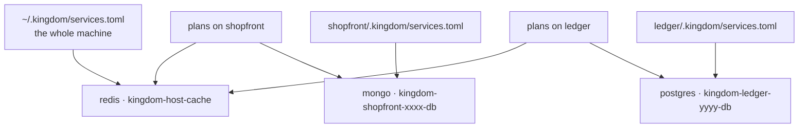
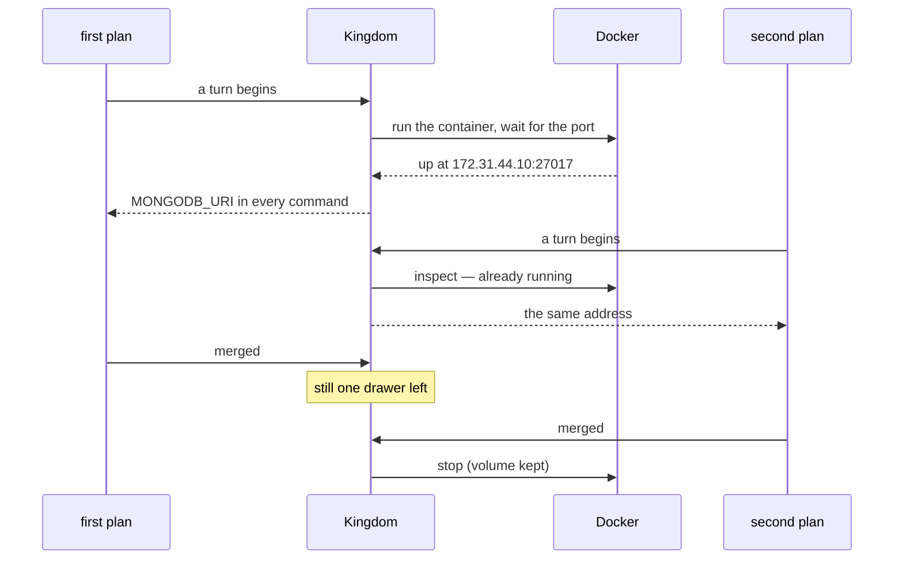

# Shared resources

A database, a cache, a message broker — the things several agents are supposed
to reach **together** rather than each starting a copy of.

Shown to the King as *the well*; called a shared service in code (`ServiceSpec`,
`RunningService`, `SharedService`, `SharedResource`).

This is the other half of the product's second question. Network isolation
([`architecture.md`](architecture.md#a-network-of-a-plans-own)) stops five
agents fighting over `:3000`. This is for the resources where sharing is the
*point*: five plans on a project that needs MongoDB should reach one MongoDB,
started once and stopped once — not five, and not one by accident.

Today a shared resource is always a **Docker container**.

## The screen

**Shared resources**, in the cities rail, or at `/resources`. It answers three
questions the ports badge in a chamber cannot:

| Question | Where the answer is |
|---|---|
| What does this machine share at all? | The ledger, grouped by owner |
| Who is in this database *right now*? | The detail pane, by plan title |
| Where do I go to change it? | The detail pane, as an absolute path |

The badge behind the 🔌 in a chamber still answers *"what can this plan
reach?"* — a glance — and links here for the rest.

**The screen never starts or stops anything.** A well is raised when a plan
needs it and stopped when the last plan lets go; a stop button would fight that
reference count in front of five working agents. The one thing the screen writes
is a new declaration, which is a change to a file.

## The two levels

When you declare a resource you choose how far it is shared. That choice decides
exactly one thing — **which file the declaration is written to** — and
everything else follows from it.

| | One project | The whole machine |
|---|---|---|
| Declared in | `<project>/.kingdom/services.toml` | `~/.kingdom/services.toml` |
| Committed? | **Yes** — it travels with the repository | No — it is your machine's business |
| Reached by | every plan working on that project | every plan on every project you open |
| Stopped when | the last plan on that project is done | the last plan **anywhere** is done |
| Container | `kingdom-<project-key>-<name>` | `kingdom-host-<name>` |

Use **one project** for something the project genuinely needs in order to run —
its own database. It is a fact about the project, so it belongs in the project's
repository and every clone of it gets the same one.

Use **the whole machine** for something that is yours rather than any project's
— one Redis you keep around, a local S3 stand-in. It lives in your profile
(`$KINGDOM_HOME`, default `~/.kingdom`), so it is never committed anywhere.

When both levels declare the same environment variable, **the project wins**:
the more specific declaration is the one it meant.



## What a declaration says

The form writes TOML, and the file is the source of truth. A complete example:

```toml
[[service]]
name   = "db"
image  = "mongo:7"
port   = 27017
env    = { MONGODB_URI = "mongodb://{host}:{port}/shopfront", MONGO_DB = "shopfront" }
volume = "shopfront-db"
```

| Field | Required | What it means |
|---|---|---|
| `name` | yes | What you call it, and half the container's name. Letters, digits, `-` and `_` only, unique within the file. |
| `image` | yes | The image to run, **tag included**. `mongo:7`, not `mongo`. |
| `port` | yes | The port the service listens on *inside* the container. |
| `env` | no | Variables handed to every command an agent runs. See below. |
| `volume` | no | A named Docker volume for the data. Without one, the data goes with the container. |

### `{host}` and `{port}`

An `env` value may contain `{host}` and `{port}`, which are replaced with the
container's real address the moment it is up:

```toml
env = { DATABASE_URL = "postgres://postgres@{host}:{port}/app", PGDATABASE = "app" }
```

A value with no placeholder passes through untouched, so a plain `PGDATABASE`
can sit beside a URL. Anything else in braces — `{hosts}`, `{HOST}` — is
**refused when the file is read**, because it would otherwise reach an agent
verbatim and fail an hour later as a connection to a host called `{hosts}`.

This is how an agent finds the well, and it is why the address cannot simply be
written down: it does not exist until the container does.

### Why never `localhost`

The address in `DATABASE_URL` is an **IP**, and an agent must use it rather than
`127.0.0.1`. Two reasons, both measured rather than assumed:

- A plan with a network of its own runs `slirp4netns --disable-host-loopback`,
  so `127.0.0.1` inside it is *its own* loopback, where nothing is listening.
  A container published to your loopback is provably unreachable from there.
- Docker's DNS resolves service names only between containers on the same
  network, so neither your machine nor a plan's namespace can look up `db`.

So Kingdom gives each set of services a network of its own out of `172.31.0.0/16`
and assigns addresses **from manifest order**, which is what makes an address
knowable before the container exists — and therefore substitutable into a
variable. `docker network create --subnet` installs a host route, so you can
open the address from your own machine too. Nothing is published on your
loopback, so a shared resource can never take a port from you.

### The volume, and your data

`volume` names a Docker volume mounted where the image keeps its data (Kingdom
knows the path for `mongo`, `postgres`, `mysql`, `mariadb` and `redis`;
anything else gets `/data`).

With one, the data survives the container being stopped and started. Without
one, it does not. That is right for a cache and wrong for a database, so it is
stated per service rather than assumed either way.

When the last plan finishes, the container is **stopped, not removed**, and the
volume is left alone. Losing your data because five agents finished their work
would be the worst possible reading of "tear down".

## The life of a well



On a server restart, containers still carrying Kingdom's labels are **adopted**
rather than killed — the opposite of what happens to a stale network namespace,
and for a good reason: a namespace with no server attached is worthless, and a
database holds state.

**A change to the file takes effect the next time the service starts**, not the
moment you save it. A container already up is not restarted under a working
agent. A plan editing `services.toml` in its worktree does not get a private
database mid-flight either — its change lands when the work is merged.

## Changing or removing one

By editing the file. The screen shows you where it is, with a path you can
paste; it creates and reports but does not edit or delete. Keeping the manifest
unambiguously the source of truth is worth more than a delete button, and
removing a `[[service]]` block is not the hard part of the job.

After removing one, stop the container yourself if it is still up:
`docker rm -f kingdom-<key>-<name>`.

## When something is wrong

| What you see | What it means |
|---|---|
| An orange banner across the screen | Docker is not installed, or the daemon is not answering. Nothing can be running; try `sudo systemctl start docker`. |
| A yellow row with a file path | That manifest does not parse. The message says why and which file. **Nothing else in that file works either** until it is fixed. |
| `not started` | Ordinary. Nothing has asked for it yet — a project with no plan open. |
| `unknown` | It is declared, but with no daemon answering Kingdom cannot tell. |

A project whose manifest is broken **refuses to start an agent** rather than
running one with no database and saying nothing: an agent that cannot reach a
database it was told about fails in a way that reads as a bug in its own code.
Before this screen existed, that refusal was the *first* you heard of a typo.

To see one for yourself:

```bash
docker ps --filter label=kingdom.city        # everything Kingdom has standing
docker logs kingdom-host-cache               # why one will not start
```

## What this is not

**Not a sandbox.** A container Kingdom starts is an ordinary container, visible
to the whole machine and to `docker ps`, and an agent can run `docker` itself
and do as it likes. Like the network namespace, this is coordination rather than
containment, and saying so plainly is worth more than a guarantee that does not
hold.

**Not arbitration.** Kingdom starts one thing and hands out its address. It does
not detect two agents writing to the same collection, and it does not queue
them. The system prompt tells an agent the data is shared and that others are
reading and writing it at the same time; that is all. See
[`roadmap.md`](roadmap.md).

**Docker is required only if you use this.** A project that declares nothing
needs no daemon, and almost every project declares nothing.

## Where the code is

| File | What it holds |
|---|---|
| `crates/kingdom-core/src/services.rs` | The manifest, its validation, the scopes, and rendering a block back out. Pure and wasm-safe, so all of it is tested without a disk or a daemon. |
| `crates/kingdom-app/src/services.rs` | The registry, the conversation with Docker, the ledger, and the writer. |
| `crates/kingdom-app/src/components/wells.rs` | The screen. |
| `crates/kingdom-app/src/components/ports_badge.rs` | The badge in a chamber. |
