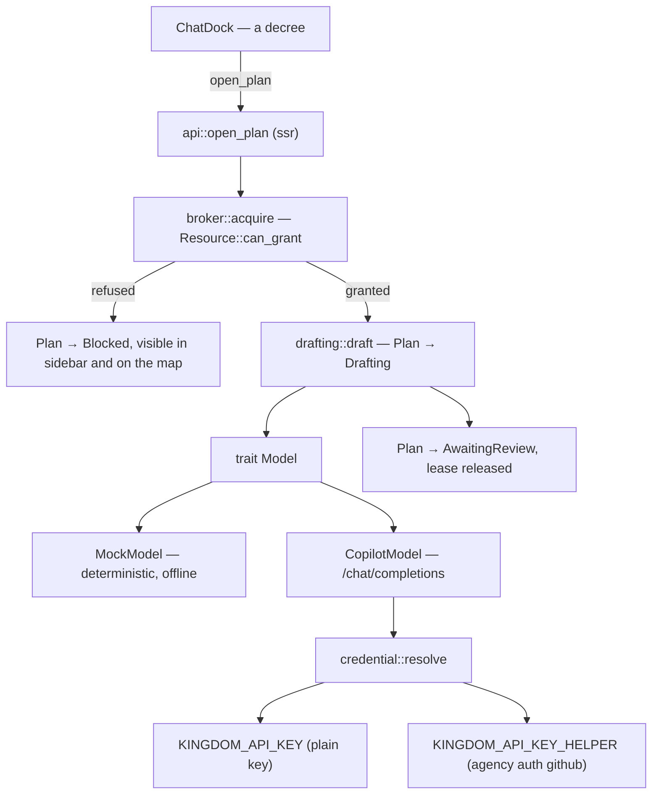

# Plans that draft themselves: fold agents into plans, add a mock model and credentialed model access

The court metaphor currently has two nouns where it needs one. `Architect` is a
top-level entity with its own status, its own leases and its own pips on the map,
and `Plan` is a second thing hanging off it. That split buys nothing: the King
does not review architects, he reviews **plans**.

So this task does two things at once, and they are cheaper together than apart:

1. **Remove `Architect` as a concept.** A `Plan` is the unit of work *and* the
   unit of review. A model is an attribute of a plan, not an actor in its own
   right.
2. **Make plans actually draft themselves** by calling a model — a deterministic
   **mock** for testing, and **GitHub Copilot** via a credential supplied either
   through the `agency` helper or as a plain API key.

Doing the collapse first means the agent wiring is built against the model we
want, rather than being retrofitted onto one we are about to delete.

## The revised metaphor

| Metaphor | Type | What it is |
|---|---|---|
| Kingdom | `Kingdom` | the dev folder you opened |
| City | `City` | one project directory |
| **Architectural Plan** | `Plan` | a proposal, drafted by a model, awaiting review |
| Crown Resource | `Resource` / `Lease` | a contended machine resource |
| The King | the user | the only one who approves anything |

A decree from the chat dock **opens a plan**. The plan drafts (a model is
working), then rests at `AwaitingReview`. The King approves or rejects. There is
no persistent agent roster in between.

## Part 1 — Collapse `Architect` into `Plan`

### `kingdom-core`

- **Delete** `Architect`, `ArchitectStatus`, `ArchitectId`, `Kingdom.architects`
  and `Kingdom::architects_in`.
- **Delete** `Task`, `TaskStatus`, `TaskId`. A decree *is* a plan; keeping a
  parallel work item would rebuild the same duplication one level down.
- `Plan` becomes the whole story:
  ```rust
  pub struct Plan {
      pub id: PlanId,
      pub city: CityId,
      pub title: String,
      pub summary: String,
      pub touches: Vec<String>,
      /// The decree that opened this plan, verbatim.
      pub prompt: String,
      /// Which model is drafting it, e.g. "mock" or "claude-sonnet-4.6".
      pub model: String,
      /// The conversation so far.
      pub transcript: Vec<Utterance>,
      pub status: PlanStatus,
      /// Crown resources this plan holds while drafting.
      pub leases: Vec<Lease>,
  }
  ```
- `PlanStatus` absorbs what `ArchitectStatus` was carrying, because those were
  always two views of one state machine:
  `Drafting | AwaitingReview | Blocked | Failed | Approved | Rejected`.
- `Utterance { speaker: Speaker, body: String }`, `enum Speaker { King, Court }`.
- `Lease.holder` becomes `PlanId`; `Resource.waiting` becomes `Vec<PlanId>`.
  `Resource::can_grant` is untouched — its tested compatibility matrix is about
  modes, not holders.

### `kingdom-app`

- `map/city.rs`: `ArchitectPips` → `PlanPips`, driven by each city's plans. The
  crane appears while a plan is `Drafting`. Colours move from
  `ArchitectStatus::color` to `PlanStatus::color`.
- `map/mod.rs`: contention threads resolve a city from a `PlanId` instead of an
  `ArchitectId` — a smaller lookup, since a plan already knows its city.
- `sidebar.rs`: already plan-centric; it gains the model name and a live
  `Drafting` state on the plan row.
- `sample.rs`: `populate_court` returns `(Vec<Plan>, Vec<Resource>)`. It must keep
  seeding a **blocked plan** and a **contended resource** — per `AGENTS.md`, those
  are the states the UI exists to show and must stay reachable in development.

## Part 2 — Give plans a model to draft with



New module `crates/kingdom-app/src/llm/`, entirely `#[cfg(feature = "ssr")]` so
none of it can reach the wasm bundle. Named `llm` rather than a fresh metaphor
noun — it is plumbing, and the metaphor is already carried by `Plan`.

- `mod.rs` — `#[async_trait] trait Model { async fn draft(&self, brief: &Brief)
  -> Result<Draft, ModelError>; fn name(&self) -> &str; }` with
  `Brief { city: CityBrief, transcript: Vec<Utterance>, prompt: String }` and
  `Draft { title, summary, touches, body }`. `CityBrief` carries the city's name,
  absolute path, stack, file count and git state — that is what makes this a
  conversation *about a project* rather than a bare LLM box.
- `mock.rs` — `MockModel`. Offline, no rand, no clock. Scenario picked by byte sum
  of the prompt mod N, overridable with a `[[scenario:NAME]]` marker (borrowed
  from phoenix-ide's mock, which exists precisely so end-to-end flows are
  authorable without a key). Scenarios: `survey`, `plan`, `blocked`, `slow`,
  `error` — enough to reach every `PlanStatus` including the failure ones.
- `copilot.rs` — `POST https://api.githubcopilot.com/chat/completions`,
  `Authorization: Bearer <token>`, plus the gateway headers
  `Copilot-Integration-Id: copilot-cli` and `Editor-Version`. Non-streaming;
  read `choices[0].message.content`. Surface `{"error":{"message":…}}` verbatim —
  an opaque failure here is the most likely thing to waste the King's time.
- `credential.rs` — resolution in priority order:
  1. `KINGDOM_API_KEY` — the plain path, for anyone holding a raw token.
  2. `KINGDOM_API_KEY_HELPER` — a shell command run with `sh -c`, defaulting to
     `agency auth github` when the provider is Copilot.

  Helper contract, taken from phoenix-ide because it is already battle-tested:
  **the last non-empty stdout line is the credential; stderr is diagnostics
  only.** Verified locally — `agency auth github` prints a 40-char `gho_…` token
  on stdout and a wall of tracing noise on stderr, so a naive "read all output"
  implementation would capture garbage. Cache for `KINGDOM_API_KEY_HELPER_TTL_MS`
  (default 1h). Never log the credential; log only its length and prefix.

- Config from the environment, loaded at startup from an optional, gitignored
  `.kingdom.env` at the workspace root (via `dotenvy`), with a committed
  `.kingdom.env.example` documenting both paths. `KINGDOM_MODEL_PROVIDER` selects
  `mock` (the default, so a fresh clone works offline) or `copilot`.

### Leases — the non-negotiable part

`AGENTS.md`: *every agent capability that touches something shared must acquire a
lease first, and contention must be visible, never silently resolved.*

`llm/broker.rs`, small and honest, no queue yet:

- Drafting acquires a **`Shared`** lease on the city's `ResourceKind::Path`,
  held by the `PlanId`, reason `"Reading <city> to draft a plan"`. Shared,
  because drafting only reads.
- The broker asks the already-tested `Resource::can_grant`. Granted → the plan
  goes `Drafting` and the lease shows on it. Refused → the plan goes `Blocked`
  with the reason, and the plan is added to `Resource.waiting` so the map draws
  the contention thread. Released on completion, including on error.
- Resources are created lazily per city on first draft, so Crown Resources starts
  reflecting reality rather than only sample data.

A real queue stays out of scope; refusal is surfaced, not resolved.

### `api.rs`

`start_task` is replaced by:

- `open_plan(prompt, city) -> Plan` — opens the plan, acquires the lease, drafts,
  rests at `AwaitingReview` (or `Blocked` / `Failed`), returns the whole plan.
- `continue_plan(plan_id, prompt) -> Plan` — another turn on an existing plan, so
  the dock is a conversation rather than one-shot.
- `model_status() -> ModelStatus` — provider, model name and whether a credential
  resolves (`Ready | Missing | Failed` + detail). A description, never a secret.

### UI

- `ChatDock` renders the selected city's plan transcript from server state, so a
  refresh does not lose it and switching cities switches conversation. Refetch
  the kingdom after each reply so the sidebar and map update (no WebSocket yet —
  that stays the next task, not smuggled into this one).
- A provider badge in the dock handle: `mock` / `copilot ✓` / `copilot ✗`, from
  `model_status()`. Clicking it opens a short panel naming the exact env var to
  set — the setup surface, without building a settings system.

## Dependencies (ssr-gated only, never in the wasm bundle)

`reqwest` (rustls, json), `serde_json`, `async-trait`, `dotenvy`, and the
`process` feature on the existing `tokio`.

## Tests

Four, each pinning something a user would notice breaking:

1. **Credential helper contract** — last non-empty stdout line wins, stderr noise
   is ignored, non-zero exit is an error. Driven by `sh -c` fixtures, no network.
   This is the bit that actually bites, as the `agency` output above shows.
2. **Mock determinism** — the same prompt yields the same draft, and
   `[[scenario:blocked]]` forces its scenario. Being predictable is the mock's
   entire reason to exist.
3. **Drafting takes a lease, and refusal is visible** — a plan opened in a city
   whose path is already held `Exclusive` comes back `Blocked` and appears in
   `Resource.waiting`, rather than drafting anyway. Extends the pinned
   `can_grant` matrix into the path that matters.
4. **The sample court still shows trouble** — after the collapse,
   `populate_court` still yields at least one blocked plan and one contended
   resource. `AGENTS.md` calls these out as the states the UI exists to show, and
   a refactor is exactly when they would be quietly lost.

No test for the live Copilot call: it needs a token and a network, and asserting
on a model's prose is worthless.

## Verification — get it running and prove it end to end

With `cargo leptos serve`, driving the real browser:

1. **Mock, offline.** Nothing configured. Claim `~/dev`, select a city, send
   *"What is this project?"*. Expect a plan to appear in the sidebar naming that
   city, a crane on the map while it drafts, the plan settling at
   `AwaitingReview`, and its Path lease appearing then clearing.
2. **Real, via `agency`.** Set `KINGDOM_MODEL_PROVIDER=copilot`. Send the same
   decree; confirm a genuine model reply about the project's actual contents.
3. **Plain key.** Set `KINGDOM_API_KEY` directly; confirm it takes priority and
   the helper is never spawned.
4. **Failure is legible.** Point the helper at a failing command; confirm the
   badge reads `copilot ✗` and the dock explains why rather than failing silently.

## Out of scope

Streaming, tool use, WebSocket push, persistence, approve/reject doing anything
beyond setting status, plans editing files, and a lease queue. Each is its own
task; this one earns the right to them by proving one real drafting turn end to
end.

## Docs

`AGENTS.md` needs a real edit, not a footnote: §2's metaphor table loses the
Architect row, §5 moves "spawning or running any real agent" out of *not built at
all*, and the placeholder-court note narrows to what is still faked. The
`kingdom-core` crate docs carry the same table and must match.
