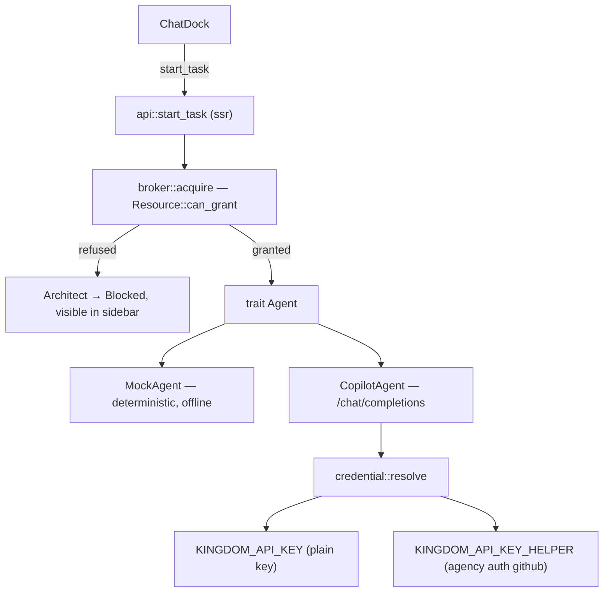

# Dispatch real architects: a mock agent, credentialed agent access, and a chat that reaches one

Today `start_task` returns a canned string apologising that no architect was
dispatched. This task makes the chat dock reach a real agent — a deterministic
**mock** for testing, and **GitHub Copilot** via a credential the King supplies
either through the `agency` helper or as a plain API key.

The guiding test from `AGENTS.md` applies: the value here is not "talk to an
LLM", it is that dispatching an architect is **visible** — it takes a lease, it
shows as `Working`, and it shows as `Blocked` when it cannot get what it needs.

## What exists now

- `api::start_task(prompt, city)` — real round trip, placeholder body.
- `ChatDock` — sends, appends to a client-local `Vec<Message>`, never persisted.
- `Architect` / `Lease` / `Resource` — real types, entirely fabricated data
  (`sample::populate_court`). `Resource::can_grant` is real and tested.
- No agent runtime, no provider, no credentials, no `reqwest`.

## Design

### 1. Domain types — `kingdom-core` (must stay wasm-safe)

Extend `model.rs` only. No I/O, no new dependencies.

- `Utterance { speaker: Speaker, body: String }`, `enum Speaker { King, Architect }`.
- `Task` gains `transcript: Vec<Utterance>` and `architect: Option<ArchitectId>`,
  so a decree is a conversation rather than a fire-and-forget string.
- `Kingdom` gains `tasks: Vec<Task>` — the chat log becomes server state, which
  is what lets it survive a refresh and lets the rest of the UI see it.
- `AgentProvider { Mock, Copilot }` and `AgentStatus { provider, model,
  credential: CredentialState, detail: String }`, where `CredentialState` is
  `Ready | Missing | Failed`. A *description*, never a secret — this is what the
  provider badge renders.

### 2. Agent runtime — `kingdom-app`, `#[cfg(feature = "ssr")]`

New module `crates/kingdom-app/src/agent/`:

- `mod.rs` — `#[async_trait] trait Agent { async fn respond(&self, brief: &Brief)
  -> Result<String, AgentError>; fn model(&self) -> &str; }` plus
  `Brief { city: Option<CityBrief>, transcript: Vec<Utterance>, prompt: String }`.
  `CityBrief` carries name, absolute path, stack, file count and git state — that
  is what makes this "a chat *about a project*" rather than a bare LLM box.
- `mock.rs` — `MockAgent`. Offline, no rand, no clock. Scenario chosen by byte
  sum of the prompt mod N, overridable with a `[[scenario:NAME]]` marker
  (borrowed from phoenix-ide's mock, which exists precisely so end-to-end flows
  are authorable without a key). Scenarios: `survey`, `plan`, `refuse`, `slow`,
  `error` — enough to reach every UI state, including failure.
- `copilot.rs` — `POST https://api.githubcopilot.com/chat/completions`,
  `Authorization: Bearer <token>`, plus the gateway headers
  `Copilot-Integration-Id: copilot-cli` and `Editor-Version`. Non-streaming;
  parse `choices[0].message.content`. Surface `{"error":{"message":…}}` verbatim —
  an opaque failure here is the most likely thing to waste the King's time.
- `credential.rs` — resolution, in priority order:
  1. `KINGDOM_API_KEY` — the plain path, for anyone holding a raw token.
  2. `KINGDOM_API_KEY_HELPER` — a shell command run with `sh -c`, defaulting to
     `agency auth github` when the provider is Copilot.

  Helper contract, copied from phoenix-ide because it is already battle-tested:
  **the last non-empty stdout line is the credential; stderr is diagnostics
  only.** This detail matters and was verified locally — `agency auth github`
  prints the token on stdout and a wall of tracing noise on stderr. Cache for
  `KINGDOM_API_KEY_HELPER_TTL_MS` (default 1h). Never log the credential; log
  only its length and prefix.

- Config comes from the environment, loaded at startup from an optional,
  gitignored `.kingdom.env` at the workspace root (via `dotenvy`), with a
  committed `.kingdom.env.example` documenting both paths.
  `KINGDOM_AGENT_PROVIDER` selects `mock` (the default, so a fresh clone works
  offline) or `copilot`.

### 3. Leases — the non-negotiable part

`AGENTS.md`: *every agent capability that touches something shared must acquire a
lease first, and contention must be visible, never silently resolved.*

Add `agent/broker.rs` — small and honest, no queue yet:

- Dispatching an architect into a city acquires a **`Shared`** lease on that
  city's `ResourceKind::Path`, reason `"Reading <city> to answer a decree"`.
  Shared, because a chat turn only reads.
- The broker asks the already-tested `Resource::can_grant`. Granted → the
  architect goes `Working` and the lease shows on it in the sidebar. Refused →
  the architect goes `Blocked` with the reason, and the decree says so. Released
  on completion, including on error.
- Resources are created lazily per city on first dispatch, so Crown Resources
  starts reflecting reality instead of only sample data.

A real queue stays out of scope; refusal is surfaced, not resolved.

### 4. Wiring `start_task`

1. Find an idle architect in the target city, or seat a new one.
2. Acquire the lease. If refused, record the refusal on the task and return.
3. Build the `Brief` from the city's existing scan data plus prior transcript.
4. Call the agent; append both utterances to `Task.transcript`; store on the
   `Kingdom`; release the lease; set the architect back to `Idle`.
5. Return the whole `Task`, so the dock renders from server state rather than a
   client-local vec.

### 5. UI

- `ChatDock` renders from `Kingdom.tasks` for the selected city, so switching
  cities switches conversation. Refetch the kingdom after each reply so architect
  status and leases update (no WebSocket yet — that stays the next task, not
  smuggled into this one).
- A provider badge in the dock handle: `mock` / `copilot ✓` / `copilot ✗`, fed by
  a new `#[server] fn agent_status()`. Clicking it opens a short panel naming the
  exact env var to set — the setup surface, without building a settings system.

## Dependencies (ssr-gated only, never in the wasm bundle)

`reqwest` (rustls, json), `serde_json`, `async-trait`, `dotenvy`, and the
`process` feature on the existing `tokio`.

## Tests

Three, each pinning something a user would notice breaking:

1. **Credential helper contract** — last non-empty stdout line wins, stderr noise
   is ignored, non-zero exit is an error. Driven by `sh -c` fixtures, no network.
   This is the bit that actually bites: `agency` is very chatty on stderr.
2. **Mock determinism** — the same prompt yields the same reply, and
   `[[scenario:refuse]]` forces its scenario. Being predictable is the mock's
   entire reason to exist.
3. **Dispatch takes a lease, and refusal is visible** — an architect dispatched
   into a city whose path is already held `Exclusive` comes back `Blocked` rather
   than proceeding. Extends the pinned `can_grant` matrix into the path that
   matters.

No test for the live Copilot call: it needs a token and a network, and asserting
on a model's prose is worthless.

## Verification — get it running and prove it end to end

With `cargo leptos serve`, driving the real browser:

1. **Mock, offline.** Nothing configured. Claim `~/dev`, select a city, send
   *"What is this project?"*. Expect a reply naming that city, an architect that
   flips `Working` → `Idle`, and a Path lease that appears then clears.
2. **Real, via `agency`.** Set `KINGDOM_AGENT_PROVIDER=copilot`. Confirmed
   working locally: `agency auth github` returns a 40-char `gho_…` token on
   stdout. Send the same decree; confirm a genuine model reply about the project.
3. **Plain key.** Set `KINGDOM_API_KEY` directly; confirm it takes priority and
   the helper is never spawned.
4. **Failure is legible.** Point the helper at a command that fails; confirm the
   badge reads `copilot ✗` and the dock explains why rather than failing silently.

## Out of scope

Streaming, tool use, WebSocket push, persistence, real agents authoring `Plan`s,
and a lease queue. Each is its own task; this one earns the right to them by
proving a single real agent turn end to end.

## Docs

Update `AGENTS.md` §5: "Spawning or running any real agent" moves out of *not
built at all*, and the fabricated-court note narrows to what is still faked.
