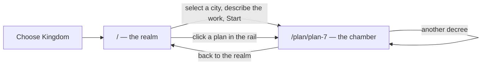

# The Plan's chamber: a real conversation view, and a route to reach it

Today a plan has no place of its own. Its whole life — the decree that opened
it, the court's reply, its status, the files it would touch — is squeezed into a
collapsible dock at the bottom of the map, and that dock shows *whichever live
plan happens to be last in the selected city*. There is no way to open a
specific plan, no URL for one, and no way back to a conversation once the
selection moves on. The rail lists plans, but they are inert text.

That is the wrong shape for the product's core loop. `AGENTS.md` says a `Plan`
is both the unit of work and the unit of review; a unit of review needs somewhere
to be reviewed. This task gives it one.

## The journey being built

Two screens, one rail down the left of both, and every plan reachable by URL.

---

## Part 1 — Split the drafting turn in two

`open_plan` currently registers a plan, takes the lease, calls the model and
settles, all inside one request. That is why the King has to wait on the map:
there is no plan id to navigate to until the model has already finished. Split
it so the identity exists before the work does.

### `api.rs`

Replace `open_plan` / `continue_plan` with three server functions:

- **`begin_plan(prompt, city) -> Plan`** — validates the decree, mints a
  `PlanId`, pushes a `Plan::opened(..)` (status `Drafting`, transcript already
  holding the King's words) and returns immediately. Takes **no lease** and makes
  **no model call**: nothing shared has been touched yet, so there is nothing to
  claim.
- **`say(plan, prompt) -> Plan`** — appends a `Speaker::King` utterance and sets
  status back to `Drafting`. Also instant, so the King's own words appear the
  moment he presses enter rather than after the model replies.
- **`draft_plan(plan) -> Plan`** — the part that actually costs something:
  acquires the shared city-path lease, builds the `Brief` from the plan's
  transcript, calls the model, and calls the existing `settle` (which releases
  every lease on every path). Blocked and failed outcomes land in the transcript
  exactly as they do today.

The credential check moves from "before the plan exists" to inside `draft_plan`.
That is a small improvement in its own right: a missing credential now surfaces
as a failed *plan* the King can see and retry, instead of an error attached to
nothing.

### Two hazards the split introduces, and how each is closed

**A second draft racing the first.** The conversation view kicks off drafting on
mount; a reload or a second tab could kick off another. Rather than inventing a
flag, use the mechanism already there: **if the plan already holds a lease, a
draft is in flight — return the plan unchanged.** The lease *is* the answer to
"is someone working on this right now?", so using it here is the lease model
earning its keep rather than being decorative.

**A client that walks away mid-draft.** If the browser navigates off and Axum
drops the request future, the model call is cancelled *after* the lease was
taken and *before* `settle` releases it — the city would be left held by a plan
that is permanently `Drafting`, blocking every later decree with no way to clear
it. Run the model call and settle inside a `tokio::spawn`, awaiting the join
handle for the response. A disconnect then loses only the reply, never the
release. Cheap, contained, and honest about being a stopgap until the WebSocket
layer makes drafting a background job properly.

---

## Part 2 — Routing

`leptos_router` is already a dependency and `main.rs` already calls
`generate_route_list(App)`; there is simply no `Router` yet.

- `App` keeps the kingdom-loading `Resource` and the `ChooseKingdom` gate, then
  wraps a `Router` around a **parent layout route** that renders the `Sidebar`
  plus an `<Outlet/>`. The rail therefore never unmounts, so moving between the
  realm and a chamber is instant and the rail's scroll position survives.
- `/` renders `<KingdomMap/>` and the decree bar.
- `/plan/:id` renders `<Conversation/>`.
- An unknown id renders a plain "no such plan in the records" panel with a way
  back, not a blank screen.

The map's camera is deliberately **not** preserved across navigation (your
call): leaving the realm and returning surveys the whole realm again.

---

## Part 3 — The two views

### `components/decree.rs` — the composer (new, carved out of `chat.rs`)

What is left of the dock once the transcript moves out: a target line
("→ Cityname"), the input, the **Start** button, and the existing provider badge
and setup panel. No collapse chevron, no log — one row plus the badge, which is
all it was ever really doing on the map.

Start dispatches `begin_plan`, then navigates to `/plan/{id}`. With no city
selected the button is disabled and the placeholder says so — already the
behaviour, just made honest by being permanently visible rather than hidden
behind a collapsed dock.

### `components/conversation.rs` — the chamber (new)

A full-height panel in the main region:

- **Header** — a back control to `/`, the plan title, the city it is drawn up
  for, its status badge (reusing `plan-{suffix}`, so it cannot drift from the
  rail or the map legend), and the model that drew it.
- **Summary and touched files** — the plan's `summary`, and `touches` as a list.
  Both exist on `Plan` today and are currently visible only as a rail tooltip
  and as gilded roofs on the map.
- **Transcript** — the existing `Transcript` component moved here and given room
  to breathe: alternating King/Court, `white-space: pre-wrap` preserved, and
  auto-scrolled to the newest line.
- **Live line** — while drafting, "The court is drawing up the plan…".
- **Composer** — another decree on this plan: `say` (instant echo) followed by
  `draft_plan`.

On mount it sets `state.selected` to the plan's city, so the rail and the map
agree with the URL about where the King is.

**Drafting that outlives the page.** If the view mounts on a plan already
`Drafting` (a reload mid-draft, most likely), poll `get_kingdom` once a second
until the status moves on, then stop. Without it, a refresh leaves a spinner
that never resolves. This is a deliberate placeholder for WebSocket push and
should carry a comment saying exactly that, so it gets deleted when push lands
rather than becoming furniture.

### `components/sidebar.rs` — make the rail a navigator

- Each plan row becomes a link to `/plan/{id}`, with the row matching the
  current route marked `.current`. This is the specific thing you asked for:
  clicking a live plan opens its conversation.
- Clicking a city row selects it **and** navigates to `/`, so the rail always
  takes the King to the thing he clicked rather than sometimes silently changing
  state on a screen that cannot show it.

---

## Part 4 — Styles

Following the existing one-partial-per-component rule:

- **delete** `components/_chat-dock.scss`
- **add** `components/_decree-bar.scss` (composer, provider badge, setup panel —
  largely lifted from the dock)
- **add** `components/_conversation.scss` (chamber header, summary, touches,
  transcript, composer)
- `layout/_throne-room.scss` loses the `chat` grid area: the grid becomes
  `"sidebar main"`, and the realm route stacks map-then-composer inside `main`
  as a flex column. One grid, both routes.
- `_sidebar.scss` gains `.plan-row` link affordances and a `.current` state.

No new colours. Status colour keeps coming from `$statuses` via
`PlanStatus::css_suffix`, which is what stops the chamber's badge from drifting
away from the rail's and the map's.

---

## Tests

**No new automated tests, deliberately.** This is a routing and presentation
change. The one invariant it touches that genuinely matters — a plan never keeps
a lease past its draft — is already pinned by
`llm::broker::tests::shared_reads_compose_and_release_clears_the_field`, and the
split deliberately routes both new entry points through the same unchanged
`settle`, so that test keeps covering them. A test asserting "clicking a link
changes the URL" would restate the router, and the server functions sit on a
process-global store that concurrent tests would race on.

What this change needs instead is to be **looked at**, per `AGENTS.md` §6:

1. Fresh kingdom → select a city → type a decree → **Start** lands on
   `/plan/plan-1` immediately, showing the King's words and a live drafting line.
2. The reply arrives in place; the rail badge flips to *Awaiting review*; the
   touched files appear; the map gilds those roofs on return.
3. Back to `/`, click a different plan in the rail → its conversation, correct
   transcript, correct city highlighted.
4. Reload on `/plan/plan-1` → the chamber rebuilds from server state alone.
5. Reload *during* a draft → the poll picks the reply up, and the lease is gone
   afterwards (check Crown Resources).
6. Navigate away mid-draft, then come back → the plan settled anyway and holds
   nothing. This is the `tokio::spawn` guarantee, and the one worth checking by
   hand.

## Out of scope

- **Approve / reject** (your call): the chamber is the obvious home for the
  verdict, but it stays a separate task rather than shipping buttons that do
  nothing.
- WebSocket push, a lease queue, persistence — all unchanged, and this task is
  shaped so the first of them deletes the polling stopgap cleanly.
