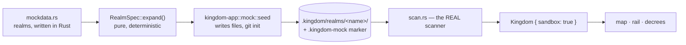

# The Proving Grounds: hardcoded mock realms, a seeder, and a sandbox the King cannot escape

Kingdom IDE is about to be pointed at itself. That is the whole point of it —
the King issues decrees and the court builds the next feature. But right now the
only kingdom it can open is a **real** dev folder, which means every rehearsal of
every flow runs against real projects: real files, real git repos, real ports.

That is unacceptable in three separate ways, and they get worse in that order:

1. **Today** — a demo or a test opens `~/dev` and the map is whatever happens to
   be on this machine. Nothing is reproducible; a screenshot from yesterday
   cannot be compared with one from today, and "does the skyline still look
   right?" has no fixed answer.
2. **Soon** — the states the product exists to show (a blocked plan, a contended
   port, two cities fighting over `~/.cargo`) are hardcoded into exactly one
   scenario in `sample::populate_court`, welded to whatever cities happened to be
   scanned. "What does the map do with forty cities?" or "what does a three-way
   contention look like?" are unanswerable without rewriting that function.
3. **The moment plans get hands** — `AGENTS.md` §8 item 3 is *give a plan hands*:
   run a command, write a file, propose a diff. The first time that lands, an
   agent will be executing against whatever folder the King last opened. There
   must be somewhere safe for that to happen *before* it can happen anywhere
   else, and the safety must be structural rather than a habit of remembering to
   type the right path.

So this task builds the **Proving Grounds**: synthetic realms, defined in Rust,
materialised on demand, that look and behave like real dev folders and are
provably not one.

---

## The shape of it



Two decisions carry this design.

### The realms are Rust, not a config format

There is no manifest file, no parser, no new dependency. A realm is a `fn` in
`mockdata.rs` returning a `RealmSpec`, and changing the fake data means editing
that file like any other source file.

This is the right trade for a fixture that only ever has one author — us. A
config format would buy the ability to add a realm without recompiling, which
nobody needs, and would cost a parser, an error-reporting path for malformed
input, a schema to keep in sync with the types, and a second place where a typo
can hide. In Rust the compiler rejects a bad realm before it exists, `CityKind`
and `Ward` are the real enums rather than strings that must be matched back to
them, and "go look at the fake data" is one file with `cargo fmt` applied.

The cost is honest and small: adding a realm is a recompile. For a fixture that
changes a handful of times a year, that is nothing.

### The seeder writes real files, and the ordinary scanner reads them

That is the arrow from `D` back into `scan.rs`. It would be less work to
fabricate `Vec<City>` in memory and skip the disk entirely. That would be a
mistake, and an expensive one:

- It would test a code path that never runs in production. `scan.rs` — its depth
  cap, its `FILES_PER_DISTRICT` pruning into `extra_files`/`extra_bulk`, its
  `SKIP_DIRS`, its `detect_kind` marker sniffing — is precisely the layer whose
  behaviour under a big or strange project we most want to rehearse. Faking
  above it means the pruning path is never exercised until a real monorepo hits
  it.
- The `AGENTS.md` invariant *"every file is accounted for as a tower or inside a
  commons block"* is a claim about scanning, not about a hand-built struct.
- When plans get hands, they need a directory to actually act on. A fake
  `Vec<City>` gives an agent nothing to write to.

So: real bytes, real folders, real `git init`. Just not *yours*.

---

## 1. `kingdom-core::mockdata` — the realms and the expansion

A new pure module beside `sample.rs`. No I/O, no new dependencies, compiles to
wasm like everything else in the crate. It holds both the vocabulary and the
realms themselves; the seeder in `kingdom-app` does nothing but write down what
this module computed.

That split follows the rule the project already lives by: pure logic in
`kingdom-core` with a test, I/O in `kingdom-app`. Expansion is maths over a spec,
exactly like `layout.rs` and `skyline.rs`, so it is testable without a
filesystem.

```rust
/// A whole synthetic dev folder.
pub struct RealmSpec {
    /// Folder name, and the kingdom's display name.
    pub name: &'static str,
    /// One line shown by the seeder and the picker.
    pub blurb: &'static str,
    /// Everything generated is a pure function of this plus the spec, so two
    /// machines seeding the same realm produce byte-identical folders.
    pub seed: u64,
    pub cities: Vec<CitySpec>,
    /// How this realm's opening court is fabricated. See §4.
    pub court: CourtFn,
}

pub struct CitySpec {
    pub name: String,
    /// Which marker files to write, so `scan::detect_kind` infers this stack
    /// by the same rules it uses on a real project — never by being told.
    pub stack: CityKind,
    pub git: GitSpec,
    pub tree: Vec<TreeSpec>,
}

/// One entry in a city's tree: a literal file, a folder, or a generated run.
pub enum TreeSpec {
    File { path: String, content: FileContent },
    Dir { name: String, children: Vec<TreeSpec> },
    /// N generated files, e.g. `src/module_{i}.rs`, sized from a range.
    /// This is what makes a 5,000-file city one line.
    Fill { pattern: String, count: usize, bytes: Range<u64>, ward: Ward },
}

/// Exact bytes when the content matters (a `Cargo.toml`, a README), or a size
/// to be filled with generated filler of the right shape for its ward.
pub enum FileContent { Literal(String), Bulk(u64) }
```

### Writing a realm should be pleasant, or nobody will edit it

The user-facing promise of this task is "open `mockdata.rs`, change the fake
data". A wall of struct literals would break that promise on contact, so the
module ships a handful of terse constructors and realms are written with them:

```rust
/// A fake dev folder shaped like this one. The everyday realm.
fn kingdom_mirror() -> RealmSpec {
    RealmSpec {
        name: "kingdom-mirror",
        blurb: "Five projects, mixed stacks — the everyday proving ground.",
        seed: 0x_M1RR0R,
        court: court::default_court,
        cities: vec![
            rust_city("orchard")
                .dir("src", [
                    file("main.rs", 4_200),
                    file("lib.rs", 9_800),
                    fill("module_{i}.rs", 24, 1_500..12_000, Ward::Rust),
                ])
                .dir("tests", [fill("case_{i}.rs", 6, 800..3_000, Ward::Rust)])
                .dirty(3),
            node_city("lantern") /* … */,
            python_city("almanac") /* … */,
            docs_city("chronicle") /* … */,
            rust_city("forge").no_git(),
        ],
    }
}

/// Every realm the seeder can build. Add yours here.
pub fn realms() -> Vec<RealmSpec> {
    vec![kingdom_mirror(), crowded(), monorepo(), contended()]
}

pub fn realm(name: &str) -> Option<RealmSpec>;
```

`rust_city` and friends write the marker files (`Cargo.toml`, `package.json`, …)
with plausible contents, so `detect_kind` infers the stack the same way it would
from a real project. `stack` on `CitySpec` is what the *test* asserts against; it
is never handed to the scanner.

### Expansion, and why it must be deterministic

```rust
impl RealmSpec {
    /// Every file this realm will contain, in a stable order.
    pub fn expand(&self) -> Vec<PlannedFile>;
    /// Rejects a realm that cannot be seeded, before a byte is written.
    pub fn validate(&self) -> Result<(), Vec<SpecError>>;
}

pub struct PlannedFile { pub city: String, pub path: String, pub bytes: u64,
                         pub content: FileContent }
```

Sizes and filler come from a small **splitmix64** PRNG seeded with
`hash(realm.seed, city.name, file.path)` — per-file, not a rolling stream. A
rolling stream would make every file's size depend on how many files came before
it, so inserting one entry at the top of a city would silently resize the entire
realm and move every tower on the map. Per-file seeding means an edit changes
exactly what it names.

Determinism here is the same requirement `AGENTS.md` already places on
`layout.rs` and `skyline.rs`, for the same reason: **the King's spatial memory**.
If the proving grounds reshuffle between runs, the map cannot be used to notice
that something changed — which is the only reason to look at it.

`validate` catches author mistakes that are miserable to diagnose after the fact:
duplicate paths within a city, absolute or `..`-escaping paths, a city named
`.git`, a `Fill` pattern without `{i}`. It is called by the seeder before
anything is written, so a mistyped realm fails with a clear message instead of
half-materialising.

---

## 2. `kingdom-app::mock` — the seeder

Server-only (`#[cfg(feature = "ssr")]`), sitting beside `scan.rs` as its mirror
image: `scan.rs` turns a folder into a `Kingdom`, `mock.rs` turns a `RealmSpec`
into a folder.

```rust
pub fn seed(spec: &RealmSpec, into: &Path) -> Result<SeedReport, SeedError>;
pub fn sandbox_root() -> PathBuf;   // KINGDOM_SANDBOX_ROOT or .kingdom/realms
```

**Order of operations, and why:**

1. `spec.validate()` first. Nothing is written until the whole realm is known to
   be seedable — a half-written realm that fails partway is worse than no realm,
   because it looks plausible.
2. Write `.kingdom-mock` — the marker (§3) — **before** any content, so an
   interrupted seed still leaves a directory that is safe to clear.
3. Materialise files. Anything under ~64 KB is written normally; anything larger
   is created and `set_len` to its declared size. That gives a **sparse file**:
   the scanner's `metadata().len()` reports the full bulk, the skyline draws a
   tower of the right height, and the disk cost is near zero. A realm containing
   a 40 MB video — the exact case behind the tested *assets never outweigh code*
   invariant — costs kilobytes.
4. `git init`, one commit, then leave the declared number of files modified so
   `has_git` and `dirty_files` are honestly derived rather than asserted. Guarded
   by `GitSpec` so a git-less environment degrades to no-git rather than failing
   the seed.
5. Return a `SeedReport` — files written, bytes on disk, cities — which is what
   the CLI prints and what the test asserts against.

Re-seeding an existing realm **clears it first**, and clearing is where the
safety rule bites.

---

## 3. The safety rails — the part that actually matters

The ask behind this task is *"I don't want it using my real projects"*. A
convention ("remember to type the sandbox path") satisfies that until the first
time someone forgets. Three mechanisms, layered, each catching what the one
before it missed:

### The marker file

Every seeded realm root contains `.kingdom-mock`, holding the realm name, the
seed and a generation timestamp. **The seeder refuses to write into, or clear,
any existing non-empty directory that does not contain this file.** No flag
overrides it; the escape hatch is to delete the directory yourself, which is a
thing you cannot do by accident from inside this app.

This is what makes `--force` safe to offer at all: it means "re-seed this
proving ground", never "overwrite whatever is there".

### `KINGDOM_SANDBOX=1`

With it set, `open_kingdom` refuses any path that is not inside `sandbox_root()`,
resolved through `canonicalize` so `../../` and symlinks cannot walk out. The
refusal is a plain server error naming the sandbox root.

This is the setting for the session where Kingdom IDE is working on Kingdom IDE.
It turns "I meant to open the fake one" from a thing you must remember into a
thing the server enforces — and when plans get hands, it is the wall that keeps
an agent's first `rm` inside the proving grounds.

### `Kingdom.sandbox: bool`

A new field, set by `open_kingdom` when the marker is present. The rail's kingdom
header renders a small, unmissable **PROVING GROUNDS** tag when it is true.

The map is the product's face and it is about to be full of convincing fake
cities. A screenshot of a fake realm that is indistinguishable from a real one is
a trap — for the King, and equally for a future model reading a screenshot back.
The honesty here is the same instinct as `AGENTS.md` §5 being explicit about what
is real versus faked, applied to the running UI rather than the docs.

---

## 4. The court, per realm

`sample::populate_court(&[City]) -> (Vec<Plan>, Vec<Resource>)` already does the
right thing: it takes the scanned cities and fabricates an opening court over
them. The only limitation is that there is exactly one of it.

So the fix is not a new representation — it is a **second and third function of
the same signature**, chosen by the realm:

```rust
pub type CourtFn = fn(&[City]) -> (Vec<Plan>, Vec<Resource>);
```

`sample::populate_court` stays exactly as it is and remains the default — it is
what the real-folder path (`open_kingdom` on `~/dev`) uses, and its test, *the
opening court always shows a blockage and a contention*, is pinning a product
requirement from `AGENTS.md` §5. Nothing about it changes.

What is added is a `mockdata::court` submodule holding alternatives, each a
handful of plain Rust lines beside the realm that uses it:

- `default_court` — delegates to `sample::populate_court`. Most realms use this.
- `three_way_contention` — one port, one holder, two waiters, plus a second
  resource contended between different cities. The map's red threads at their
  worst, which is the visual this realm exists to exercise.
- `quiet_court` — nothing blocked, nothing contended. Deliberately *not* the
  default, for the reason `AGENTS.md` gives, but reachable so the all-clear state
  can be looked at on purpose.

The dangling-`PlanId` check that currently lives inside `populate_court`'s test
moves into a shared helper these courts are checked with, because a `waiting`
entry pointing at a plan that does not exist silently drops the red thread from
the map — the single most important thing the map draws — and that failure is now
reachable from three functions instead of one.

---

## 5. Getting at it

### A binary

```bash
cargo run -p kingdom-app --bin kingdom-seed -- kingdom-mirror [--into DIR] [--force]
cargo run -p kingdom-app --bin kingdom-seed -- --list
```

Takes a realm *name*, resolved through `mockdata::realm()`; an unknown name
prints the list. A second binary rather than a flag on the server, because
seeding is a one-shot job with an exit code — a CI step or a `make` target can
depend on it, and it does not need an Axum runtime.

### A button

The `ChooseKingdom` screen gains a quiet secondary action: **"Enter the Proving
Grounds"**, which seeds `kingdom-mirror` if absent and opens it. One click from a
cold clone to a populated, reproducible map with zero configuration.

This matters more than it looks. The opening screen currently demands an absolute
path to a real dev folder before the app shows anything at all — so the very
first thing a new contributor (or a model rehearsing the flow) does is point the
tool at real files. Making the safe path the *easy* path is what stops that being
the default behaviour.

### The bundled realms

- **`kingdom-mirror`** — a fake dev folder resembling this one: a Rust workspace
  city, a Node city, a Python city, a docs city, one no-git city. ~400 files.
  The everyday realm, and what the button opens.
- **`crowded`** — 40 cities of wildly varying size. Exists to make map layout,
  label collision and level-of-detail switching fail *here* rather than on the
  King's machine.
- **`monorepo`** — one city with ~8,000 files nested well past `SCAN_DEPTH`, plus
  a 40 MB sparse asset. Drives every cap in `scan.rs`: the depth cut, the
  `COUNT_CAP` budget, `FILES_PER_DISTRICT` pruning into `extra_files`, and the
  assets-vs-code weighting.
- **`contended`** — small cities, but `three_way_contention` as its court.

---

## 6. Where the realms live

Default `sandbox_root()` is **`.kingdom/realms/<name>`** under the repo, which
`.gitignore` already excludes via `/.kingdom/`. Overridable with
`KINGDOM_SANDBOX_ROOT` for a tmpfs or a scratch disk.

Under the repo rather than `/tmp` so a realm survives a reboot and can be
inspected with ordinary tools while debugging what the map did with it; not under
`target/` so `cargo clean` does not silently delete it mid-investigation. The
definitions are committed and the materialised bytes are not — regenerating is a
single deterministic command, so the bytes are worth nothing but the recipe is
worth everything.

---

## Tests

Four. Each pins something that would be noticed breaking, and nothing here
restates an accessor.

1. **Expansion is deterministic and locally scoped** (`kingdom-core`) — expanding
   the same realm twice gives identical paths *and sizes*; inserting a file into
   one city leaves every other city's expansion byte-identical. Pins the
   per-file-seed decision. Without it, someone "simplifies" the PRNG into a
   rolling stream and every edit to `mockdata.rs` silently reshapes the whole map
   — the same class of breakage `layout.rs`'s determinism test already guards.

2. **The marker guards the door** (`kingdom-app`) — seeding into a temp dir
   holding an unrelated file fails and **writes nothing**, and the pre-existing
   file is still there afterwards; seeding into the same dir once marked
   succeeds. This is the test that stands between this feature and destroying
   someone's work, which makes it the most valuable one in the task.

3. **The sandbox cannot be walked out of** (`kingdom-app`) — with
   `KINGDOM_SANDBOX=1`, `open_kingdom` refuses an outside path, refuses a
   `..`-relative path that resolves outside, and accepts the realm root. Pins the
   containment, including the traversal case that a naive `starts_with` on
   unresolved strings would let through.

4. **A seeded realm survives the round trip** (`kingdom-app`) — seed
   `kingdom-mirror`, run the *real* `scan_kingdom` over it, and assert the
   cities, their inferred `CityKind`s and their file counts match what the spec
   declared. This is the one that proves the whole chain is honest: `stack:
   CityKind::Rust` in the realm is only meaningful if `detect_kind` actually
   infers Rust from the `Cargo.toml` that was written. It also covers `validate`
   for the bundled realms for free, since the seed step calls it.

No test for the CLI's argument parsing, for `SeedReport`'s fields, or for "the
button renders".

---

## Out of scope

- **Loading realms from a file at runtime.** Explicitly rejected above: a
  recompile is a fine price for a fixture with one author, and a config format
  would add a parser, a schema and a second place for a typo to hide.
- **Fake git *history*.** One commit plus dirty files is enough to make `has_git`
  and `dirty_files` honest. Branches and conflicts wait until something reads
  them.
- **Fake running processes.** Nothing actually binds port 3000;
  `ResourceKind::Port` is a claim in the court, not a socket. Real process
  supervision is its own task.
- **Mocking the model.** Already solved — `llm::mock` with its `[[scenario:NAME]]`
  markers is exactly this idea applied to drafting, and this task deliberately
  mirrors its stance (deterministic, offline, hardcoded in Rust). The two
  compose: a mock realm plus a mock model is a fully offline end-to-end
  rehearsal.
- **Persistence of a seeded kingdom's state.** Still in-memory; a restart still
  empties the court. Unchanged by this task.

---

## Docs to update

- **`AGENTS.md` §5** — the Proving Grounds join the "real today" list, and §7
  gains the seed command. Worth stating plainly that developing Kingdom IDE
  against Kingdom IDE is expected to happen inside a sandboxed realm, and that
  `mockdata.rs` is the one file to edit to change the fake data.
- **`README.md`** — the one-command path from clone to a populated map, ahead of
  "point it at your dev folder".
- **`.kingdom.env.example`** — `KINGDOM_SANDBOX` and `KINGDOM_SANDBOX_ROOT`.
- **`mockdata.rs`'s own module docs** — how to add a realm, in the file where
  someone adding one is already looking. This replaces a separate format
  reference: the types *are* the schema.
