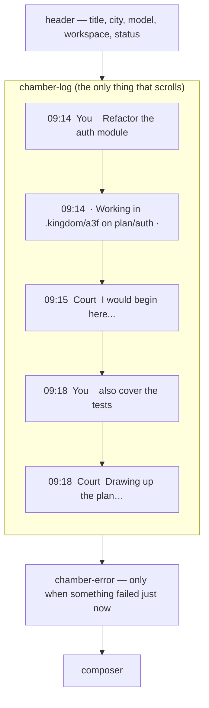

# A chamber that reads in order

The plan's chamber does not read as a conversation. The King says something,
and his own words appear *third* — beneath two blocks derived from the newest
model reply, and above a stray error line that may have come from a different
screen entirely.

Nothing is wrong with the data. `Plan.transcript` is a `Vec<Entry>` in
insertion order and the `For` renders it faithfully. The fault is that
`ChamberBody` interleaves *plan state* with *the message flow* in one scrolling
column:

| DOM order today | What it actually is |
|---|---|
| 1. `.chamber-summary` | derived from the **newest** draft |
| 2. `.chamber-touches` | derived from the **newest** draft |
| 3. `<Transcript/>` | the real log — begins with the King's **first** decree |
| 4. drafting line | live, correct |
| 5. `state.error` | a **global** signal; leaks in from other screens |

So the two newest things sit above the oldest thing. That is the whole bug.

The fix is to make the log contain the conversation and nothing but the
conversation, in the order it happened, with a quiet time on each line.

---

## Part 1 — Delete the touched-files concept

A model's file list is a guess. It is presented as fact, it lights up buildings
on the map, and it is wrong often enough not to be worth the floor space. It
goes — not just from the chamber view, but from the domain.

**`kingdom-core`**

- `Plan.touches` — deleted, along with its initialiser in `Plan::opened`.
- `sample.rs` — `notable_files` and `collect` exist *only* to fabricate
  `touches`; both are deleted with the field. The opening court keeps its
  failed plan and its mid-draft plan, which is what the pinned test in that
  module cares about.
- Doc comments in `model.rs` (~line 97), `skyline.rs` (~line 105) and
  `scan.rs` (~line 117) all describe a building path as "the join key for a
  Plan's `touches`". That join no longer exists; reword them to say a path
  identifies a building on the map, full stop.

**`kingdom-app`**

- `llm::Draft.touches` — deleted.
- `copilot.rs` — `mentioned_paths()` and its call site go with it.
- `mock.rs` — the `Plan`/`Slow` scenario keeps listing files **in its reply
  body** (that is chat output, and it is what makes the mock a useful
  rehearsal); it simply stops returning a `touches` vector.
- `api.rs::settle` — drops `plan.touches = draft.touches.clone()`.

**The visible consequence, stated plainly so it can be vetoed:** the map loses
its gilded roofs. `map/city.rs` currently builds an `under_plan` set from every
pending plan's `touches` and passes it down through `Buildings` →
`BuildingGlyph` to mark a `.touched` building and draw a `.roof-gilt` polygon.
All of that goes: the `under_plan` memo, both component props, the `touched`
memo, the gilt polygon, and `.roof-gilt` + its `gilt-pulse` keyframes in
`_skyline.scss`. Cities keep every other signal they have — selected, astir,
troubled, the skyline itself.

**`Plan.summary` is kept.** It is *not* the file list, and the rail uses it as
a row tooltip — a genuinely different surface from the chat. It stops being
rendered in the chamber (it is a restatement of the reply's first sentence, not
a message), but the field and `settle`'s use of it stay.

## Part 2 — Stamp every entry with the time it happened

`Utterance` and `Note` each gain an `at`, so a line's position in the log is
corroborated by something other than array order.

```rust
/// When something entered a plan's log: milliseconds since the Unix epoch, UTC.
///
/// A bare integer rather than a date type, because `kingdom-core` must compile
/// to wasm and every calendar crate wants a clock the browser does not have.
/// Rendering it as a local time is the browser's job.
pub struct Timestamp(pub i64);
```

- `Timestamp::now()` is cfg-split. Native reads `SystemTime`. The wasm arm
  returns `None` — **the browser never authors a log entry**; every one is made
  server-side in `api.rs`, `sample.rs` or `court.rs`. Making the field
  `Option<Timestamp>` rather than a `0` sentinel means that unreachable case
  renders as *no time*, instead of confidently claiming 1 January 1970.
- `Plan::say` and `Plan::note` stamp automatically; `Plan::opened` stamps the
  decree it seeds the transcript with. No call site outside core changes.
- `#[serde(default)]` on the field, so the wire type tolerates an entry that
  predates it.

**Rendering.** Add `js-sys` as an optional dependency behind the `hydrate`
feature and format with `js_sys::Date` → a bare `HH:MM` in the King's own
timezone. Under `ssr` the formatter returns an empty string. This is safe from
hydration mismatch because the chamber is never server-rendered with real
content: `App` gates on `state.kingdom.is_open()`, which is false during SSR and
only becomes true in a client-side `Effect`.

Subtle by design: `.msg-at` sits in the gutter beside the existing speaker
label, at `$ink-faint`, 11px, tabular numerals so the column does not jitter.
Notes — which are centred pills, not bubbles — carry theirs inline, before the
text.

## Part 3 — One column, one order

`.chamber-log` becomes exactly the transcript, then the live line:



- The `.chamber-summary` and `.chamber-touches` blocks are removed from the
  view, and `.chamber-summary`, `.chamber-touches`, `.touches-label`,
  `.touch-path` from `_conversation.scss`.
- The drafting line stays last, because that is where it belongs in time.

**The stray error.** `state.error` is global — `ChooseKingdom` and `DecreeBar`
write to it too — so an error raised on another screen renders as a permanent
red *chat message* at the foot of this plan's log, dressed as something the
court said. Two changes: clear `state.error` when the chamber mounts, so
nothing leaks in from elsewhere; and render what remains as a `.chamber-error`
strip **above the composer**, outside the log. A genuine drafting failure is
already recorded properly as a `Note(Failed)` in the transcript by `settle` —
it does not need a second, worse rendering.

**Auto-scroll.** A `NodeRef` on `.chamber-log` plus an `Effect` that tracks the
entry count and the drafting flag, setting `scroll_top = scroll_height`. Today
a long conversation leaves the newest reply below the fold, which is a strange
way to treat the thing the King is waiting for. `web-sys` already has the
`Element` feature this needs.

---

## Tests

**No new automated tests, and that is the honest answer here.**

- Removing `touches` is enforced by the compiler across both crates — a test
  asserting a deleted field is absent cannot fail in a useful way.
- The ordering fix is a *layout* change. Order was already guaranteed by
  `Vec<Entry>` and the `For`; nothing about the data was ever wrong, so a test
  over the data would have passed before the fix and after it.
- `transcript_tests::notes_never_reach_the_model_and_the_prompt_survives_them`
  already pins the one invariant genuinely at risk — that notes never reach a
  model and ordering survives — and it keeps passing unchanged through the
  `at` field being added, because it builds entries via `say`/`note`.
- `sample::tests::the_opening_court_always_shows_trouble_and_history` must keep
  passing after `notable_files` is deleted. It should, as it asserts on
  statuses only.

What this needs instead is to be looked at:

1. Fresh decree → the chamber opens with **your words at the top**, timestamped,
   the workspace note beneath them, then the reply.
2. Say something else → your line appends at the bottom instantly, the view
   scrolls to it, and the reply lands under it.
3. `[[scenario:error]]` → the failure appears as a note *in sequence*, not as a
   sticky red line at the foot.
4. Trigger an error on the opening screen, then open a plan → no error strip.
5. A conversation longer than the viewport stays pinned to the newest line.
6. The map still selects, still draws cranes on drafting cities, still marks
   troubled ones — with no gilded roofs anywhere.

## Out of scope

- WebSocket push. The `poll_while` stopgap and its "delete me" comment stay
  exactly as they are.
- Approve / reject verdicts.
- Markdown rendering of replies. `white-space: pre-wrap` continues to do the
  work; turning model prose into rendered markdown is its own decision.
