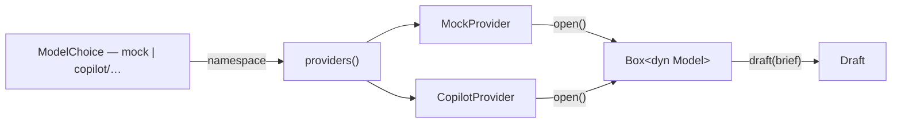

# One model type, and mock is just one of them

Today "mock" is a top-level concept. `ModelProvider::{Mock, Copilot}` sits in the
domain model; `llm::provider()` reads `KINGDOM_MODEL_PROVIDER`; the catalogue
hard-codes a `mock_option()` at the head of the list; the decree bar carries a
`mock ✓` badge next to the model chip; and `llm::status()` has a whole `match`
arm explaining what the mock is.

None of that is a fact about the mock. It is a fact about *provider* being
modelled as a separate axis from *model*, which it never needed to be — a
namespaced id (`mock`, `copilot/claude-opus-5`) already names its backend, and
`ModelChoice::provider()` already derives it. The mock's specialness is
leftover scaffolding from when it was the only thing that worked.

This task collapses that: **one `Model` trait, one way a model announces itself,
and a catalogue assembled from providers rather than from one hard-coded entry
plus a loop.** The mock becomes a provider that serves exactly one model, listed
and chosen like any other.

## The guiding test

> Does this make it easier for one person to know and steer what many agents are
> doing?

Indirectly, and that is the honest framing: it does not add a capability. It
removes a second vocabulary for the same idea, so the next model backend (a
local Ollama, an Anthropic key) is *one file implementing one trait* rather than
a new variant threaded through `ModelProvider`, `status()`, `configured()`,
`catalogue()`, the badge, and two env vars. The King's screen gets one control
simpler at the same time.

---

## The shape

Two traits, because there are genuinely two questions with different lifetimes:

```rust
/// What a backend can offer, and how to build one. One per backend, resolved
/// once at startup and asked again whenever the catalogue is refreshed.
#[async_trait]
pub trait Provider: Send + Sync {
    /// The id namespace this provider owns: `"mock"`, `"copilot"`.
    fn namespace(&self) -> &'static str;

    /// Every model this provider will actually serve right now, plus why the
    /// list might be empty. Never an error: a provider that cannot reach its
    /// gateway reports that and yields nothing, so one broken backend cannot
    /// empty the picker.
    async fn catalogue(&self) -> ProviderCatalogue;

    /// Builds the model a choice names. The choice is already known to belong
    /// to this namespace.
    async fn open(&self, choice: &ModelChoice) -> Result<Box<dyn Model>, ModelError>;
}

/// One model, ready to draft. Unchanged in spirit; `name()` becomes the
/// namespaced id so a plan records exactly what drew it.
#[async_trait]
pub trait Model: Send + Sync {
    async fn draft(&self, brief: &Brief) -> Result<Draft, ModelError>;
    fn id(&self) -> &str;
}
```

`ProviderCatalogue { options: Vec<ModelOption>, credential: CredentialState,
detail: String }` — a provider reporting on itself. `llm::catalogue()` becomes a
fold over the registry: concatenate the options, and take the detail from
whichever provider has something worth saying.

The registry is a plain `fn providers() -> Vec<Box<dyn Provider>>` returning
`[MockProvider, CopilotProvider]`. Deliberately **not** a global registry with
registration macros: two providers do not need a plugin system, and a `Vec`
literal is the version of this that a reader can follow in one line.



### What the mock gains by this

`MockProvider::catalogue()` returns one `ModelOption` (`id: "mock"`, vendor
`"Offline"`, no efforts, `recommended: false`) and `CredentialState::Ready` with
a detail line saying it needs none. It is the only provider that can never fail
to offer something, which is exactly why it makes a good fallback — but that is
now an *emergent* property of the list, not a special case in `assemble()`.

---

## Decisions taken (from the King)

**1. The picker opens on the best available model, not on the mock.**
`KINGDOM_MODEL` wins if set (now a full namespaced id, e.g.
`copilot/claude-opus-5`). Otherwise: the first `recommended` option in the
assembled catalogue, falling back to the first option at all. With no working
credential the Copilot provider yields nothing, so the catalogue is `[mock]` and
a fresh clone still drafts offline with zero setup — the old behaviour, arrived
at by the general rule instead of by a hard-coded default.

**2. The `mock ✓` / `copilot ✗` badge goes away entirely.** Credential state
moves into the model picker, which already renders `catalogue.detail` and now
also gets the env-var setup block when `credential != Ready`. One control fewer
in the decree bar, one fewer server round trip on load, and the answer to "what
will draft this?" lives in exactly one place: the chip.

**3. `KINGDOM_MODEL_PROVIDER` is dropped, silently.** `KINGDOM_MODEL` alone
takes a namespaced id. A stale `KINGDOM_MODEL_PROVIDER` in someone's local
`.kingdom.env` is ignored; `.kingdom.env.example` and the README are updated to
match. (No deprecation warning: the project has no external users, and a warning
path is code that outlives the thing it warns about.)

---

## Changes, file by file

### `crates/kingdom-core/src/model.rs`

- **Delete `ModelProvider`.** It has exactly two consumers: `llm::configured()`
  routing (replaced by namespace lookup) and the badge (deleted). `ModelChoice`
  keeps `api_name()`; `provider()` becomes `namespace() -> &str` returning the
  part before the `/`, or `"mock"`… — no. Returning the *whole id* when there is
  no slash is wrong for a future bare-id provider, so: `namespace()` returns the
  segment before `/` if present, else the whole id. `mock` → `"mock"`,
  `copilot/x` → `"copilot"`. Same behaviour, no enum.
- **Delete `ModelStatus`** and `ModelStatus::is_ready()`. Its two fields that
  still matter (`credential`, `detail`) already exist on `ModelCatalogue`.
- `ModelCatalogue::resolve()` keeps working unchanged — it already degrades a
  withdrawn model to `default_id`, which is now "best available" rather than
  "mock". The existing test needs its expected default updated.
- `CredentialState` stays exactly as is.

### `crates/kingdom-app/src/llm/mod.rs`

- Add `Provider`, `ProviderCatalogue`, and `providers()`.
- `Model::name()` → `Model::id()`, returning the namespaced id.
- `configured(choice)` → `open(choice)`: find the provider whose `namespace()`
  matches the choice's, and delegate. An unknown namespace is a real error
  (`ModelError::Refused`) rather than a silent fall-through to the mock — the
  current `_ => Mock` arm means a typo'd id quietly drafts fake work, which is
  the one failure mode worth being loud about.
- Delete `provider()` and `status()`.
- `default_model_id()` keeps its name but changes source: `KINGDOM_MODEL` (whole
  namespaced id) or `None`, with "best available" resolved in `catalogue.rs`
  where the option list is actually known.

### `crates/kingdom-app/src/llm/mock.rs`

- `MockProvider` implementing `Provider`; `MockModel` keeps implementing `Model`.
- `MODEL_ID: &str = "mock"` (renamed from `MODEL_NAME` — it is an id now, and
  the rename is what stops the two concepts drifting back apart).
- The `mock_option()` currently living in `catalogue.rs` moves here, as
  `MockProvider::catalogue()`. This is the heart of the task: the mock describes
  itself, in its own file, exactly like Copilot does.
- `recommended: false`, so it sinks below real models in the picker rather than
  sitting at the top — but it is the *only* option when nothing else is
  available, so it is still visible and still the fallback default.

### `crates/kingdom-app/src/llm/copilot.rs`

- `CopilotProvider` implementing `Provider`, holding nothing (it resolves a
  credential per call, as today).
- `CopilotProvider::catalogue()` absorbs today's `catalogue::fetch/parse/cached`
  path. The `/models` parsing, the TTL cache, `RECOMMENDED`, `SKIP`, the vendor
  table and the endpoint filter are Copilot's business and move into this file
  (or a `copilot/` submodule if it gets unwieldy — decide while doing it, do not
  pre-split).
- `CopilotModel::name()` → `id()`, returning `format!("copilot/{model}")`. Store
  the namespaced id and slice for the wire name, so the two cannot disagree.

### `crates/kingdom-app/src/llm/catalogue.rs`

Shrinks to the assembly step only: call every provider, concatenate options,
pick the default (`KINGDOM_MODEL` → first recommended → first → `"mock"`), and
reduce the per-provider credential states into one. The reduction rule: report
the *worst* non-mock state, so a broken Copilot credential still surfaces even
though the mock is `Ready`. Details are joined with a space.

### `crates/kingdom-app/src/api.rs`

- Delete `model_status()` (`GetModelStatus`).
- `draft_plan` calls `llm::open(&choice)` instead of `llm::configured(&choice)`.
- Everything else is untouched: `begin_plan` already resolves through the
  catalogue, and that path is unchanged.

### `crates/kingdom-app/src/components/decree.rs`

- Delete the `model-badge` button, the `showing_setup` signal, the `status`
  resource, and the `ModelSetup` component's standalone panel.
- Move the `EXAMPLE` env-var block into `ModelPicker`, shown under the detail
  line only when `catalogue.credential != Ready` — the King sees how to fix it at
  the exact moment he notices the list is short.
- Update the `KINGDOM_MODEL_PROVIDER=copilot` line in `EXAMPLE` to
  `KINGDOM_MODEL=copilot/claude-opus-5`.

### `crates/kingdom-app/src/main.rs`

The startup line currently prints `status.provider.label()`. Replace with the
catalogue: `Models available: N (default: <id>) — <detail>`. Same purpose,
honest under the new shape.

### Styles, docs, sample data

- `style/components/_decree-bar.scss`: drop `.model-badge`; keep `.setup-code` /
  `.setup-detail` (now used inside the picker), drop `.model-setup` /
  `.setup-line`.
- `.kingdom.env.example`, `README.md`, `AGENTS.md`: `KINGDOM_MODEL_PROVIDER` is
  gone; `KINGDOM_MODEL` takes a namespaced id; the mock is described as "a model
  in the list" rather than "the default provider".
- `sample.rs` / `mockdata/court.rs` keep `ModelChoice::new("mock", None)` —
  placeholder plans should still read as drawn by the mock, and the id is
  unchanged.

---

## Tests

The existing suite mostly carries over; three deserve attention.

1. **Keep and update** `model.rs::a_choice_routes_by_its_own_id` — retargeted at
   `namespace()`. It pins the thing the whole design rests on: provider is read
   off the id, so a plan drawn by Copilot can never be re-drafted by the mock.
2. **Keep and update** `model.rs::resolve` test — same cases, new expected
   default.
3. **One new test**, in `catalogue.rs`: with a Copilot provider yielding nothing
   and a failed credential, the assembled catalogue still offers the mock, its
   `default_id` is `"mock"`, and its `credential` is `Failed` rather than `Ready`.
   That is the exact interaction the badge used to make visible and which is now
   invisible unless the picker gets it right — a fresh clone must still draft,
   *and* must still be told its credential is broken.

No new test for "the mock implements `Provider`" — the compiler pins that.
The existing `copilot::effort_reaches_the_wire_only_when_the_king_chose_one` and
`mock::drafts_are_deterministic_and_markers_pin_the_scenario` are unaffected
beyond the `name()`→`id()` rename.

```bash
cargo test -p kingdom-core
cargo test -p kingdom-app --features ssr --no-default-features
cargo leptos build   # the wasm half must still compile: ModelStatus is gone from both sides
```

---

## Risks and things to watch

- **`ModelStatus` deletion is cross-cutting.** It is in `kingdom-core`, so it
  must vanish from the wasm build too. This is exactly the failure the one-crate
  design catches at compile time; expect two or three follow-on compile errors
  and welcome them.
- **Opening on a real model changes what a fresh clone spends.** With a working
  credential, the first decree now costs tokens where it used to be free. This
  is the King's explicit choice and is the right default — but it is a behaviour
  change worth noting in the README, not just the code.
- **The catalogue's TTL cache moves into the Copilot provider.** Keep it there
  and keep it per-provider; a shared cache across providers would be a cache
  whose key is a concept we just deleted.
