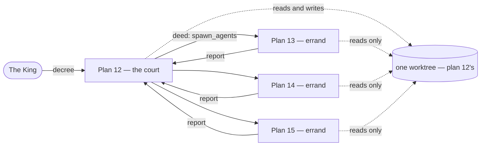

# Errands the court can send

Port Phoenix IDE's `spawn_agents` (`~/dev/phoenix-ide/crates/phoenix-tools/src/subagent.rs`)
as the last unported tool from task 00060's list. `AGENTS.md` currently says this
is blocked on a design decision:

> `spawn_agents`. Kingdom has no notion of a sub-plan. A spawned agent is either
> a real `Plan` — and then: does it appear on the map, does it own a worktree,
> who merges it? — or it is something invisible, which breaks the product's
> first question. That is a design decision, not a port.

This task answers it. **An errand is a real `Plan` that owns no worktree, never
appears on the map or the rail, and can never be merged.** Each of those three
questions gets a stated answer, and each answer is enforced by a guard rather
than by nobody happening to call the wrong function.

## The shape

The court, mid-turn, sends errands: *go and read these three things and tell me
what you find*. Each errand is another agent working in the same place, with the
same files. The call blocks until they all report. The King sees the call as a
deed in the parent's chamber, clicks an errand, and reads its whole conversation
in the same chamber view the parent uses — with a banner at the top saying whose
errand it is.



### Why an errand is a `Plan` and not a new type

Because everything the experience asks for already hangs off `Plan`, and hangs
off it *only*: the `/plan/:id` route, the `Conversation` component, the watch
socket, the herald, and the store. A parallel `SubAgent` type with its own
transcript would need a second copy of each — five places where the errand view
could drift from the chamber it is supposed to look identical to.

It also brings the thing that matters most on restart: errands are written to
`.kingdom/plans/` like any plan, so `store::reconcile` repairs an errand
interrupted mid-turn *for free*, and a finished errand is still readable weeks
later. The deed's text output is a summary; the errand's transcript is the
evidence, and evidence that only lives in memory is evidence the King loses on
the next rebuild.

## The three decisions, and what enforces each

### 1. Remit: an errand is read-only

Errands run **in parallel, in the parent's worktree**, with `think`, `read_file`
and `search` and nothing else.

This is the whole reason the feature is safe. Several agents writing to one
worktree at once is precisely the collision this product exists to prevent —
committed by the product itself, with no arbitration to catch it (`model.rs` is
explicit that leases were removed because nothing could reach them). A read-only
remit makes the collision *unrepresentable* rather than merely unlikely, which
is what lets errands run concurrently without rebuilding that machinery first.

It is also the shape the tool is actually for: fan out to investigate, report
back, let the parent decide what to change.

**Enforcement.** `Remit` goes on `Workshop`, beside the path boundary, because
it is the same kind of rule and belongs at the same seam:

```rust
pub enum Remit {
    /// Reads and reports. Cannot touch the world.
    Survey,
    /// Everything the court has.
    Full,
}

pub fn all(remit: Remit) -> Vec<Box<dyn Tool>>   // was: all()
```

`tools::invoke` filters by the workshop's remit, so a tool outside it comes back
as `Refusal::NoSuchTool` — the same answer a hallucinated name gets, which is
recoverable in one turn. Filtering only in `ToolSpec::all` would leave a model
that invents `bash` actually getting `bash`; the list a model is *shown* and the
list it may *run* must be the same list, from one function.

A `Survey` remit does not include `spawn_agents` either. One level, no
recursion — see "Named for later" below.

### 2. The errand's chamber is a record, not a place to speak

No composer, no Done button, and a banner naming the parent with a link back.

An errand is work the *court* delegated to answer its own question. Letting the
King type into it would mean the parent is blocked on a tool call whose
conversation somebody else is now steering — two hands on one wheel, and the
parent gets back a report on a conversation that changed under it. If the King
wants to redirect the work, the place to do it is the parent's chamber, which is
where his decree belongs.

**Enforcement.** `say` and `draft_plan` refuse an errand, so a stale tab or a
hand-made request cannot drive one.

### 3. Errands live only inside the parent

Not in the rail, not on the map. The rail is the list of what *the King*
decreed; filling it with work he did not personally ask for makes it worse at
its job. The map is worse still: an errand holds no worktree of its own, so a
second pip on the same city would double-count one piece of work.

The way in is the deed line in the parent's chamber, which is where the King is
already looking when he wants to know what the court is doing.

**Enforcement.** `Kingdom::plans_in` (the map's reader) excludes errands, and
the rail's own filter in `sidebar.rs` gains the same condition. `pending_plans`
too — an errand is never awaiting the King.

## The dangerous one

**`finish_plan` must refuse an errand, loudly.**

An errand's `Workspace` is a *clone of its parent's* — same path, same branch,
same id. So `finish_plan` on an errand would merge the parent's in-progress work
and then delete the worktree out from under a plan still running in it. The UI
never offers the button, but the blast radius is the King's actual work, so this
gets a guard and a test rather than trust in the UI.

The reverse case is already covered and should be confirmed rather than
re-solved: finishing the *parent* while errands are in flight is refused by the
existing `is_busy` guard, because the parent's `spawn_agents` deed stays in
flight for exactly as long as its errands do.

## Domain changes (`kingdom-core`)

```rust
pub struct Plan {
    // ...
    /// The call this plan was sent to answer, when it is an errand: the plan
    /// that sent it and the deed that did the sending.
    ///
    /// `None` for a plan the King decreed, which is every plan he can see in
    /// the rail. The deed id is carried as well as the plan id so one parent's
    /// several rounds of errands stay distinguishable.
    #[serde(default)]
    pub errand_for: Option<Errand>,
}

pub struct Errand { pub parent: PlanId, pub deed: String }

impl Plan {
    /// A plan sent by another plan to answer one question.
    pub fn sent(id: PlanId, parent: &Plan, deed: &str, task: String) -> Self;
    pub fn is_errand(&self) -> bool;
}

impl Kingdom {
    /// The errands one call sent, in the order they were sent.
    pub fn errands_of(&self, parent: &PlanId, deed: &str) -> impl Iterator<Item = &Plan>;
}
```

Additive and `#[serde(default)]`, so plan documents already on disk load
unchanged — the route `sandbox` and `working_on` took. Add a test that a
pre-errand record still loads and reads as not-an-errand, matching the existing
`a_plan_recorded_before_the_court_had_hands_still_loads`.

**Ids.** Errands take ordinary `plan-N` ids from the same `PLAN_SEQ`. Do not
invent a `plan-12-errand-1` form: `store::plan_number` parses `plan-N` to sort
the rail, and anything else sorts to `u64::MAX`.

**Who speaks the task.** An errand's opening transcript entry is the task text,
recorded as `Speaker::King`. That is a small lie — the parent's court said it,
not the King — and it is the right one: `Speaker` maps directly to the wire's
`user`/`assistant` roles in `copilot.rs`, and a third variant would need a
decision at every match in `copilot.rs`, `mock.rs`, `store::reconcile` and
`conversation.rs` to buy nothing but a label. Fix the label where labels belong:
`Transcript` renders "Commission" instead of "You" for an errand's King turns.
Write that reasoning down where `sent` constructs it.

**Status.** No new `PlanStatus` variant. An errand is `Drafting` while it works,
`AwaitingReview` when it has reported, `Failed` when it could not. The badge in
an errand's chamber reads "Reported" rather than "Awaiting review", relabelled
at render time — nobody reviews an errand, but a sixth status would ripple
through `ALL`, the map legend, `is_settled` and every match on state for one
word.

## The tool

Model-facing name: **`spawn_agents`**, matching Phoenix and the wider ecosystem.
This cuts against `AGENTS.md`'s "use the vocabulary in type names, function
names, UI copy" — and it is the same trade `ask_user_question` already made. A
tool name is the one string a model has strong priors about, and a novel name
buys metaphor consistency at the cost of malformed calls. **The domain noun is
`Errand` everywhere else**: the type, the UI copy, the banner, the deed line. If
you would rather the tool be `send_errands`, say so in review — it is one string
and a description.

Schema, cut down from Phoenix's:

```json
{ "tasks": [ { "task": "..." } ] }
```

One to six tasks; `task` required. Dropped, each for a reason:

- **`cwd`** — an errand works where its parent works. A second directory is a
  second workspace boundary, and the boundary is the one invariant here.
- **`mode`** — decided by the remit, not per call.
- **`model` / `effort`** — an errand inherits its parent's. Offering a choice
  means rendering the catalogue into the schema, and `Tool::input_schema(&self)`
  is static with `tools::all()` a list of singletons (deliberately — see its doc
  comment). Threading a per-plan catalogue through tool construction is real
  structural cost for a knob nobody has asked for.
- **`agent_type`** — Kingdom has no skills or agents directory. `AGENTS.md`
  already declines `skill` for the same reason: a loader for a directory nobody
  populates is building for no user.
- **`max_turns`** — the cap belongs to the remit, not to the model's judgement.

Max 6 rather than Phoenix's 10: six concurrent model calls against one gateway
is already where rate limits start answering instead of models.

### Running them

`api.rs::converse` is already the turn loop and already takes everything an
errand needs. Give it a `Remit` and a round cap; the tool spawns one `converse`
per task with `tokio::spawn`, joins them, and formats the reports.

The cap for `Remit::Survey` is lower than `MOST_ROUNDS` (24) — 12 is ample for
three read-only tools, and the failure it bounds is the one `MOST_ROUNDS`
documents, multiplied by six.

The circular shape is worth noticing before it bites: `tools::spawn_agents`
needs `api::converse`, and `api::converse` calls `tools::invoke`. Both are
`#[cfg(feature = "ssr")]` in one crate so this compiles, but the turn loop must
become reachable from `tools` — make `converse` `pub(crate)` with a doc comment
naming its two callers and restating why the loop lives in `api.rs` (that
reasoning is already on it).

**A wall-clock bound as well as a round cap.** The parent's turn is blocked for
as long as the slowest errand, and a gateway that never answers would park it
indefinitely. Bound the whole call; errands still running when it expires are
reported as timed out and the parent gets whatever the others found. A partial
answer it can act on beats a turn that never returns — the same reasoning as
`ask_user_question`'s `PATIENCE`, at a much shorter scale.

### What comes back

One block per errand: its plan id, its task, and its final reply or its failure.
The id matters — it is how the parent can refer to an errand in its own reply,
and how the King finds the same conversation the parent read.

## The UI

### Live errand status in the parent, for free

`herald::proclaim` sends an errand's changes on **both** its own channel and its
parent's. That is a handful of lines and it is the whole live-status story,
because the receiving end already does the right thing: the wire carries whole
plans, and `Kingdom::absorb` appends a plan it does not recognise rather than
dropping it. So a chamber watching the parent accumulates its errands into
`state.kingdom` as they work, and the deed line reads them back with
`errands_of`.

No new wire type, no new socket, no errand ids stored on the `Deed` — the link
lives on the errand, in one direction, and the parent's view is a query. Note
this in `herald.rs` beside the existing "why whole plans" argument; it is that
decision paying off a second time.

### The deed line

`spawn_agents` gets its own arm in `Transcript`, next to the one
`ask_user_question` already has — the precedent for "this deed is not a line of
command output" is set. It renders one row per errand: status dot, the task, and
a link to `/plan/<id>`. Live while they run, and still there once they are done.

The generic `DeedLine` would render this as JSON-in, text-out, which is exactly
the unreadable-at-the-interesting-moment failure its own doc comment warns
about.

### The errand's chamber

The same `Conversation` component, unchanged in how it renders the log. What
changes is the frame around it:

- A banner above the header: *"An errand of «parent title»"*, linking to the
  parent, plus the task text. This is the "you are in a sub-agent conversation"
  marker.
- The composer and the Done button are not rendered (`Show` on `is_errand`).
- The status badge relabels `AwaitingReview` to "Reported".
- The auto-draft effect skips errands — an errand is driven by its spawner, and
  a King who opens one in the window between its creation and its first turn
  must not start a second loop over it.

Styling goes in `style/components/_conversation.scss`, beside `.chat-question`.

## Offline

`mock.rs` gains an `Errand` scenario, pinned by `[[scenario:errand]]`, which
sends two errands and then answers from their reports. Without it the whole
feature is only testable against a paid gateway — the dependency the mock exists
to remove — and the parallel path in particular is where an offline rehearsal
earns its keep.

The errands themselves need nothing new: their task text hashes to `Survey` or
`Plan` and they speak, which is exactly the behaviour under test.

## Done when

- The court can send errands mid-turn; they run in parallel and it answers from
  what they found.
- The parent's chamber shows the call as a row per errand, updating live, each a
  link.
- Clicking one opens the same conversation view, with a banner naming the parent
  and no composer.
- An errand never appears in the rail or on the map.
- `cargo test -p kingdom-core` and
  `cargo test -p kingdom-app --features ssr --no-default-features` pass, and
  `kingdom-core` still builds for wasm32.

## Tests worth having, and only these

1. **A write tool is refused under `Remit::Survey`.** The invariant the parallel
   design rests on, tested at the seam that enforces it — beside the existing
   `a_path_that_leaves_the_workspace_is_refused`, which is the same kind of rule.
2. **`finish_plan` refuses an errand.** The guard whose absence merges the
   parent's work and deletes a live worktree.
3. **An errand is invisible to the rail and the map, and visible to
   `errands_of`.** One test over `Kingdom`'s readers: this is the filter applied
   in several places and therefore the one that will be forgotten in one of them.
4. **A pre-errand plan record still loads.** Additive-serde is a claim, not a
   fact, and the cost of being wrong is a kingdom that will not open.

Not worth testing: that `Errand` round-trips through serde, that `is_errand`
returns true when the field is `Some`, or that the tool rejects an empty `tasks`
array. The first two restate the implementation; the third is schema validation
the existing `BadArguments` path already covers.

## Named for later, deliberately

- **Recursion.** An errand cannot send errands, because `Survey` does not
  include `spawn_agents`. A tree of agents needs an answer to "who is blocked
  behind whom" across more than one level, and that is the arbitration question
  `model.rs` says to rebuild against a real collision rather than keep warm.
- **Errands with hands.** The moment one may write, it needs a worktree or a
  lock — the same arbitration question. The `Remit` enum is the seam it would
  arrive at, and `Full` already exists as its other arm.
- **Cancelling an errand from the chamber.** No button: there is no cancellation
  path anywhere in Kingdom yet, and inventing one for this alone is how the lease
  machinery happened. The wall-clock bound is what stops a stuck errand today.
