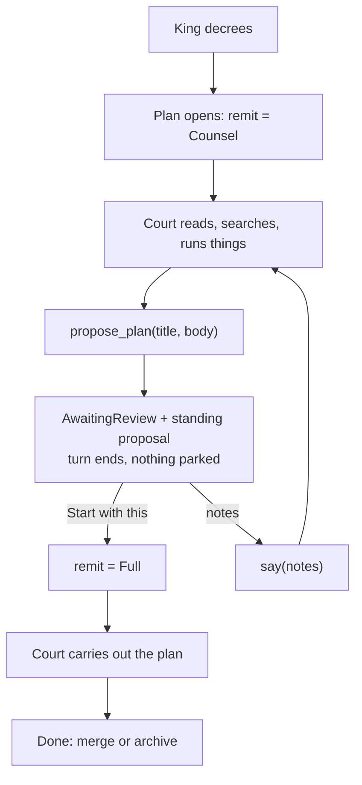

# Counsel before hands

A decree opens under **counsel**: the court may read, search and run things, but
not change the project. When it knows what to do it calls `propose_plan` and
stops. The King reads the proposal, and either sends back changes or presses
**Start with this** — which is the moment the court gets hands.

Today every plan is born with `Remit::Full` and starts editing on turn one. The
King's only review point is *after* the work. This inverts that, which is the
stance `AGENTS.md` says the product exists to take: an architect brings you
plans; you approve or reject; you do not draw the blueprints yourself.

It also fixes a smaller thing that has been quietly wrong: Kingdom never reads a
project's `AGENTS.md`. The court is briefed on a file list and nothing else.

---

## Where this came from

Phoenix IDE solves the same problem with an Explore/Work mode pair, a
`propose_task` tool intercepted before it reaches the executor, and a
`TaskApprovalReader` panel whose buttons are `Start here` / `Request changes` /
`Discard`. Two things are worth taking and one is worth leaving.

**Take:** the shape (read-only phase → formal proposal → approval widens
authority → same conversation continues), and the system-prompt assembly —
`AGENTS.md` discovered by walking up from the working directory with
content-hash dedup, a mode block that states the boundary in prose, and a
testing-discipline directive placed *before* project guidance so the project's
own stricter rules come later and win.

**Leave:** the task-file substrate. Phoenix writes the proposal to
`tasks/NNNNN-pX-status--slug.md` on disk, scopes Explore's `patch` to that
directory, and carries only the *path* in the tool call — which then needs a
`task_plan_revisions` table, a `_TEMPLATE.md` marker, an ID-allocation hint
injected into the prompt, and a status rename committed on approval. Kingdom
needs none of it. A plan is already one JSON document under
`<kingdom_root>/.kingdom/plans/`, and its transcript already records every tool
call in order with timestamps. The proposal rides in the tool call's arguments,
lands on the `Plan`, and is persisted and pushed by the machinery that already
exists. Revision history is the transcript.

---

## The flow



The two edges out of review are both paths that already exist. **Request
changes** is literally `say` + `draft_plan` — the composer's own path, with the
King's notes as an ordinary `Speaker::King` turn. Only **Start with this** needs
a new server function, and all it does is widen the remit.

### Why the turn *ends* at a proposal

The obvious move is to model `propose_plan` on `ask_user_question`: park the
call on a oneshot, special-case the in-flight deed into a card, resume when the
King clicks. It is the closest existing pattern and it would be a smaller diff.

It is the wrong one here. A question is answered in seconds; a proposal is read
for minutes and slept on for hours. Parking means an open HTTP request for the
whole review, a `PATIENCE` timeout that can expire a perfectly good proposal,
and a review that dies with the server — `store::reconcile` would settle the
deed as refused and mark the plan `Failed`, throwing away work the King was
about to approve.

Ending the turn costs nothing by comparison, because everything the resumption
needs is already written down. The proposal is on the plan, the plan is on disk,
and `draft_plan` rebuilds the conversation from the transcript on every pass. A
server restart mid-review loses nothing.

---

## Domain changes — `kingdom-core`

### `Remit` moves down into the domain

`tools::Remit` is already the single definition of what a plan may touch
(`crates/kingdom-app/src/tools/mod.rs:49-60`), and `tools::all` is already the
only place a remit becomes a tool list. It is a plain `Copy` enum with no I/O,
so it compiles to wasm unchanged.

Move it to `kingdom-core` and re-export from `tools` at its historical path, so
every existing `use` keeps resolving. It has to cross the wire now: the chamber
renders differently under counsel, and the rail's badge changes wording.

```rust
pub enum Remit {
    /// Reads and reports, and cannot touch the world. What an errand gets.
    Survey,
    /// May look at anything and run anything, but changes nothing and
    /// proposes instead. What a decree starts under.
    Counsel,
    /// Everything the court has. Granted by the King, on a proposal.
    Full,
}
```

> **The one naming call worth overriding.** `Counsel` over Phoenix's `Explore`
> because `Survey` and `Explore` are near-synonyms sitting next to each other in
> the same enum, which is exactly the kind of pair a reader has to keep
> straight by memory. `Counsel` also already exists in the codebase's
> vocabulary — `copilot.rs:670` falls back to `"Counsel on {city}"` — and it
> names the *stance* rather than the activity: a counsellor may inspect
> anything and lay no brick. If you would rather the code said `Explore`, it is
> a one-word rename and nothing else in this task moves.

### Two new fields on `Plan`

```rust
pub struct Plan {
    // ...
    /// How much of the world this plan may touch, right now.
    ///
    /// Widened exactly once, by the King, on a proposal he accepts. Defaults
    /// to `Full` when absent so a plan recorded before counsel existed keeps
    /// the hands it was drafted with.
    #[serde(default = "Remit::full")]
    pub remit: Remit,

    /// The plan the court has put to the King, if there is one standing.
    #[serde(default)]
    pub proposal: Option<Proposal>,
}

pub struct Proposal {
    pub title: String,
    /// The proposal itself, as markdown.
    pub body: String,
    pub at: Option<Timestamp>,
    /// True once the King has said to start with it.
    pub approved: bool,
}
```

`Plan::opened` sets `Remit::Counsel`. `Plan::sent` sets `Remit::Survey`, which
lets `converse` read the remit off the plan instead of taking it as an argument
— one parameter fewer, and the errand invariant lives on the errand rather than
at its call site.

### The standing-proposal rule

Three transitions, and they are the whole state machine:

| when | `proposal` |
|---|---|
| `propose_plan` | replaced with a new one, `approved: false` |
| `approve_plan` | `approved = true` |
| any ordinary spoken ending (`settle`) | cleared **iff** `!approved` |

That last row is what stops a stale card. Court proposes → King ignores it and
asks a question → court answers in prose → without the rule, the card would
reappear offering to start a proposal the conversation has moved past. An
approved proposal survives, because it is the plan being carried out and the
chamber header names it.

The card renders iff `status == AwaitingReview && !remit.is_full() &&
proposal.is_some_and(|p| !p.approved)`. No ambiguity, no extra state.

---

## The tool — `crates/kingdom-app/src/tools/propose_plan.rs`

Unlike every other tool, this one does not act on the world; it ends the turn.
Phoenix intercepts `propose_task` in the state machine before it reaches the
executor and leaves `run()` as a bug fallback. Kingdom has no state machine to
intercept in, so it runs as an ordinary tool and signals the ending through its
outcome — `converse` checks for it by name after settling the deed and returns.

Carry `title` and `body` **in the arguments**, not a path. That is the whole
difference from Phoenix, and it is what removes the task-file substrate: the
body is recorded on the deed, so it is in the transcript, so it is on disk, so
it is pushed to the chamber, so it is in the model's own context on the next
round — all by machinery that already exists.

Guards worth having, each reported back as a `Refusal` the model can act on:

- Empty `title` or `body`.
- Called under `Remit::Full` — the plan is already carrying out an approved
  proposal and cannot propose its way to more authority.
- Called under `Remit::Survey` — an errand reports to the court that sent it,
  and nothing about it is ever waiting on the King.

### The remit ladder in `tools::all`

| tool | Survey | Counsel | Full |
|---|:-:|:-:|:-:|
| `think`, `read_file`, `search`, `read_image` | ● | ● | ● |
| `bash`, `tmux_run`, `tmux` | | ● | ● |
| `browser_*`, `browser_profile` | | ● | ● |
| `ask_user_question` | | ● | ● |
| `propose_plan` | | ● | |
| `patch` | | | ● |
| `spawn_agents` | | | ● |

**`patch` is withheld under counsel even though `bash` can write.** These are
not in tension. `Workshop::root()` already states plainly that the path
boundary does not contain a shell (`tools/mod.rs:236-247`), so withholding
`bash` would buy a guarantee Kingdom cannot keep while costing the court `git
log`, `cargo tree` and the ability to run the failing test it is proposing to
fix. The tool list is not a sandbox; it is a statement of the job. Offering
`patch` says *you may edit*. Withholding it says *you may not*, and the prompt
says why. The `bash` hole is a hole, not an invitation — and it is documented
as one in the mode block below rather than implied away.

`spawn_agents` is withheld for a duller reason: an errand of a counselling plan
is a case that has to be thought about (it would inherit `Survey`, which is
probably right, but nothing has asked for it). Left out rather than guessed at.

---

## The charter — what the court is actually told

Today the system prompt is four sentences built inside `copilot.rs:618-645`,
which means it is Copilot's prompt rather than Kingdom's, and any second
provider would have to reinvent it. It never mentions `AGENTS.md`.

Lift it into `crates/kingdom-app/src/llm/charter.rs` — a `Charter` assembled
once per turn in `converse` and carried on `Brief`, which providers render.
Named on-metaphor because it is content rather than plumbing: a charter is the
document that grants and limits powers, which is exactly what this is.

In order, because the order carries reasoning:

1. **The preamble.** Today's opener, unchanged.
2. **The city brief.** `CityBrief::render()`, unchanged.
3. **Where it is standing.** The workspace path and whether it is isolated. The
   court is *never told this today* — `begin_plan` records it as a
   `NoteKind::Workspace`, and `Plan::turns` deliberately withholds notes from
   the model. So an agent in a worktree at `<city>/.kingdom/<uuid>` has no idea
   it is not in the project's own checkout.
4. **The remit block.** The prose below.
5. **Testing discipline**, lifted near-verbatim from Phoenix. It counters the
   model's "more tests is better" prior with an explicit cost model.
6. **`<project_guidance>`** — every `AGENTS.md` / `AGENT.md` found walking up
   from the workspace to the kingdom root, root-most first. It comes *after*
   testing discipline on purpose: a project's own, more specific rules arrive
   later and win.
7. **The mermaid hint.** One sentence; the chamber renders fences as diagrams.

Dedup by content hash, exactly as Phoenix does
(`system_prompt.rs:63-70`) and for exactly the same reason: a worktree contains
a copy of the city's tracked `AGENTS.md`, so the walk finds the same file twice.

Cap the guidance total (64 KiB is generous) and say so in a comment. Kingdom
resends the whole system prompt on **every round** of a loop that can run 24
times, so an unbounded `AGENTS.md` is a bill, not just a long prompt.

### The counsel block

> You are drawing up a plan, not carrying it out. Read, search, and run
> whatever you need in order to understand the work — but change nothing. No
> edits to files, no commits, nothing written into the project.
>
> You have `bash`, and it is not fenced in: a command that names an absolute
> path can write anywhere on this machine. That boundary is one you are trusted
> to keep, not one Kingdom enforces. Use it to look — `git log`, `cargo tree`,
> running the tests to see which fail — and never to change.
>
> When you know what should be done, call `propose_plan` with a title and the
> plan itself. Say what you would change, in which files, and why; say what you
> checked and what you are assuming. The King reads it and either starts you on
> it or sends back changes, and you have no hands until he does.
>
> If he asks you to change something directly, explain that you must put a plan
> to him first.

### The full block

Today's tools paragraph, plus one line when an approved proposal stands: *You
are carrying out a plan the King approved. It is above, in the record of your
own `propose_plan` call. Follow it; if you find it was wrong, say so rather than
quietly doing something else.*

---

## Server — `crates/kingdom-app/src/api.rs`

**`converse`** currently resolves tools and the workshop once, before the loop.
Move both inside it, reading the remit back off the plan each pass. This is not
a new idea — it is the rule the loop already follows, and the comment at
`api.rs:611-616` states it: *"The conversation is rebuilt from the plan each
pass rather than accumulated in a local... reading them back is what makes this
loop's state the plan's state."* The remit is more of the same. Drop the
`remit` parameter; both callers already have it on the plan.

After settling a deed, if the tool was `propose_plan` and it succeeded: end the
turn. Record the proposal on the plan, set `AwaitingReview`, clear `working_on`,
return.

**`approve_plan(plan) -> Plan`**, new `#[server]`. Refuses unless a proposal
stands. Sets `approved = true` and `remit = Full`; records a `NoteKind::Workspace`
note (authority changing is something that *happened*, and the King must be able
to see the moment it did) and a `Speaker::King` utterance — *"Approved. Carry
out the plan as proposed."* — so the model receives the grant as an ordinary
user turn needing no special wire handling. Sets `Drafting`; the chamber then
dispatches `draft_plan` exactly as it does after `say`.

**`say`** needs no change. The King's notes land as a King turn, status goes to
`Drafting`, and the court revises. That is the entire feedback loop.

**`settle`** clears an unapproved standing proposal on the spoken path.

**`describe`** gets a case beside the `ask_user_question` one: `propose_plan` →
`"Awaiting the King's word"`. Same reasoning as the existing case — *"who is
blocked behind whom" is one of the three questions this product exists to
answer*, so it gets said in words rather than rendered as a tool name.

**`store::reconcile`** needs no change and should get none. A plan interrupted
mid-turn still becomes `Failed` with its in-flight deeds refused. But a proposal
is not in flight — the turn ended when it was made — so a plan awaiting review
when the server dies reloads as `AwaitingReview` with its proposal intact and
its buttons live. That falls out of ending the turn, and it is the payoff for
not parking.

---

## Browser — the chamber

A `Proposal` card in `conversation.rs`, rendered above the composer when a
proposal stands. Follow the `.chat-question` idiom exactly
(`_conversation.scss:469-550`) — it is the existing "this is not something to
watch, it is something to do" card, and a proposal is the same kind of thing.

- The body renders as markdown. **Kingdom has no markdown renderer today** —
  the chamber prints utterances as plain text. This is the one genuinely new
  dependency in the task. Use `pulldown-cmark` in the client bundle, or render
  server-side, or ship v1 as pre-wrapped text and let a proposal read as plain
  prose. Worth deciding deliberately rather than by accident; plain text is a
  legitimate v1 and the rest of the flow does not depend on it.
- **`Start with this`** — the label the King asked for. Calls `approve_plan`,
  then dispatches `draft_plan`. Locked on click like `Question`'s `sent` signal
  (`conversation.rs:706-727`), so a double-click cannot grant twice.
- A notes box and **`Request changes`** — calls `say` + `draft_plan`, the
  composer's own path.
- **`Set aside`** — clears the standing proposal and leaves the plan
  `AwaitingReview` with the composer live, so the King can talk or press Done.
  Deliberately not a terminal state: `Archived` already means that and is
  reached the way it always is.

Elsewhere: the chamber header shows the remit while counselling; the composer's
placeholder acknowledges it; the rail's badge reads `Proposal` rather than
`Awaiting review` when one stands (a label, not a sixth `PlanStatus`).

**The map does not change.** A pip that lit up for a standing proposal would be
the right instinct and the wrong task — `AGENTS.md` is explicit that live
updates do not reach the map yet, so it would only be true until the next
refetch. The rail and the chamber carry this.

---

## Mock — `crates/kingdom-app/src/llm/mock.rs`

`Scenario::Propose`: propose on the first pass, then on the second — seeing an
approval in the transcript — act and speak. This is not optional polish. The
mock exists so the paths that matter are reachable with no credential, and the
existing scenarios (`Ask`, `Work`, `Errand`) each exist to rehearse exactly one
thing request/response could not do. Approval is now the most important of them.

The opening court in `sample.rs` should gain a plan awaiting a proposal, for the
reason the existing test pins (`sample.rs:141-165`): a court of tidy settled
plans makes the states the UI exists to render unreachable during development.
Extend that test rather than writing a new one.

---

## Tests

Four, each pinning something a reader or caller depends on:

1. **The standing-proposal rule** (`kingdom-core`) — proposed shows, approved
   stops showing, superseded-by-speech clears, approved survives speech. Pure
   logic, and the card's correctness rests entirely on it.
2. **The counsel rung** (`tools/mod.rs`) — extends the existing
   `a_survey_cannot_reach_the_tools_that_touch_the_world` test in place.
   Counsel offers `bash` and `propose_plan`, does not offer `patch`, and
   **refuses `patch` when asked for by name**. That second half is the one that
   matters: models invent tool names, and the list shown and the list runnable
   must not disagree.
3. **Guidance discovery** (`charter.rs`) — a worktree whose city has an
   `AGENTS.md` yields it once, not twice, and kingdom-root guidance sorts
   before city guidance.
4. **Serde back-compat** (`store.rs`) — a plan document written before `remit`
   and `proposal` existed loads, and comes back `Full`. `store.rs` is the one
   thing that can lose real work.

No test for the tool's schema, the enum's labels, or the card's markup.

---

## Landing order

Each step compiles and is useful alone:

1. **The charter.** Lift the system prompt out of `copilot.rs`, add `AGENTS.md`
   discovery, workspace grounding and testing discipline. No behaviour change,
   immediate benefit, and it is where the mode block will hang.
2. **`Remit` moves down**, gains `Counsel`, and lands on `Plan` — with
   `Plan::opened` still setting `Full`. Pure plumbing, nothing observable.
3. **`propose_plan` + `approve_plan` + the card.** The flow, end to end, with
   the mock scenario.
4. **Flip `Plan::opened` to `Counsel`** and add the counsel block to the
   charter. One line, and the product changes stance.

---

## Out of scope

- **Naming a plan from its proposal.** A proposal carries a title, and it is a
  better one than the decree's first clause — but retitling means renaming
  `kingdom/<slug>`, which is task **00070**, already in progress. The title and
  branch keep coming from the decree; 00070 gets a better source to draw on.
- **Proposals under `Remit::Full`.** Phoenix reuses `propose_task` in Work mode
  as a non-blocking fork proposal. A separate feature with a separate question
  behind it.
- **A fresh conversation on approval.** Phoenix offers `New chat` beside `Start
  here`, seeding a successor with only the approved plan. Kingdom continues in
  place, which is simpler and keeps the exploration visible in the chamber that
  produced it. Worth revisiting when context length becomes the binding
  constraint.
- **Errands under counsel** — see `spawn_agents` above.
- **The round budget.** `MOST_ROUNDS` is 24 for a loop that now covers both
  exploring and executing. Approval should plausibly refresh the budget, since
  the work genuinely restarts. Left as a one-line judgement for whoever writes
  it, called out here so it is not a surprise.
