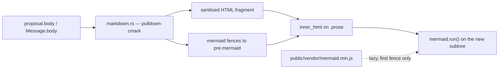

# A chamber that renders what it is told

The court writes markdown. Kingdom prints it verbatim. A proposal — the one
artefact the product's whole stance rests on, the thing the King is meant to
*read and judge* — arrives as a wall of `##`, `-` and code fences in a `<pre>`.

This task builds the renderer, points the proposal card and the court's messages
at it, and then — and only then — restores the one Phoenix sentence that was
deliberately deleted for saying Kingdom had one.

## Why the mermaid note comes last

`llm/system_prompt.rs` carries a long comment and a test
(`the_prompt_does_not_claim_output_is_rendered`) forbidding the word "mermaid"
anywhere in the prompt. That is not an oversight to route around: Kingdom
shipped the claim once, and a plan asked to make proposals render markdown found
the contradiction and spent 25 of its 30 reasoning blocks arguing with the
prompt instead of proposing anything.

The comment ends "Restore this the day a renderer exists." This is that day —
but the ordering is load-bearing. The hint goes back in the same commit that
makes it true, never before.

## Shape

## The work

**1. `components/markdown.rs` — a new module, wasm-side.**

- `pulldown-cmark`, default features off — pure Rust, compiles to wasm. Record
  the bundle delta in the module docs.
- Tables, strikethrough, footnotes on; smart punctuation off.
- **Drop raw HTML.** Filter `Event::Html` / `Event::InlineHtml` rather than
  passing them through. The body is model output rendered with `inner_html`; a
  model that emits `` renders as visible text.
- A chamber with no mermaid fence never requests `/vendor/mermaid.min.js`.
- A malformed mermaid fence still shows its source.
- `cargo test -p kingdom-core` and
  `cargo test -p kingdom-app --features ssr --no-default-features` pass, and
  `cargo leptos build` produces a bundle whose size delta is stated.

## Deliberately not in scope

Syntax highlighting for ordinary code fences (another heavy dependency), and
markdown in the rail, the map or tool output. Tool output is a machine's, not
prose.
