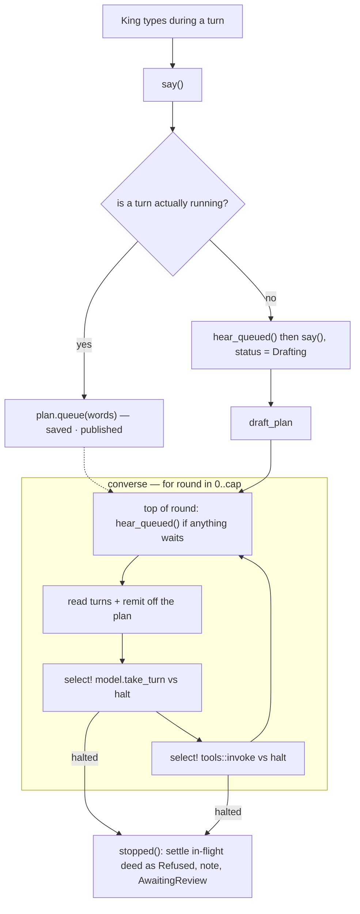

# The King may speak while the court works — and may call a halt

Two controls the chamber does not have, both answering the same question: *what
does the King do when the court is mid-turn and he has something to say?*

Today the answer is "wait". The composer is disabled for the whole turn — which
can be twenty minutes of tool calls — and there is no way to stop a turn that
has plainly gone the wrong way. The King's scarce resource is attention and
judgement, and both are currently unspendable while the court is busy.

This adds:

1. **Queued words.** The composer stays live during a turn. What the King sends
   is queued on the plan and heard at the court's next opportunity — between
   tool rounds, not mid-deed.
2. **Stop.** A button beside Send, shown only while a turn is running, that ends
   the turn cooperatively and hands the chamber back.

Phoenix IDE is the reference for both (`executor.rs::maybe_drain_steering_queue`,
`transition.rs::handle_core_cancellation`). The shapes are borrowed; the
plumbing is Kingdom's own, and much smaller, because `converse` already does
most of the work.

---

## Why this is a small change

`converse` (`api.rs:658`) already rebuilds the conversation from the plan on
**every round**:

```rust
for round in 0..cap {
    let (turns, permissions, approved) = {
        let kingdom = lock()?;
        ...
    };
```

It does this because a plan can change mid-turn — the King accepts a proposal,
`approve_plan` widens the remit, and the next pass must offer the tools that
grant implies. **A queued message is the same shape of change.** So the drain
site is a line above a read that already exists, and the model sees the King's
words in the very next brief without any of the loop's state having to move.

That is also exactly Phoenix's rule — *never mid-stream, never mid-deed* —
arrived at for free rather than enforced by a state machine.



---

## Part 1 — Queued words

### Domain (`kingdom-core/src/model.rs`)

```rust
/// Words the King spoke while the court was working, waiting to be heard.
#[derive(Debug, Clone, PartialEq, Serialize, Deserialize)]
pub struct QueuedMessage {
    /// Names this message so the King can withdraw it before it is heard.
    pub id: String,
    pub body: String,
    pub at: Option<Timestamp>,
}
```

On `Plan`, beside `working_on`:

```rust
/// What the King said while a turn was in flight, in the order he said it.
///
/// Deliberately *not* in the transcript. The transcript is what was said and
/// done; these are words nobody has heard yet. Keeping them apart is what lets
/// the chamber draw them as pending and lets the King withdraw one.
#[serde(default)]
pub queued: Vec<QueuedMessage>,
```

`#[serde(default)]` for the usual reason — every plan record already on disk
predates the field.

Three methods, all small and all tested:

| Method | Does |
|---|---|
| `queue(&mut self, body) -> String` | Pushes a `QueuedMessage`, returns its id |
| `hear_queued(&mut self) -> usize` | Drains every queued message into the transcript as `Speaker::User`, **in order**, returns how many moved |
| `unqueue(&mut self, id: &str) -> bool` | Drops one before it is heard; false if it was not there |

`hear_queued` re-stamps deliberately: the queued message keeps its own `at` for
the chamber to show while it waits, and the transcript entry is stamped when it
is *heard*. That is the honest reading — being heard is when the words became
part of the conversation, and `Plan::say` already insists a message's time is
the moment it entered the log rather than one chosen by hand.

### The registry of live turns (`kingdom-app/src/turns.rs`, new)

The one genuinely new piece of machinery, and it serves **both** halves of this
task.

```rust
static RUNNING: OnceLock<Mutex<HashMap<PlanId, watch::Sender<bool>>>> = OnceLock::new();
```

Same shape and same reasoning as `ask_user_question::PENDING` and `bash::JOBS`:
in-process, keyed by plan, gone on restart, with `store::reconcile` already
repairing what a restart leaves behind.

`tokio::sync::watch` rather than a new `tokio-util::CancellationToken`
dependency — `bash.rs` already reaches for `watch` for precisely this shape
("signalled once, many waiters, and a late arrival still sees it"), the `sync`
feature is already on, and it keeps the dependency list where the Cargo.toml
comments have plainly worked to keep it.

```rust
/// Registers this turn as running, and yields the halt signal it must watch.
/// The guard removes the entry on every exit, including a panic.
pub fn begin(plan: &PlanId) -> TurnGuard;

/// True while a turn for this plan is genuinely running *in this process*.
pub fn is_running(plan: &PlanId) -> bool;

/// Asks a running turn to stop. False when nothing was running.
pub fn halt(plan: &PlanId) -> bool;
```

**`is_running` is not `is_busy`, and the difference is load-bearing.**
`Plan::working_on` is a *description* that survives a restart and a panic; that
is why `say` currently clears it, and the comment at `api.rs:469-486` spells out
that this clearing is the only cure for a wedged plan short of restarting the
server.

If `say` branched on `is_busy()`, a wedged plan — busy mark set, no turn behind
it — would swallow every message the King sent into a queue nothing would ever
drain. That is strictly worse than today. Branching on `is_running()` instead
keeps the rescue hatch exactly as it is: a wedged plan has no registry entry, so
`say` takes the direct path and un-wedges it, precisely as now.

### `say` (`api.rs:432`)

The guards at the top are unchanged. Only the `update` closure branches:

```rust
update(&mut kingdom, &plan_id, |p| {
    if crate::turns::is_running(&plan_id) {
        // Heard at the top of the court's next round. Not appended to the
        // transcript here: the turn in flight rebuilds its brief from the
        // transcript each pass, so writing straight into it would slip words
        // into the conversation between a deed and its result.
        p.queue(prompt);
    } else {
        // Anything left queued by a turn that has since ended goes first, so
        // the log can never carry the King's words out of the order he said
        // them.
        p.hear_queued();
        p.status = PlanStatus::Drafting;
        p.working_on = None;
        p.say(Speaker::User, prompt);
    }
})
```

**The browser needs no change to `speak`.** It already calls `say` then
`draft_plan`, and `draft_plan` already returns early on a busy plan
(`api.rs:527`). So a queued message costs one no-op request, and a message that
landed on an idle plan starts a turn — the existing behaviour, unchanged.

### The drain site (`api.rs:671`)

At the top of the round, immediately before the read that is already there:

```rust
let (turns, permissions, approved) = {
    let mut kingdom = lock()?;

    // The King spoke while the court was working. His words join the log
    // *before* it is read back, so this round's brief carries them.
    //
    // Here rather than anywhere else because this is the one moment in a turn
    // where nothing is half-done: the last deed is settled and the next has not
    // been asked for. Splicing them in mid-deed would hand the model a
    // conversation in which a tool call and its result are separated by
    // something nobody said at the time.
    //
    // Guarded rather than called unconditionally: `update` saves and publishes,
    // and a write per round with nothing in it would push a whole plan over
    // every watch socket for no news.
    if kingdom.plan(&plan_id).is_some_and(|p| !p.queued.is_empty()) {
        update(&mut kingdom, &plan_id, |p| { p.hear_queued(); });
    }

    // ...existing read of turns / permissions / approved...
};
```

### The end-of-turn drain

The top-of-round drain alone leaves a race: `say` decides to queue while a turn
is alive, and the turn ends before it comes back round. Both of `converse`'s
normal exits therefore check the queue and go round again rather than returning:

- `Reply::Spoke` (`api.rs:736`) — `settle` still runs, so the court's answer is
  recorded and the plan reaches `AwaitingReview` exactly as now. If anything is
  queued, the plan is re-marked `Drafting` with a fresh `working_on` and the
  loop `continue`s; the queued words are heard at the top of the next round.
  This is right on its own merits: the court says "done", the King had already
  added "also check the tests", and it carries on.
- `propose_plan` (`api.rs:846`) — same. A proposal parks the turn *for review*,
  and a queued message is the King's review arriving early. It takes the path
  `say` + `draft_plan` already take for notes sent back on a proposal, so
  nothing new is reachable; it just happens without a round trip.

**Not** on the failure paths (`settle(Err)`, the round cap, the panic handler).
Looping a queued message back into a provider that just errored would burn the
round budget against a broken model. The words stay queued, the composer is
live, and the next thing the King sends flushes them in order via `say`'s
`hear_queued()`.

The round budget keeps counting across a drain, deliberately — it is a runaway
guard, and a queued message is not a reason to hand out more rope.

### Withdrawing one

```rust
#[server(Unqueue, "/api")]
pub async fn unqueue(plan: String, message: String) -> Result<Plan, ServerFnError>
```

Calls `Plan::unqueue`. Racing the drain is harmless: the message is either still
there and goes, or has already been heard and the call reports that it could not
be withdrawn — the same honest "nothing was waiting" that
`ask_user_question::answer` returns.

---

## Part 2 — Stop

### `stop_plan` (`api.rs`)

```rust
/// The King calls a halt.
#[server(StopPlan, "/api")]
pub async fn stop_plan(plan: String) -> Result<Plan, ServerFnError>
```

1. `turns::halt(&plan_id)` — signals the watch channel.
2. Signals every running subagent of this plan too. Without this, Stop leaves
   the errands the court sent still burning tokens against a turn nobody is
   waiting for — and the spend is a large part of why the button exists.
3. If nothing was registered, the plan is **repaired** rather than left alone:
   `working_on = None`, status `AwaitingReview`. Stop therefore doubles as the
   manual cure for a wedged plan, which until now needed a server restart.

The cleanup itself is done by `converse` on its way out, not here — the turn
owns its own plan writes, and two writers racing over one plan is how the
in-flight deed would end up settled twice.

### Cooperative, at three points in `converse`

The guard from `turns::begin` is taken at the top of `converse`, and its
receiver is raced against the two long awaits:

```rust
// The model call. Dropping the future drops the HTTP request, which is what
// Phoenix's `AbortLlm` achieves by aborting the task -- same effect, no task to
// abort, and every careful busy-mark clearing below still runs.
let answer = tokio::select! {
    biased;
    _ = halt.halted() => return stopped(plan_id, None),
    answer = model.take_turn(&brief) => answer,
};
```

```rust
// The deed. `bash` op=run deliberately keeps its process -- Phoenix documents
// the same choice, and Kingdom's `JOBS` registry means the handle survives, so
// the model can peek or kill it on a later turn.
let outcome = tokio::select! {
    biased;
    _ = halt.halted() => return stopped(plan_id, Some(&act.id)),
    outcome = crate::tools::invoke(...) => outcome,
};
```

And a check at the top of each round, so a halt landing between the two is not
held until the next long await.

`biased` so a halt already signalled wins deterministically rather than by
coin-flip against a ready future.

### What the halt leaves behind

A new `stopped(plan_id, in_flight)` alongside `settle`:

- Settles the in-flight deed, if there is one, as
  `ToolOutcome::Refused { reason: "Stopped by the King." }`. This reuses the
  variant `store::reconcile` already uses for a deed the server died during, for
  the same reason: an unsettled call would be replayed to the model forever as
  still running.
- `working_on = None`, `status = AwaitingReview`.

  **Not `Failed`.** A red badge for something the King chose to do is a lie
  about who did what, and `Failed` is the status the chamber offers a retry
  against. `AwaitingReview` is exactly true: the turn is over and it is his
  move.
- A note — which needs a new `NoteKind::Stopped`, since `Failed` is wrong for
  the reason above and `Workspace`/`Merge` describe something else. It gets a
  `css_suffix` of `"stopped"` like its siblings.

  > The King called a halt. The court stopped where it stood; anything it had
  > already done is still in its workspace. Say something to set it going again.
- Clears any `ask_user_question` entry parked for this plan, so a halted turn
  does not leave a oneshot in `PENDING` that nothing will ever answer.

The King can then simply type and carry on. The model sees the refused deed in
the transcript — valid context that says plainly it was cut short — which is
Phoenix's answer too, and needs no invented system turn to explain itself.

**Stop and the queue stay independent**, as they are in Phoenix. Stopping does
not flush the queue and does not discard it; queued words are heard when the
next turn starts, or when the King's next message flushes them.

---

## Part 3 — The chamber

### The composer (`components/conversation.rs:610`)

- The textarea **loses `disabled={move || drafting.get()}`**. It stays live for
  the whole turn, and `submit`'s `drafting.get_untracked()` guard goes with it.
- The placeholder gains a drafting case, in the chamber's existing voice:
  *"The court is working — say something for it to hear next…"*
- The gold Send button stays enabled and keeps saying **"Send"** while drafting
  rather than "Drafting…", because it now does something. What it does is queue,
  and the chip that appears says so better than a disabled button did.
- A **Stop** button, shown only while a turn is running
  (`drafting && plan.is_busy()`), between Send and Done.

### Queued words in the log

After the `"Drawing up the plan…"` ghost line at the bottom of `.chamber-log` —
which is where they belong in time: the court started, then the King spoke.
Drawn as ghost user messages in the manner of `.chat-msg.drafting`, each with a
`×` calling `unqueue`, and a marker reading **"waiting to be heard"**.

### Style (`style/components/_conversation.scss`)

- `.queued-word` — follows `.chat-msg.drafting`: `$ink-faint`, italic body.
- `.queued-mark` — the pending pill, borrowing the existing
  `@keyframes deed-pulse` so everything pending in the chamber breathes at the
  same rate.
- `.stop-btn` — the `.done-btn` recipe (`padding: 10px 14px`, `1px solid
  $edge-bright`, `$panel-2`) so it lands at the same height as its neighbours,
  with `$blocked` on hover for the one destructive control in the row.

---

## Tests

`kingdom-core` (`model.rs`):
- `hear_queued` moves everything into the transcript in the order it was queued.
- `unqueue` removes one and leaves its neighbours in order; returns false for an
  id that is not there.
- A plan JSON written before this task deserialises with an empty `queued` — the
  existing literal-JSON back-compat tests are the pattern.
- A queued message is not a `Turn`: `turns()` does not yield it until it is
  heard. This is the one that stops the queue leaking into a model brief early.

`kingdom-app`:
- `say` queues when a turn is registered running, and appends when it is not.
- **A wedged plan is still rescued**: `working_on` set with no registry entry →
  `say` appends directly and clears the mark, as it does today. This is the
  regression the `is_running`/`is_busy` split exists to prevent, so it gets a
  test that names it.
- `say` on an idle plan with words left queued flushes them *before* its own.
- `turns::halt` returns false for a plan with no turn running, and `stop_plan`
  repairs such a plan rather than erroring.
- The halt guard removes its registry entry on drop, including on a panic.
- `store` round-trips `queued` through save/load.
- `stopped()` settles an in-flight deed as `Refused` and leaves the plan
  `AwaitingReview`, not `Failed`.

All of it stays offline — no test starts a browser or calls a model, per the
house rule.

```bash
cargo test -p kingdom-core
cargo test -p kingdom-app --features ssr --no-default-features
```

## Rehearsal

Against a proving ground, on port 3010 as asked:

```bash
KINGDOM_REALM=kingdom-mirror KINGDOM_SANDBOX=1 \
  LEPTOS_SITE_ADDR=127.0.0.1:3010 cargo leptos watch
```

Driven in the browser, end to end:

1. Open a plan, send a decree, and type again while the court is working — the
   chip appears and the log keeps moving.
2. Watch the queued words enter the transcript at the next round boundary, never
   in the middle of a deed.
3. Queue one and withdraw it before it is heard.
4. Hit **Stop** mid-deed: the deed settles as refused, the note appears, the
   composer is live, and the plan reads `AwaitingReview`.
5. Carry the same conversation on afterwards and confirm the court picks up from
   a transcript that says it was interrupted.

## Out of scope

- **Killing what a stopped deed left running.** A halted `bash` keeps its
  process, exactly as Phoenix's does, and the `JOBS` handle survives for the
  model to peek or kill on a later turn. Killing on stop is a separate decision
  about what a halt *means*, and guessing at it here is how the lease machinery
  happened.
- A depth limit on the queue. Phoenix caps it at five; Kingdom has no evidence
  yet about what the King actually does with it, and a cap invented before the
  first user is a refusal nobody asked for.
- Editing a queued message. Withdraw and retype covers it, and Phoenix reached
  the same conclusion.
