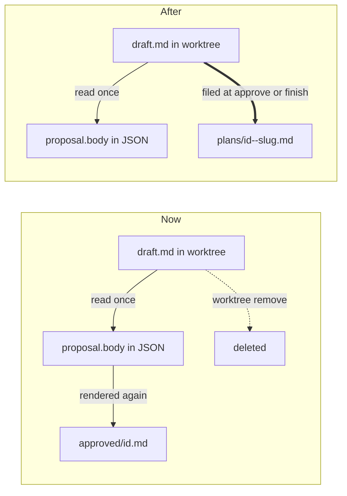

# One plan document, filed when the worktree is cleaned up

Today the plan's markdown exists in three places and the one the court actually
wrote is the one that gets destroyed. This makes the draft file the single
document: it lives in the plan's worktree while the work happens, and it is
**filed into the kingdom's records** at the moment the worktree is torn down.
Nothing is ever written into the user's repository.

## What is true today

I traced the plan's prose from the model's `patch` call to disk.

| Copy | Where | Lifetime |
|---|---|---|
| `.kingdom/draft.md` | the plan's worktree | **destroyed** with the worktree |
| `proposal.body` | `plans/<id>.json` in the profile | forever |
| the same body again | `approved/<id>.md` in the profile | forever, write-once |

`tools/propose_plan.rs` defines `DRAFT = ".kingdom/draft.md"` and
`Patch::for_draft` scopes a proposing model's `patch` to exactly that file.
`propose_plan::proposed()` then reads it, `api::converse` (api.rs:1300) calls
`Plan::propose(title, body)`, and that copies the whole markdown onto the plan.
`store::record_approval` renders a second full copy into `approved/<id>.md`.

Meanwhile the file itself dies. I confirmed the mechanism in a scratch repo
rather than assuming it: `worktree.rs::commit_pending` runs `git add -A`, but
`exclude_worktree_dir` has put `.kingdom/` in `.git/info/exclude`, so the draft
is never committed — and `git worktree remove --force` then deletes it along
with the checkout. Two durable copies of the prose, and the original gone.

This is not theoretical. `~/dev/.kingdom/plans/plan-11.json` and `plan-12.json`
each carry a 7–10 KB `proposal.body`, and each has a matching
`approved/plan-11.md` / `approved/plan-12.md` holding the same text again.

## What I would change

### 1. A filed plan, written once, beside the plan's JSON

**`crates/kingdom-app/src/store.rs`** — replace `approved_plan()` and
`record_approval()` (store.rs:65 and :87) with:

- `pub fn filed_plan(root, plan) -> PathBuf` — the path
  `<profile>/kingdoms/<key>/plans/<plan-id>--<slug>.md`.
- `pub fn file_plan(root, plan, body) -> io::Result<PathBuf>` — writes it.

The body is **the draft file's own bytes**, not `proposal.body` re-rendered,
with a short header above it: plan id, city, model and effort, workspace,
branch, when, and the decree quoted. That header is what `record_approval`
already builds, so `stamp()` and `effort()` (store.rs:140, :168) are kept and
reused rather than rewritten.

It keeps `record_approval`'s two existing properties, both deliberately:

- **Write-once.** If the file exists, return its path and change nothing. The
  store test `the_first_approval_is_the_one_that_is_kept` becomes the test that
  a second filing does not overwrite the first.
- **Atomic.** Same temp-then-rename as `save`, so a reader never catches it
  half-written.

The filename carries the slug because that is what the King said he liked about
Phoenix's `tasks/` directory — a name you can read in `ls`. `plan.slug` already
exists, is git-safe, and is what the branch was cut from, so
`plan-12--move-kingdoms-records.md` sits next to branch
`kingdom/move-kingdoms-records`. `store::load` filters on the `json` extension
(store.rs:181), so a `.md` sibling in `plans/` is ignored by the loader — I
checked, this needs no change.

Two details about that name. `slug` is `#[serde(default)]` — it postdates some
records — so an empty one falls back to plain `<plan-id>.md` rather than
producing a trailing `--`. And slugs collide by design: `plan-4` and `plan-5` in
my own records share `add-the-ability-for-a-site`. The id prefix is what makes
the filename unique, which is why it leads rather than follows.

### 2. File it at approval, and again at merge or archive if it was not

**`crates/kingdom-app/src/api.rs`**

`approve_plan` (api.rs:1723) currently calls `record_approval` inside the
`update` closure. It calls `file_plan` instead, reading the draft from
`<workspace.path>/.kingdom/draft.md` — the worktree is still standing at that
moment, so the bytes are there. Everything else about that block stays: the
`NoteKind::Workspace` note naming where it was recorded, and the failure path
that lets the approval stand and reports only the lost record.

`finish_plan` (api.rs:1827) gains the step the King asked for. It reads the
draft **before** calling `worktree::merge`/`archive` — that is the last moment
it exists — and, on `Finish::Settled`, files it. Write-once means a plan filed
at approval is untouched here; a plan archived while still awaiting review, or
set aside and then archived, gets filed now. The filing is noted in the plan's
log beside the merge note, so the King can see where the plan went.

For an **in-place** workspace there is no teardown — `merge` and `archive` both
return early — so the draft would otherwise be left sitting in the user's
project folder. After filing, that source file is removed. It is Kingdom's file,
not the project's.

### 3. Where the draft path comes from

**`crates/kingdom-app/src/tools/propose_plan.rs`** — add
`pub fn draft_path(workspace: &Workspace) -> PathBuf` beside the existing
`DRAFT` constant. Both callers need to join the constant onto a workspace, and
that knowledge belongs where the constant is rather than duplicated in `api.rs`.
No change to the tool itself, to `Patch::for_draft`, or to the `<next_step>`
cue — that half of the Phoenix port works and this leans on it.

### 4. Retire the `approved/` directory

This is the "stop juggling copies" half, and it needs its reasoning stated
because the ledger was added deliberately (commit 9c97f43) and `AGENTS.md`
argues for it.

The stated justification is that `plans/<id>.json` "is rewritten on every
update, so a revision after approval replaces the standing proposal and the
agreed terms are gone." I went looking for that path and **it is not reachable
through the product.** `Plan::propose` has exactly one non-test caller
(api.rs:1300, the `propose_plan` branch of `converse`); `tools::all` offers
`ProposePlan` only under `Permissions::Propose` (tools/mod.rs:133); and
`ProposePlan::run` refuses under `Permissions::Full` (propose_plan.rs:138).
`approve()` sets `Full`. So after approval nothing can call `propose` again and
the body in the JSON is frozen anyway.

So the ledger is not protecting against a reachable loss — but the *guarantee*
it offers is still worth keeping, and the filed plan keeps it: written at the
moment of the grant, from the bytes the King read, never rewritten. It is the
same promise, in one document instead of two.

What this does **not** do: delete anything already on disk.
`~/dev/.kingdom/approved/` and the three files in it stay exactly where they
are, and `profile::migrate`'s `MIGRATED` list keeps `"approved"` so an older
kingdom still copies them forward. A plan record is the one thing disk cannot
tell us again; this change must be survivable.

### 5. Documentation

- `store.rs` module doc — the directory tree and the new filing rule.
- `propose_plan.rs` module doc — the paragraph claiming the draft merely keeps
  the user's project clean now has a second half: where the draft ends up.
- `AGENTS.md` §4 "Approval is written down and never rewritten" and the "Where
  state lives" tree.

## What I am deliberately not doing

**`proposal.body` stays on the plan.** It looks like the third copy to remove,
and it is the one I would leave alone. The proposal card renders it from a
pushed `Plan` (`components/conversation.rs`), `watch.rs` re-sends whole plans,
and the browser cannot read a worktree — `artifact.rs` serves workspace files
but refuses anything that is not an image, deliberately, and widening it into a
general file server is exactly what its module doc forbids. Removing the field
means a new route, a new fetch in the chamber, and a `kingdom-core` change, to
save a copy that is the machine's own read path. That is a different plan.

So the count goes from **two durable prose copies plus a doomed draft** to **one
filed document plus the JSON the server reads from** — which is the same
relationship `plans/<id>.json` has always had to everything else.

**The draft path stays a fixed constant.** Worth flagging a collision this
change makes visible rather than creates: two *in-place* plans in one city share
`<city>/.kingdom/draft.md`, because the path has no plan id in it. Isolated
plans are safe — each worktree is `<city>/.kingdom/<uuid>/`. Today the loser's
draft is silently overwritten and then destroyed; after this it would be
overwritten and then filed, which is more visible but no more correct. Fixing it
means changing what `Patch::for_draft` allows and what the system prompt tells
the model to write, so it is its own decision.

## Tests

In `store.rs`, adapting the two existing ledger tests rather than adding beside
them, since the function they cover is being replaced:

- a filed plan carries the draft's bytes, the decree, the city and the branch
- filing twice keeps the first document
- `load` still returns the plan, ignoring its `.md` sibling in `plans/`

In `api.rs`, following the style of `a_subagent_is_never_finished_on_its_own` —
pinning the decision through the predicate rather than standing up a git repo:

- a plan approved and then merged has exactly one filed document
- a plan archived having never been approved is still filed
- a missing or empty draft is not an error at either moment

In `worktree.rs`, extending the existing `archiving_keeps_the_work_recoverable`
harness, which already builds a real repo and worktree: that a draft read before
`archive` survives the teardown that deletes the checkout.

## What I checked, and what I am assuming

**Checked.** That `git worktree remove --force` deletes an excluded, uncommitted
`.kingdom/draft.md` (scratch repo, confirmed). That `.kingdom/` reaches the
exclude file via `exclude_worktree_dir`. That `store::load` filters on `json`.
That `Plan::propose` cannot be reached after approval, through all three of
`tools::all`, `ProposePlan::run` and `approve()`. That real plan records carry
both copies of the body today.

**Assumed.** That the draft is still present at merge time for an approved plan
— after approval `patch` is unrestricted, so the court *could* overwrite or
delete `.kingdom/draft.md`. Write-once filing at approval is what makes that
harmless: the document is already banked before the court gains the hands to
disturb it.

**One thing to note before approving.** This worktree is two commits behind
`main`, which moved the records out of the kingdom root into the King's profile
(`~/.kingdom/kingdoms/<key>/`, `crates/kingdom-app/src/profile.rs`). Every path
above is written against `main`, not against the `AGENTS.md` in this worktree,
which still describes the old layout. I would merge `main` in first.
