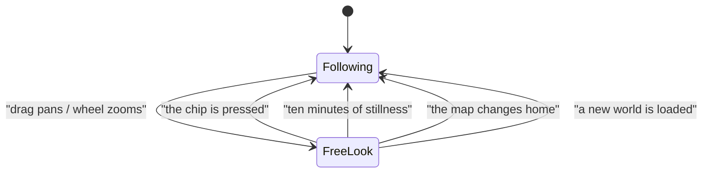

# A map that leans in, and lets go when the King takes the wheel

Two complaints about the map at the foot of the rail, which turned out to share
one cause: the camera was something only the interface drove.

1. Opening a file *aimed* the map at its building without ever arriving at it.
2. Panning or zooming by hand was undone a moment later by the map re-framing
   itself.

## Why opening a file showed no detail

The file effect sent `ViewerCommand::LookAt`, which centres the camera and
deliberately keeps the zoom. The frame it was moving was the *town's*, fitted to
a 290x260 px pane -- so a house came out around twenty pixels wide.

`LodLevel::for_holding_pixels` calls anything under 24 px `Districts`, the
coarsest of the three tiers: wards collapse into plaques and no file is
labelled. The map was therefore pointed exactly at the right building and drawn
at the one detail level that could not show it.

The fix is written in apparent house size rather than in scale, which is the
currency the tiers already use and the one thing that is stable across
repositories of wildly different size:

```rust
pub const INSPECT_HOLDING_PIXELS: f32 = 84.0;

pub fn zoom_to_holding_pixels(&mut self, pixels: f32) {
    self.scale = self.clamp_scale(self.scale_for_holding_pixels(pixels));
}
```

`LookAt` became `Inspect`, which does both halves. 84 px is comfortably past the
64 px `FileDetail` threshold rather than sitting on it, so resizing the pane
cannot make the tier flicker, and far short of `MAX_HOLDING_PIXELS` so the
building keeps its neighbours and its street.

The zoom is a cut rather than a glide on purpose: the rail's map ticks at
`RAIL_WAKE` (125 ms), so a tween would be animated at eight frames a second.

**Closing the file now pulls back to the town**, reversing a decision the old
comment defended. That decision was right when the difference was a pan of a
town-wide frame; once opening a file fills the pane with one building, a closed
panel would leave the map staring at a file nobody is reading.

## Why panning fought back

Worth writing down, because the mechanism was not obvious. The two focus effects
read `built` off the `status` signal. That signal is re-set wholesale on every
poll the bridge's revision moved for -- and `status_matches` moves the revision
when the *camera rect* shifts more than half a world unit.

So dragging the map re-set `status`, which re-ran the focus effects, which
re-sent the `Focus` that dragged the camera straight back. The map was
doing this to itself, every 50 ms poll, for as long as the King held the mouse
down.

Two things fix it. `built` and the new `manual` are read through `Memo`s, which
only notify when their own value changes, so a pan no longer wakes anything.
And the takeover proper:

```rust
pub const RELEASE_AFTER: Duration = Duration::from_secs(600);

pub struct Steering {
    last_input: Option<Duration>,
}
```

One `Option` rather than a flag beside a timestamp -- "the map is following" and
"it was last touched at T" are the same fact asked twice, and two fields is how
they come to disagree.

It lives in the engine, not in Leptos, for two reasons: it is written by the
very systems that move the camera, so it cannot disagree with what actually
happened; and it is then plain arithmetic the native suite can pin, which
nothing in `view.rs` can be.

`touched` is called *inside* the branch that actually pans -- a click that
selects a city moves nothing and must not take the camera.

## What ends a takeover



The last two are not arbitrary. A camera framed for the whole main region is
simply wrong in a 290 px pane, so a change of home is *fitting* rather than
following; and a camera held over a world that no longer exists is meaningless.
Together they give the rule a shape a person can hold: **free look lasts as long
as the map stays where it is.**

Both focus effects *track* `manual`, which is the half that makes the ten
minutes work without any timer in the interface: when the engine drops the flag
the effects re-run on their own and the map goes to the city and the file open
*now*, rather than waiting for the next time one of them changes.

## The chip

A real `<button>` at the bottom-left of the map -- the one corner neither the
rail head nor the loading card claims -- shown only in the rail, because on the
King's own map nothing follows him and there is nothing to announce. A steady
dot rather than a blinking one: a held camera is a state, not an alarm.

It does not know what to re-frame. It clears the flag and the effects do the
rest.

## Checked

`cargo test -p kingdom-citymap` (120 tests), both target builds, and driven in a
real browser on the Proving Grounds with `?map=on`: opening a file frames its
building with the label drawn, a drag raises the chip, opening a *different*
file while held leaves the map where it was, and pressing Follow jumps it to the
file that is now open.

## Two judgements, both one constant

`INSPECT_HOLDING_PIXELS = 84.0` and `RELEASE_AFTER = 600s` are judgements rather
than measurements, and each is a single named constant with its reasoning
beside it.
