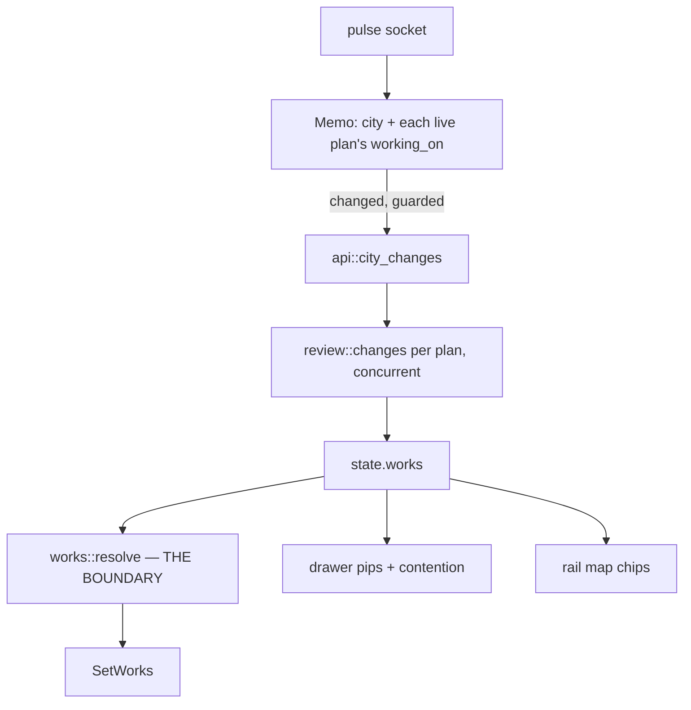

# Whose hands are on this file: agent colours, stacked

The map and the review drawer could say *what* changed. With several agents in
one town they could not say **who** changed it — everything added was one green,
everything removed one red, and the whole picture was scoped to whichever plan's
chamber happened to be open. That is the first of the three questions in
`AGENTS.md`, unanswered at exactly the moment it starts to matter.

Now every agent has its own two-colour banner, every live agent in the city is
drawn at once, and a file several agents share is **one house wearing one band
each**.

## Three bugs, and what was actually wrong

All three were reported as separate complaints. Two turned out to share a cause.

### 1. Big changes and small changes drew nearly the same bar

`scaffold_height` was `9 + 43·√(churn / busiest_file_in_the_same_plan)`. Three
compressions stacked:

- **the floor ate a sixth of the range** before any measurement happened;
- **`sqrt` on top of that** flattened what was left;
- **it was relative**, so height meant "compared to this plan's biggest file"
  rather than anything a person could compare across the map.

Measured: a change **200× smaller** drew a bar **23% as tall**. And with several
agents drawn at once the relative ramp became actively wrong — each agent's
stack was measured against its own plan's ruler.

The fix is an absolute log ramp (`FULL_CHURN = 600`), a floor cut from 9 to 3.5,
and **girth ramping too** rather than being a constant `0.82`. Apparent volume
is height × girth², so the second channel roughly doubles the dynamic range.
Against the real proving-ground fixture:

| | 4-line change | 400-line change | ratio |
|---|---|---|---|
| old (volume) | 8.6 | 33.6 | **3.9×** |
| new (volume) | 3.0 | 32.5 | **10.8×** |

### 2. Removals did not show — two causes, not one

**Deleted files were filtered out of `resolve` entirely.** A deletion-only plan
resolved to an empty list and left the map blank while an agent worked hard.

**And the skirt was sub-pixel.** `SKIRT_SPREAD` was an absolute `1.9` world
units *at maximum*, in a world whose `REFERENCE_WORLD` is 1,000 and where a
typical holding stands ~32 units. A file that was 80% additions got `1.9 × 0.2 =
0.38` of a unit. It was being drawn correctly and was simply too small for any
display to resolve. It is now a **share of the footprint** (0.45 of the shorter
side, with a floor), so it scales with whatever house it wraps.

The deeper fault under both: `growth` was a *ratio*, which structurally cannot
say "a lot was added **and** a lot was removed". A 50/50 file got a half-height
bar and a half-strength stain and read as *less* work than a pure addition of
the same size. Bands now carry `added` and `removed` as absolute counts.

### 3. Deleted files had nothing to say

The old reasoning was sound as far as it went — the map is drawn from the city's
checkout, where the house still stands, so a scaffold on it would say the
opposite of what happened. But the conclusion was wrong: the answer is to draw
**the opposite of a scaffold**, not nothing.

A deletion is now a **razed lot** — a scar over the whole footprint plus a
collapse band at the house's *base*, capped at the roofline. That is the grammar:
what is being built rises above a roof, what is being taken away sits at the foot
of the building. The two can never be confused at a glance.

## The colour axis

`kingdom-core/src/palette.rs`: eight hues, each in two values — light for lines
added, dark for lines removed. So **hue answers "who" and value answers "added or
removed"**, in one glance rather than two.

This is a *third* axis and needed its own space. `PlanStatus::color` says what an
agent is **doing**; `Language::tint` says what the code **is**. The hues were
chosen by search rather than by eye, and tests pin all three separations
numerically (agents from each other: 88; growth from its own cutting: 270; from
the status palette: 89).

**`assign_banners` is hash-with-de-collision**, and both halves matter. The hash
keeps an agent's colour stable across reloads, restarts and tabs — which is what
makes the rail a usable key. But two plans hashing to one slot would be drawn
identically, and *two agents that cannot be told apart is the exact failure this
feature exists to fix*. So the hash is a **preference**, and a collision costs
only the later plan its preference, only while both are live.

## Every agent, not just the open one

`state.works` went from `Option<ChangeSummary>` to `Vec<(PlanId, ChangeSummary)>`.
Three things are load-bearing:

- **The chamber no longer publishes it.** It used to, from the summary the rail
  already had. That was right for one plan and wrong for many: a chamber
  publishing its own plan's changes would blank every other agent's works each
  time the King opened one. `app::watch_city_works` owns it, keyed on the city.
- **It is push-driven, not polled.** The rail's socket already carries a pulse
  per plan, so "has an agent here done anything?" is answered locally and free.
  The `Memo` is a small digest, not the kingdom — the kingdom signal re-sets on
  every push including other cities, and refetching git for those would be a
  request per round of every turn.
- **The reads are concurrent and the lock is released first.** `review::changes`
  shells out to git; holding the kingdom mutex across it would park every request
  behind the slowest git in the city.

`resolve` groups **by path**, so two agents creating the same file get one ghost
with two bands rather than two houses in different corners of the folder. The
grouping is a `BTreeMap` because its iteration order *is* the ghost placement
order, and a hash order would move a new house between refetches.

## Checked

`kingdom-core` (80), `kingdom-citymap` (167), `kingdom-app --features ssr` (266,
with one pre-existing failure needing a live Copilot credential — verified it
fails identically on a stashed tree). Both target builds.

Then driven against a real proving ground: three plans in `almanac` on three real
worktrees, with `task_1.py` edited by all three (+401 / +36 / +4), two whole-file
deletions, a large removal, and a created file. Confirmed in the browser that the
rail, the drawer and the map header agree exactly — jade, rose, azure — that
`task_1.py` is marked contended carrying precisely the two *other* agents' pips,
and by resolving the live manifest against the live summaries that six works come
out with one contended file and two razings, every dimension finite.

The map's own geometry could not be photographed: headless Chrome has no WebGL
surface here (`Failed to create wgpu surface`), which is why `mode.rs` stands the
engine down under automation in the first place. It was verified through
`resolve` + `band_height`/`band_girth` against the real manifest instead — the
same numbers the renderer consumes, one call earlier.
