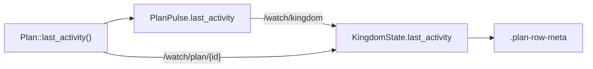

# When each agent last moved: an age line in the rail

Every plan row in the cities rail now carries a second, quiet line: `6m ago`, or
`just now`, or `3h ago` — how long since anything last happened in that plan.

## Why it is not read from the transcript

The browser already holds plans with transcripts, so the obvious implementation
is a reverse scan in the rail. It is wrong, and it fails silently.

A browser is sent a *whole plan* only on the chamber's socket, for the one plan
whose chamber is open. Every other plan is spoken about on `/watch/kingdom` as a
`PlanPulse`, which carries no transcript by design — `events.rs` argues at length
that whole plans on the wire are affordable only on a channel keyed per plan. So
a rail deriving the age itself would show the age of the **opening fetch**,
forever, for every plan the King is not looking at: a number that looks right and
says an agent has gone quiet when it has not.

So the age is computed once, server-side, and travels on the pulse.

Both sockets write the cache, which is the pattern `Attention` already uses and
for the same reason: the chamber's socket holds the whole plan and computes it,
the rail's is told it, and they cannot disagree because `Plan::last_activity` is
the single definition on both ends. Without the chamber's half, the one plan the
King is actually watching would be the one row whose age lagged — the pulse
channel dedupes, and the chamber's socket is what carries that plan's news.

## What "last moved" means

The newest **stamped** entry of any kind — words, a deed, one of Kingdom's own
notices. A plan grinding through `cargo build` reads as fresh, which is the
point: the question is *has this agent gone quiet?*, not *has it spoken?*

Two decisions inside that:

- **A deed is dated by `settled_at` where it has one**, so a ten-minute build
  that returned a second ago reads `just now`. One still running has only its
  start, so the number climbs while it runs — which is exactly how a wedged
  agent becomes visible from the rail.
- **The maximum, not the last entry that carries a stamp.** Position in the log
  and time do not agree: a batch of parallel deeds settles in an order unrelated
  to the order it was written down in, so reading the end of the log reports a
  plan as older than it is. A test pins the case.

`None` — a log from before entries were timed — renders as **nothing at all**.
`0m ago` would be a claim; silence is what "not known" looks like.

## Cost to the dedupe, stated plainly

This is the only field on a pulse that moves on its own, so it does weaken the
dedupe that makes one channel shared by every tab affordable. Not much: a plan
actually working already pulses about once per deed, because `turn.rs` writes
`working_on` at the top of each one, and an idle plan publishes nothing at all —
which is the case the dedupe was defending.

## One clock, not thirty

`rail_clock()` is a single 30-second interval for the whole rail, passed into
each `CityBranch` as a prop. Thirty rows with a timer each would wake the browser
thirty times to redraw strings that change once a minute.

It differs from the chamber's `ticking_clock` in never stopping. That one halts
when no deed is in flight, because a settled deed's elapsed time cannot change;
an age can and does, so stopping would freeze precisely the rows worth reading.
Twice a minute is what makes that affordable, and because it is started once
rather than re-run per turn, plain `on_cleanup` suffices where that function has
to own its handle.

The age is deliberately **not** in the `For` key. Every other member of that key
is captured when the row is built; this one moves on every tick, and keying on it
would rebuild every row in the rail twice a minute to change one word.

## Shape

`.plan-row-inner` became a column of `.plan-row-head` (pip, title, badge —
exactly the row it was) and `.plan-row-meta`. Hover and `current` stayed on the
outer element, so the highlight covers both lines rather than making a selected
plan read as two rows. The meta line is 10px `$ink-faint` with a 2px top margin
and no colour of its own — a tinted age would compete with the badge, which is
the one thing in the row allowed to call for action. Its tooltip gives the exact
time, so the coarse number resolves to a precise one.

## Checked

`fmt`, `clippy`, `kingdom-core` (84, up from 80), `kingdom-app --features ssr`
(288, up from 284), `kingdom-citymap` (203), `kingdom-browser`, and the wasm
build — which is the only thing that compiles the half this change mostly lives
in.

**Seen running**, against the `kingdom-mirror` proving ground on port 3117:

- the pulse on `/watch/kingdom` carries `last_activity` for all six plans;
- rows render `6m ago` with `Last activity at 14:12` on hover;
- the number moves `6m ago` → `7m ago` with no reload, proving the clock ticks;
- speaking to one plan reset **that row alone** to `just now` while its
  neighbours stayed at `8m ago` — the cache, both sockets and the row all in one
  observation.

The `browser_*` tools could not reach their Chrome during this work, so the above
was driven over CDP directly; the screenshot was taken the same way.
