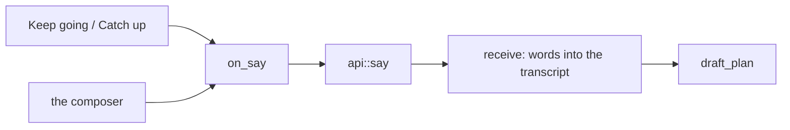

# Two buttons for a dead end

**Status:** done · **Priority:** p3

When a plan stops, the chamber now offers the decree the King was about to type
anyway, as a button above the composer:

- **Keep going** — on a plan whose turn failed.
- **Catch up with `<base>`** — on a plan whose merge git refused.

Both send ordinary words through the ordinary door. Neither is a new mechanism.

## Why they go through `on_say` and nothing else

The obvious implementation of "Keep going" is a button that calls `draft_plan`
directly — no message, no round trip, just send the court round again. It is
wrong, and it fails silently.

`turn::follows_silence` exists because a plan whose reply came back empty must
not resend a byte-identical request; `tasks/00200` has the plan that died three
times in ninety seconds that way. What breaks the loop is that the King's words
land *in the transcript*, after the `EmptyReply` note, so the next brief differs
from the one that got silence. A button that re-drafted without saying anything
would rebuild exactly the payload that already failed — and would look like it
worked, right up until it returned the same nothing.

So the button runs the same three lines the composer's `submit` does. What
reaches `api::say` is indistinguishable from typing.

## The merge refusal that is worth a button, and the two that are not

`worktree::merge` had one refusal type covering three situations. Only one of
them names a job an agent can do:

| Refusal | Whose move | Variant |
|---|---|---|
| the plan records no base branch | nobody's — merge by hand | `Refused` |
| the city has the wrong branch checked out | **the King's** — switch back | `Refused` |
| git declined: the branch has diverged | **the court's** — merge and resolve | `Diverged` |

The distinction is the whole feature. An agent cannot switch the branch in the
King's own working copy — moving it out from under him is precisely the
collision this product exists to prevent — so offering to send one at that
refusal would point at the wrong hand. `Finish::Diverged` is therefore split by
*whose move it is next*, which is the only question the chamber asks of it.

On disk the two are identical: both abort the merge, both leave the city exactly
as it was found, both leave the plan's status untouched. The existing test
pinning that invariant now asserts `Diverged` and is otherwise unchanged, and a
new sibling pins the wrong-branch case as `Refused` — the assertion that would
catch someone collapsing the two back together.

## Why a note kind and not a string match

`NoteKind::MergeConflict` carries the fact from the server to the browser. The
alternative — the chamber scanning the note's body for the word "conflict" —
reads the *contents of git's error message*, which is git's to reword. This is
the argument `NoteKind::EmptyReply` already makes, so this is the second kind
that exists to be matched on rather than to be coloured: `css_suffix` returns
`"merge"`, because to a reader it is the same event.

## The offer withdraws itself

`merge_wants_the_court` reads the **last** transcript entry only. That does two
jobs for one condition:

- Anything else happening — the court acting, the King speaking — takes the
  button away, so a stale offer cannot ask for work already in progress.
- Pressing it is itself "the King speaking", so the offer is gone before a
  second click can land. No `sent` flag, no disabled state; the condition that
  draws the button is the one the button falsifies.

Deliberately unlike `turn::follows_silence`, which walks *past* the King's words.
That one exists to survive him having spoken; this one should stop the instant
he does.

## What is not offered

**A halt the King called.** `turn::halted` leaves such a plan `AwaitingReview`
rather than `Failed`, specifically so a deliberate act is not painted in the
colour of a breakage. A "Keep going" beside his own Stop would undo his decision
with one click — the same misreport, wearing a button.

**A subagent.** Its chamber renders no composer at all, and `api::say` refuses
one server-side: it answers to the plan that sent it.

**A settled plan.** `api::say` refuses those too, so the button would be one
that always errors — and a control that always errors teaches the King to stop
trusting the row it sits in.

## Where they sit

A strip between the error strip and the composer. Not *in* the composer row:
that row is Send, Stop and Done, and a fourth control appearing and vanishing
there would shift the others under the King's cursor mid-reach. Not in the log
either — the log is what was said and done, and this is a decision still to
make, which is the rule the proposal card and the error strip already follow.

Styled at `.done-btn` weight and **not gold**. Gold in this chamber means "this
is yours to decide"; these decide nothing, they save him typing. `.log-jump` is
the existing precedent and carries the same reasoning in its own comment.

Both can stand at once — a plan can be `Failed` *and* have just had a merge
refused — and they read as two offers, which is honest.

## Verified

Both buttons were driven in a browser against the `kingdom-mirror` realm, not
only unit-tested: pressed, the decree lands in the transcript, the mock court
answers it, and the offer is gone afterwards. The catch-up case was reached by
writing a `MergeConflict` note into a plan record on disk, which is what
`finish_plan` writes when git refuses.

Four tests: which stops are prodded, that the catch-up offer stands only while
the refusal is the last word, that the decree names the plan's real base rather
than assuming `main`, and that the wrong-branch refusal stays the King's.
