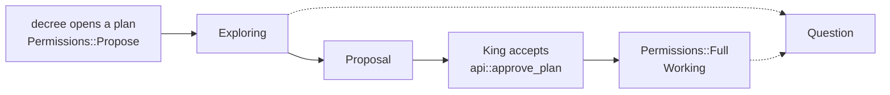

# Exploring before Working

**Status:** done · **Priority:** p2

Every live plan in the left rail read **Drafting**, in the working green,
whether the agent was still reading the code to draw a plan up or was changing
files under a plan the King had accepted. Those are the two halves this
product's stance rests on, and the rail could not tell them apart.

It now says **Exploring** (teal) or **Working** (green). The chamber header says
the same thing, from the same function.

## Why permissions and not a sixth status

The fact was already on the plan and already authoritative. `Plan::permissions`
is `Propose` from the moment a decree opens a plan and widens to `Full` exactly
once, in `api::approve_plan` — the single door, and `Plan::approve` says so. So
this is a labelling change over a field we already keep.

`PlanStatus` is untouched, on the argument `Attention` already made in this
codebase: a status is *where a plan is in its life*, and a sixth variant to say
one word would have rippled through `ALL`, `is_settled`, the map legend, the
working ring in `citymap::engine::activity` (which pins
`PlanStatus::Drafting.color()`), `store.rs`'s recovery and `turn.rs`. None of
those needed to know.

`Permissions::label()` already existed, returning "Drawing up a plan", and had
**no callers anywhere in the workspace**. It was reworded rather than joined by
a second vocabulary beside it, and given a `css_suffix()` sibling so
`style/_status.scss` stays the one place a state becomes pixels.

## The ranking, in one function

`sidebar::badge_for(status, needs, permissions)` is the whole of it, and the
order is the point:

| | reads | why it wins |
|---|---|---|
| 1. attention | Question / Proposal | whose move it is beats everything |
| 2. remit, while `Drafting` | Exploring / Working | what stage the work is at |
| 3. status | Awaiting review / Merged / … | where the plan is in its life |

Attention still outranks the stage, which is the arm worth pinning: an agent
*with hands* that stops to ask is blocked on the King, not working.

The chamber header used to run its own two matches over the same facts — one for
the words, one for the colour. Both now call `badge_for`, so the two surfaces
the King reads one plan from cannot disagree. Subagents are the one exception
and keep their own words ("Reported", "Working"); no rail ever draws one.

## The trap, twice: approval moves the permissions and nothing else

The status is `Drafting` on **both sides** of the grant. `api::approve_plan`
sets it explicitly at the end. Everything that decides whether to redraw by
asking "has this plan changed?" therefore had to be told about the new field, or
it would have answered *no* at the exact moment the King granted his agent hands:

- **The rail's `<For>` key.** A row whose key is unchanged is reused. The
  comment block above that key already documented three instances of this same
  trap (status, proposal, attention); the remit is the fourth, and without it an
  approved plan would have read "Exploring" for the entire life of the work.
- **`PlanPulse`.** The kingdom-wide channel is deduped on the digest, and a
  digest that had not changed would never have been sent. A plan approved in one
  tab would have gone on reading "Exploring" in another until a full refetch —
  and a plan whose chamber is *shut* is spoken about by nothing else.

Both are pinned by tests. `a_pulse_carries_the_stage_across_an_approval`
asserts the two pulses compare **unequal**, which is the dedupe's actual
question rather than a proxy for it.

## Colour

One new palette entry, `"exploring"` (`#2dd4bf`), deliberately **not** a
`PlanStatus` colour — the comment above `PlanStatus::color`'s block says those
must stay in step with the Rust, and this one has no counterpart there. Green
keeps meaning hands on the code; teal is reading and not touching yet.

`"drafting"` stays in `$statuses`: `PlanStatus::css_suffix` still emits it, and
the errand dots in the chamber still read it.

The map is left green for both, on purpose. It answers "who is working"; which
stage they are at is a rail question.
