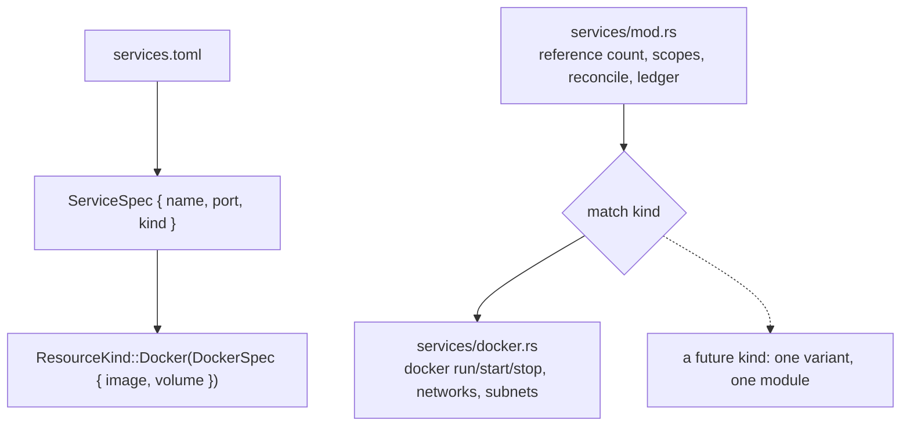

# A shared resource that knows what kind of thing it is

**Status:** done · **Priority:** p2

Every shared resource was a Docker container, and the code said so in about
forty places: `ServiceSpec` carried an `image` and a `volume`, `RunningService`
a `container`, `ResourceInventory` a `docker_trouble`, and the ledger screen
composed `docker logs …` **in the browser**. `kingdom-app/src/services.rs` was
2,907 lines in which the reference-counting invariant — the part that is about
*sharing* — was interleaved with the subprocess conversation with `docker`.

This gives a resource a **kind**, and splits sharing from runtime. Behaviour is
unchanged: every manifest that parsed before parses identically, and every
address, container name and subnet is the same one.

## The decision that changed mid-flight

The approved plan specified a `ResourceDriver` trait with a `DockerDriver`
implementing it. **It was not built, and the King agreed** — the trait was the
wrong shape and the plan said so only after the question had been asked:

- one implementor, chosen deliberately ("Docker only for now"), so `driver_for`
  was a function mapping one variant to one value;
- the signature was contorted by that single implementor —
  `raise(scope, key, &[(usize, &ServiceSpec)])`, where the `usize` exists purely
  because *Docker* assigns addresses from manifest order, returning a
  `RunningService` whose every field is container-shaped;
- and it is **weaker** than the enum. A kind added without its match arms does
  not compile; a driver shaped wrongly for a new kind compiles and is wrong at
  run time.

The repository already makes this judgement in prose twice — it shells out to
the `docker` CLI rather than taking on `bollard`, and copies a four-line `which`
rather than adding "a utility module that exists to hold four lines".

So the seam is an **enum carrying its payload**, dispatched by exhaustive
`match` at five sites. Everything else the King asked for — a type, a modular
split, room for a second kind — is here.



## The wire format

```toml
[[service]]
type   = "docker"      # optional; "docker" if absent
name   = "db"
image  = "mongo:7"
port   = 27017
volume = "shopfront-db"
```

Flat and internally tagged, not a nested `[service.docker]` table: the existing
shape *is* the docker shape, and nesting would make the tag honest and every
file already on disk wrong.

Parsing goes through a private flat `RawService` and then **converts**. Serde
can read a flat tagged enum, but what it says when it cannot is the problem —
"unknown variant `podman`, expected `docker`" names no service, and in a file
with four of them that is a search rather than a fix. The conversion is where a
fault becomes a sentence with a name in it:

```
service `db` is of type `podman`, which is not a kind of shared resource
Kingdom knows. Use one of: docker.
```

**Field faults are still judged by `validate`, not at conversion.** A missing
image is reported through `ResourceKind::missing_field`, so faults come out in
the order they appear in the file — a kind that checked its own fields eagerly
would report the second service's missing image before the first service's
missing name.

## Renames, all of them a Docker word on a kind-agnostic type

None is persisted: `SharedResource`, `SharedService` and `RunningService` are
runtime truth, rebuilt per request, so there was no document to migrate.

| Was | Is |
|---|---|
| `ServiceSpec.image` / `.volume` | `ServiceSpec.kind` → `DockerSpec { image, volume }` |
| `SharedResource.container` | `.handle`, plus new `.hint` |
| `SharedService.image` | `.what` (with `#[serde(alias = "image")]`) |
| `RunningService.container` / `.image` | `.handle` / `.what`, plus `.kind` |
| `ResourceInventory.docker_trouble` | `.runtime_trouble` |
| `ServiceError::DockerMissing` / `DockerUnreachable` | `Unavailable(String)`, composed by the runtime |
| `ServiceError::NeverReady { container }` | `{ hint }` |
| `declare_shared_resource(scope, city, name, image, port, volume)` | `(scope, city, spec)` |

## Five traps, four of them found by running it

**1. A half-raised scope leaked a container.** The old `raise` used `?` inside
its loop, so a failure on the third service dropped the two already standing —
and the registry never heard of them, so the sweep, which only stops what this
process raised, would never stop them. `docker::raise` now returns a `Raised`
carrying **both** what came up and what went wrong, and `mod.rs` records before
returning the error. A `Result` cannot express "three are standing and here is
why the fourth is not", which is exactly the state a failed raise leaves.

**2. The old wire form stopped parsing.** Renaming `SharedService.image` broke
`a_shared_service_from_before_the_two_levels_reads_as_a_projects_own`, a test
that pins tolerance of an older browser bundle across a server upgrade. Fixed
with `#[serde(alias = "image")]` — one word, and the test now asserts it.

**3. `nothing_is_published_to_the_kings_loopback` reads its own source** via
`include_str!("services.rs")`. It had to move to `docker.rs` with the `run`
arguments it guards; left behind it would have compiled and asserted nothing.

**4. A pre-existing failure, surfaced.** `a_restart_brings_the_well_back_to_the_agents_that_had_it`
wrote a manifest still setting `env` — retired and made a hard parse error by
task 00300. Being `#[ignore]`d it had never run since. Deleted the line; it
passes. **This was broken on `main` before this change.**

**5. `raise` now means two things.** `crate::services::raise` records drawers;
`docker::raise` only talks to a daemon. One test called the first from inside
the second's module and silently bound the wrong one. Named in full there, with
a comment.

## One behaviour change, and it is an improvement

`inventory` reads the manifests **first** and asks a runtime whether it is
healthy only if some manifest declares that kind. A machine that shares nothing
no longer shells out to `docker version` to draw an empty screen — on a timer,
for as long as the screen is open. Pinned by
`a_kingdom_that_shares_nothing_asks_no_runtime_anything`, which is true whether
or not the machine running it has Docker.

## What was checked

The full gate: `fmt`, `clippy --all-targets`, all four test suites, and the wasm
build. `kingdom-core` 128 tests (was 124), `kingdom-app` 368 (was 366),
`kingdom-citymap` 252.

**Against a real Docker daemon** (29.7.2 on this machine), all four `#[ignore]`d
lifecycle tests: `services_against_real_docker`,
`a_restart_brings_the_well_back_to_the_agents_that_had_it`,
`concurrent_reconciles_raise_one_container`, `a_host_well_serves_two_projects`.
That is what proves the split still raises, adopts, restarts and stops.

**Driven in a browser** against the `kingdom-mirror` realm:

- a manifest with **no `type`** renders identically — `Image` and `Data` come
  from `ResourceKind::facts()`, and the kind labels its own row;
- the form's preview writes `type = "docker"` explicitly, and declaring through
  it wrote exactly that file — proving the new `declare_shared_resource`
  signature end to end;
- `type = "podman"` shows the refusal above as a yellow trouble row;
- with nothing declared, **no Docker banner** — the behaviour change above,
  visible.

## What this is not

Still one kind. The seam is shaped against where a second would actually differ
— no image, no volume, no daemon, no network — rather than against Docker's
shape, but a seam is only truly proven by the second thing through it. Two
dispatch sites keep a catch-all on purpose (stopping, diagnosing): falling over
in front of five working agents holding databases is worse than logging and
carrying on. `every_kind_offered_has_a_runtime_behind_it` walks
`ResourceKind::all()` so that catch-all cannot hide a kind nobody wired up.
